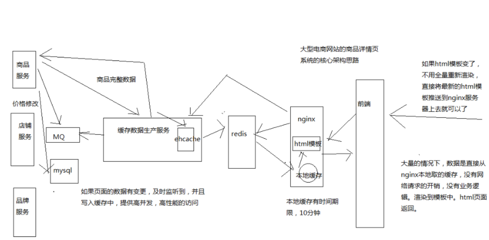
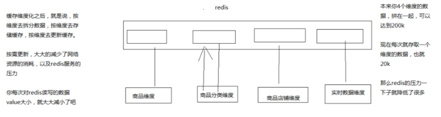
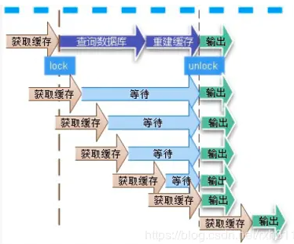

### 商品详情页缓存架构图：

  
具体流程为：

  1. 用户访问nginx，会先从 nginx 的本地缓存获取数据渲染后返回，这个速度很快，因为全是内存操作。 nginx缓存数据一般是主动过期，比如10分钟后自动过期。nginx缓存抗的是热数据的高并发访问。
  2. 如果nginx本地缓存失效，会从 redis 中获取数据回来并缓存上。
  3. 假如 redis 中的数据失效，会从缓存数据生产服务中获取数据并缓存上。redis抗的是高频的离散访问，能缓存1T+的数据，qps可以达到几十万。（利用redis cluster的多master写入）redis缓存过期采用LRU策略；
  4. 缓存数据生产服务，本地也有一个缓存，比如用的是 ehcache 他们通过队列监听商品修改等事件，让自己的缓存数据及时更新。（tomcat jvm堆内存缓存）
  5. 其他服务，商品、店铺等服务能获取到商品的修改事件等，及时往 mq 中发出商品的修改事件， 并提供商品原始数据的查询。这里可能是直接从 mysql 库中查询的。

这样一来，在缓存上其实就挡掉了很多数据，一层一层的挡并发。

### 缓存淘汰策略

最常用的缓存淘汰策略：

  * FIFO：先进先出，可以用链表实现，链表尾部进入，头部出。
  * LRU： 最近最少使用的；用链表实现，每次被访问的直接移动到链表头；从链表尾部清理；
  * LFU：最不经常使用；可以使用有序链表实现，链表的值保存访问次数，每次从尾部移除数据.

### 缓存更新策略

数据发生变动时，需要先删除缓存，然后再更新mysql中的数据。

  * 此处是删除缓存而不是更新缓存，主动更新缓存的代价很高，一般不这么干。
  * 顺序是先删除缓存，再更新数据库，因为反过来如果更新数据库成功，删除缓存失败，会有不一致的情况；

在已经删除缓存，但更新数据库还没有完成，此时如果有请求过来，会将旧的数据更新到缓存；这样会导致数据库和缓存数据的不一致；解决方式：将修改数据库和更新缓存做成异步串行。（虽然有阻塞的风险，但是大概率是读请求多，写请求少）

缓存需要保证同一个商品的读写操作路由到同一台机器中，否则缓存就失去意义。

缓存策略在高并发下，需要严格的压测和计算；

### 缓存维度化

比如商品详情页，库存的更新频率和商品属性的更新频率是不一致的，如果所有信息都放到同一个value中，会导致缓存频繁失效。解决方式就是缓存维度化，只更新维度信息。  

### 缓存穿透

缓存穿透是指用户查询数据，在数据库没有，自然在缓存中也不会有。这样就导致用户查询的时候，在缓存中找不到，每次都要去数据库再查询一遍，然后返回空（相当于进行了两次无用的查询）。这样请求就绕过缓存直接查数据库，这也是经常提的缓存命中率问题。  
解决方法：

  * 不存在的仍然以key-null的形式存储到缓存，但过期时间要设置的足够短。
  * 将存在的数据存到一个很大的bitmap或者bloom Filter中，通过bitmap来判断是否存在，然后这样可以降低对mysql的访问；

### 缓存击穿

缓存击穿是指数据库中有而缓存中不存的key，持续的大并发会击破缓存，直接请求数据。比如key不在缓存，某一时刻大量的请求key直接击穿缓存到达数据库。  
解决方法：

  * 设置热点数据常驻缓存不失效；
  * 通过设置互斥锁（采用SETNX（set if not exists）来设置另一个短期key来锁住当前key的访问，访问结束再删除该短期key)来减缓对缓存数据的大流量；  

### 缓存雪崩

缓存中的大批量的key过期，所有原本应该访问缓存的请求都去查询数据库了，而对数据库CPU和内存造成巨大压力，严重的会造成数据库宕机。从而形成一系列连锁反应，造成整个系统崩溃。  
解决办法：

  * 缓存中数据过期时间设置为随机，防止同一时间大批量的key同时到期；
  * 如果是分布式的，将热点数据分步到不同的数据库。
  * 牺牲用户体验，做限流、降级
  * 添加预警机制

### 缓存预热

系统新上线或者是缓存崩掉重启后需要先预热缓存数据，否则容易造成mysql的压力过大；  
解决思路：

  * 直接写个缓存刷新页面，上线时手工操作下；
  * 数据量不大，可以在项目启动的时候自动进行加载；
  * 日常例行统计数据访问记录，定时刷新缓存；

### 缓存降级

缓存失效或者挂掉的情况下，直接返回默认数据，也不去请求数据库。通过提供有损服务来降低对整个业务的影响。
