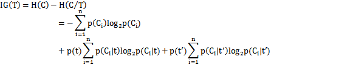
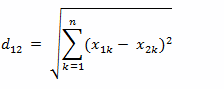
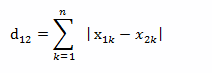
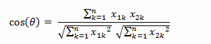
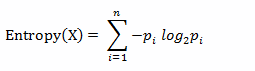

（1）文本表示的方法  
一般使用向量空间模型，粒度为一个词语，即将文本表示为N维空间中的一个规范化的特征矢量。  
（2）特征选取  
特征的选择分为两种，一种是每一类选取一部分词语作为特征词，二是整个系统作为一个整体来选择特征值。特征选择的几种方式：  
tf-idf：文档频率和反文档频率。  
信息增益：整个系统选择一部分特征词。它的衡量方式是有特征和无特征的情况下，整个系统的信息熵的变化。  


（4）相似度计算  
两个向量之间计算距离的几种方式：

  * 欧氏距离  

  * 曼哈顿距离  

  * 余弦夹角  

  * 汉明距离  
将一个字符串转换为另一个字符串时所作的最小替换次数。
  * 信息熵  
  
（5）新闻聚类中采取的方式  
feature词表  
fearture词表是采用tf-idf来提取的，分别训练出了每一类的特征词以及所对应的权重，以及整个系统的特征词以及权重。聚类拿的是系统的特征词表。  
一篇文档的处理：  
首先对文档进行分词，查看是否出现特征词，计算特征词的权重，形成一个向量。  
tf：在当前文档中出现的次数  
idf：从分类特征中加载的idf
        
        ```bash
        weight = tf * log(1/idf +0.01)
        Topic质心的计算方式(term1......termm)
        page1： weight11，weight12，weight1m
        page2： weight21，weight22，weight2m
        pagen： weightn1，weightn2，weightnm
        首先计算平均值：
        w1=  ( weight11+weight21+weighn1)/n
        w2= (weight12+weight22+...weightn2)/n
        wm=（weight1m+weight2m+...weightnm）/n
        用阈值过滤（weight值最大不可超过阈值）
        归一化
        w1 = w1 /(w1*w1 + w2*w2 + ... wm *wm)
        wm = wm /(w1*w1 + w2*w2 + ... wm *wm)
        ```

（6）处理的流程  
将每一个文档都当做一个topic；  
选择距离最近的两个topic；  
计算两个topic合并前后的凝聚力大小变化（凝聚力为topic下文档两两之间距离的均值（此距离用的是欧式距离）），变化过大则跳转到第二步，重新选择；  
合并两个topic，更新新的topic的质心，并重新计算该topic和其他topic之间的距离  
如果topic的数量少于最少的topic数目，跳出循环返回，否则跳转到第二步；


（7）两个topic之间距离的计算，最大为1，最小为0
    
    
    ```bash
    topic 1: X1 =  (w11, w21, ...... wm1)
    topic 2: X2 = (w12, w22, ...... wm2)
    sum = w11 *w12 + .... wm1* wm2
    num =  (w11 & w12 ? 1:0)+ ..... (wm1&wm2?1:0）
    avg = sum /num
    dis  = (w11 & w12)?(w11*w12-avg)*(w11*w12-avg):0  + ...... (wm1 & wm2)?(wm1*wm2-avg)*(wm1*wm2-avg):0
    dis = dis / num
    ```

（8）聚类的结果调整  
同一个网站发布了大量同一个类的文章，比如某一时间段健康频道下会出现大量的关于某一疾病的说明、治疗方式等，这个可以通过url过滤掉。同一个网站不同频道发布的也算。  
影响聚类结果调整的参数：topic之间的相似度、topic的凝聚力、特征选取的多少  
topic的排序：按照转载量，即每个topic下的文章的数量（焦点新闻）  
（9）KNN  
算法接受一个未标记的数据集，然后将数据聚类成不同的组。  
首先随机的选取K个点，作为聚类的中心。  
对于每一篇文档计算与聚类中心的距离，将其归类为距离最小的那一组中，并更新该组的聚类中心。  
直到中心点不再变化。
