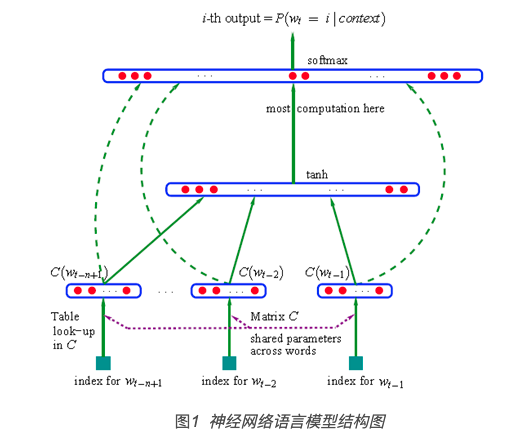
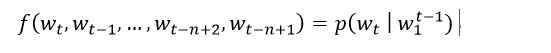
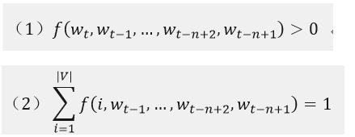
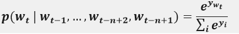
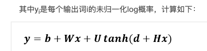
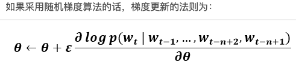
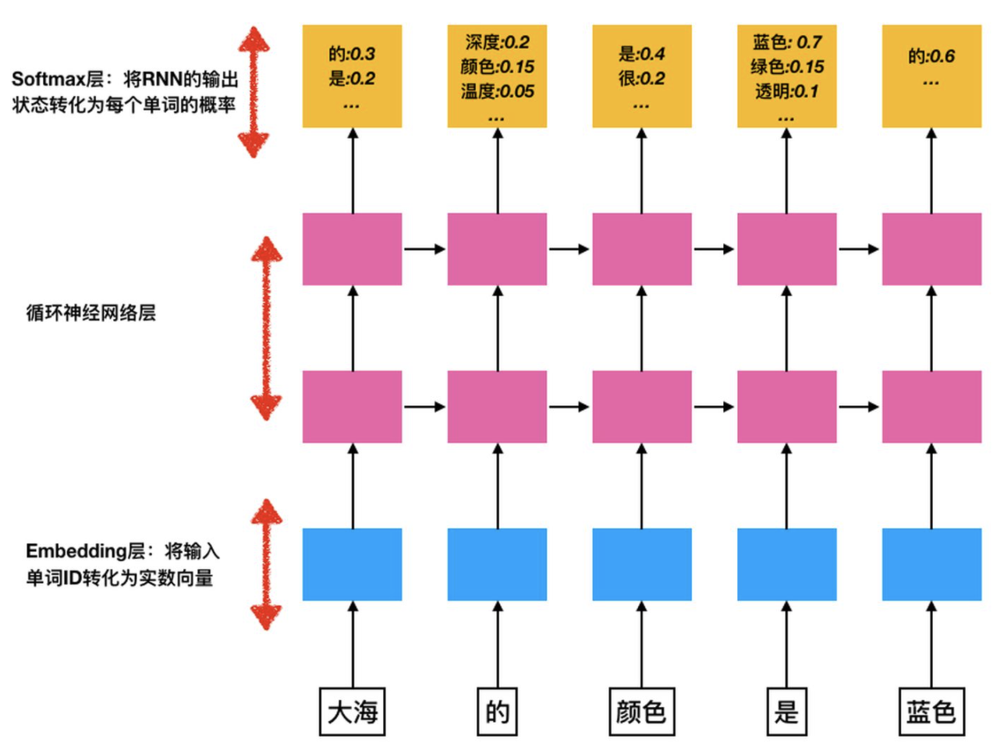
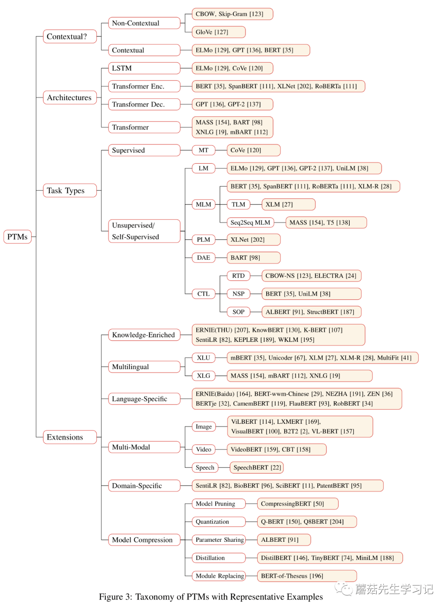
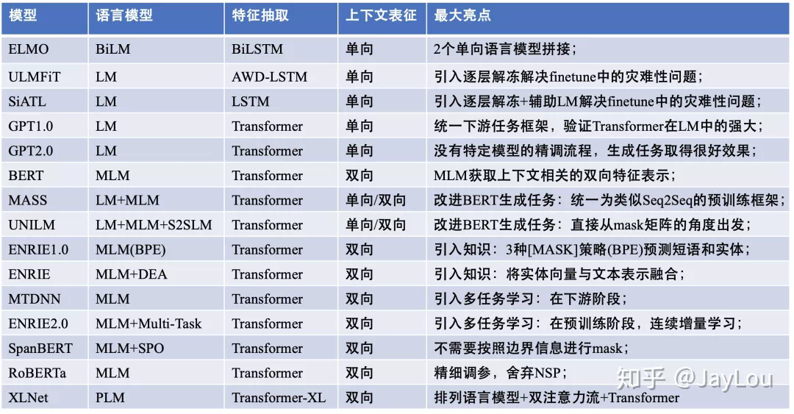

#### NLU&NLG

  * 自然语言理解（NLU，Natural Language Understanding）: 使计算机理解自然语言（人类语言文字）等，重在理解。具体来说，就是理解语言、文本等，提取出有用的信息，用于下游的任务。它可以是使自然语言结构化，比如分词、词性标注、句法分析等；也可以是表征学习，字、词、句子的向量表示(Embedding)，构建文本表示的文本分类；还可以是信息提取，如信息检索（包括个性化搜索和语义搜索，文本匹配等），又如信息抽取（命名实体提取、关系抽取、事件抽取等）。

  * 自然语言生成（NLG，Natural Language Generation）: 提供结构化的数据、文本、图表、音频、视频等，生成人类可以理解的自然语言形式的文本。NLG又可以分为三大类，文本到文本（text-to-text），如翻译、摘要等、文本到其他（text-to-other），如文本生成图片、其他到文本（other-to-text），如视频生成文本。

#### 语言模型

语言模型一个语言模型可以理解为一个句子S在所有句子中出现的概率分布P(s)，也就是检测一句话是不是正常的一句话；

  * n-gramm: 出现在第i位置上的词，仅与它前面的n-1个历史词有关；  
存在的问题：  
1、无法建模出更远的关系；  
2、无法建模出词语之间的相似度；（是使用的一种统计的思想）  
3、依赖于语料，未出现过的直接会出现概率为0的情况；

  * NNLM（神经网络语言模型）：同样是n-gram模型，用三层的神经网络来构建语言模型；  

输入层为（n-1）* m个节点，每个词向量为m维；隐藏层为h个节点，输入层到隐藏层的权重矩阵为H，维度为h X （n-1）* m的矩阵；

输出层为|V|维的向量，第i个节点表示输出为词i的未归一化log概率；隐藏层到输出层的权重矩阵为矩阵U： |V| X h的矩阵；模型的目标是学到一个好的函数来估计条件概率：  
且需要满足的条件：  
输出层采用softmax函数：  
  
其中b，W，U，d和H都是参数，x为输入，则θ=(b, W, U, d,H)一般的神经网络输入层就是输入值，在这个模型中输入层x也是需要优化的参数；其中W可以为0；

优点：建模出了词语之间的相似度缺点：因为这是通过前馈神经网络来训练语言模型，  
缺点：显而易见就是其中的参数过多计算量较大，同时softmax那部分计算量也过大。另一方面NNLM直观上看就是使用神经网络编码的 n-gram 模型，也无法解决长期依赖的问题。

  * RNNLM  

#### n-grammer和NNLM、CNNLM的共同点以及区别

共同点：都是计算语言模型，将句子看作一个词序列，来计算句子的概率  
不同点：

  * 计算概率方式不同，n-gram基于马尔可夫假设只考虑前n个词，nnlm要考虑整个句子的上下文；
  * 训练模型的方式不同，n-gram基于最大似然估计来计算参数，nnlm基于神经网络的优化方法来训练模型，并且这个过程中往往会有word embedding作为输入，这样对于相似的词可以有比较好的计算结果，但n-gram是严格基于词本身的；
  * 循环神经网络可以将任意长度的上下文信息存储在隐藏状态中，而不仅限于n-gram模型中的窗口限制；

#### LM 、 Bi-LM、 MLM、sequence-to-sequence LM

  * LM：是指一类能够求解句子概率的概率模型，通常通过概率论中的链式法则来表示整个句子各个单词间的联合概率。LM使用的是单向的。LM更适合做生成任务；  
为什么不能同时使用两侧的数据呢？  
主要是因为我们的学习目标是预测下一个词，如果让当前词同时融入两侧的信息，会造成label的leak问题。

  * bidirectional LM (Bi-LM)：分别考虑从左到右的LM和从右到左的LM，这两个方向的LM是分开建模的。

  * MLM：mask languge model，同时利用左侧和右侧的元素（字、词、实体）来预测被mask掉的元素；MLM天生不适合做NLG（自然语言生成）任务；

  * sequence-to-sequence LM：输入的source句子和target句子，mask单词在target上，那么当前mask的上下文就是source句子的所有单词和target句子中mask单词左侧的词汇可以被看到；

#### 预训练模型的分类

预训练模型可以通过四种分类维度来划分：

  * 表征的类型，即：是否上下文感知；
  * 编码器结构，如：LSTM、CNN、Transformer；
  * 语言模型，如：语言模型LM，带掩码的语言模型MLM，排列语言模型PLM，对比学习等；
  * 针对特定场景的拓展和延伸。如：知识增强预训练，多语言预训练，多模态预训练和模型压缩等；

目前主流的语言表征方式采用的是「分布式表征」(distributed representation)，即低维实值稠密向量，每个维度没有特定的含义，但是「整个向量表达了一种具体的概念」。预训练模型是学习分布式表征的重要途径之一，它的好处主要包括：在大规模语料上进行预训练能够学习到「通用的语言表示」，并有助于下游任务。提供好的模型「参数初始化」，提高泛化性和收敛速度。在「小数据集」上可以看作是一种「正则化」，防止过拟合。

#### 几种常见的预训练模型

  * Glove 是属于统计语言模型，通过统计学知识来训练词向量;
  * ELMO 通过使用多层双向的LSTM（一般都是使用两层）来训练语言模型，任务是利用上下文来预测当前词，上文信息通过正向的LSTM获得，下文信息通过反向的LSTM获得，这种双向是一种弱双向性，因此获得的不是真正的上下文信息;
  * GPT是通过Transformer来训练语言模型，它所训练的语言模型是单向的，通过上文来预测下一个单词;
  * BERT通过Transformer来训练MLM这种真正意义上的双向的语言模型，它所训练的语言模型是根据上下文来预测当前词。  

