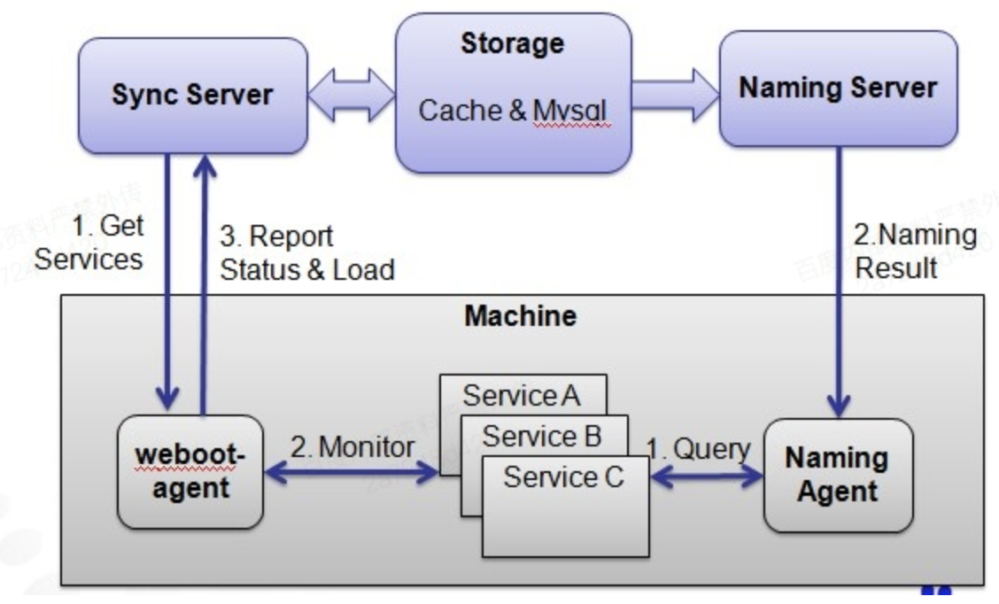
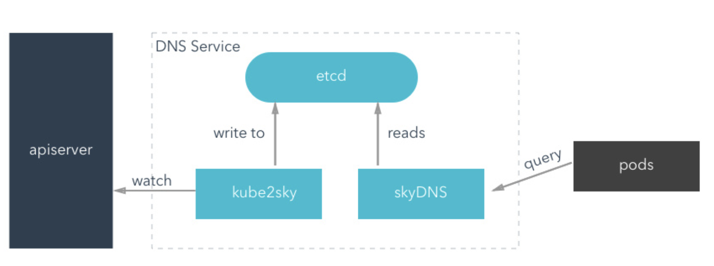

#### 1、负载均衡（load balance）的意义

最大化吞吐量，最小化响应时间，且避免任何单一资源的过载；

#### 2、LB的常用算法

  * RR（round robin）： 轮询，每个请求按时间顺序逐一分配到不同的后端服务器，如果后端服务器down掉，能自动剔除，在实现RR算法的时候，还需要根据其他的因素: max_fails、fail_timeout、weight等因素进行综合评估
  * weight RR：带权重的轮询，适用于后端服务器性能不均的情况；
  * IP_HASH：每个请求按照访问IP的hash结果分配，这样每个访客固定访问一个后端服务器，可以解决”负载集群SESSION同步”的问题。
  * Fair：第三方插件，可以根据也没大小，后端响应时间来分配请求，比如nginx可以使用Fair插件来做负载均衡
  * URL_HASH：按访问URL的Hash结果来分配请求，使每个URL定向到同一个后端服务器（多用于缓存服务，比如同一个urlhash到同一台服务器，能提高缓存的命中率）

#### 3、bns基本架构为：

架构分为server端和client端，server端的服务包括：

  * Uns：naming server，运行在服务端，缓存全量的服务单元数据；
  * webfoot-agent：运行在node节点，收集node上的实例信息，并上报给server；
  * naming-agent：客户端，提供命令行查询；

#### 4、bns的作用

通过matrix部署的应用，会生成一组bns，可以通过bns进行访问（类似于k8s的dns功能）；

#### 5、k8s 的dns

  1. K8s的dns功能简单说：可以在集群的内部可以通过curl -s <服务名：服务端口号> 来访问服务。

  2. service解决了服务发现和负载均衡的问题，有了clusterIp和nodePort类型的service的ip，为什么还需要dns?

Ip是后生成的，只有在服务启动后才会存在，或者采用环境变量的方式带入到容器，但环境变量也是在依赖的服务已经启动后才有的。最简单的方式是ip和dns name之间可以自由互换，只知道名字就可以知道name。

  3. k8s的dns架构：

其中，etcd用来保存dns数据， kube2sky用来监听service的变动并存储到etcd，skydns从etcd中读取dns信息并对外提供服务；

  4. 一个服务的dns地址：

服务名.namespace.svc.cluster.local

  5. k8s做pod探活的方式：livenessprobe和readnessProbe。

