注：

  * IO分为磁盘IO和网络IO，以下所说的都是网络IO。
  * 同步和异步、阻塞和非阻塞是独立的状态，同步不等于阻塞，异步不等于非阻塞；
  * 同步和异步分为：网络模型的同步和异步、IO的同步和异步，这二者不同。
  * 网络模型的同步和异步描述的是客户端和server端是同步交互还是异步交互。
  * IO的同步和异步是指用户线程和内核处理线程的同步和异步。
  * 以下所说的同步和异步指的是IO的同步和异步；

### 1、同步阻塞IO模型（BIO）

同步阻塞模型在server端有单线程和多线程两种实现方式，方式都是建立连接后一直等到数据传输结束后才会释放连接；此处的阻塞是指是否等待数据传输（IO）时是否阻塞；  
单线程的处理流程为：


    
    
    ```plain
    while(1) {
      fd = accept(listen_fd)  // 判断是否有连接进来
      fds.append(fd)
      for (fd in fds) {
        if (recv(fd)) {  
          // 阻塞等待数据传输，此处会影响上面accept接收连接
        }
      }  
    }
    ```

多线程的处理流程为：
    
    
    ```plain
    while(1) {
      fd = accept(listen_fd)
      // 开启线程read数据（fd增多导致线程数增多）
      new Thread func() {
        // recv阻塞（多线程不影响上面的accept）
        if (recv(fd)) {
          // logic
        }
      }  
    }
    ```

此模型适用于连接数比较小的架构，100万个用户则需要100万个线程，而同时发生读写操作的线程数不超过20%，所以容易造成浪费；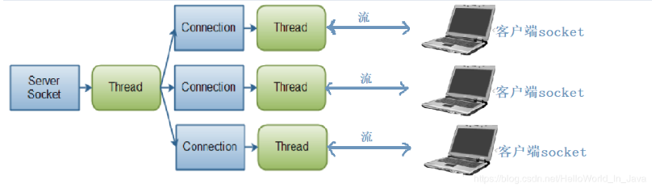

### 2、同步非阻塞模型（NIO）

为什么是单线程，没有多线程处理？因为：网络IO是非阻塞的，没必要开着线程处理。
    
    
    ```plain
    setNonblocking(listen_fd)
    while(1) {
      // accept非阻塞（cpu一直忙轮询）
      client_fd = accept(listen_fd)
      if (client_fd != null) {
        // 有人连接
        fds.append(client_fd)
      } else {
        // 无人连接
      }  
      for (fd in fds) {
        // recv非阻塞， 此处只判断是否有数据，如果没有数据，直接返回，不阻塞
        setNonblocking(client_fd)
        // recv 为非阻塞命令
        if (len = recv(fd) && len > 0) {
          // 有读写数据
          // logic
        } else {
           无读写数据
        }
      }  
    }
    ```

### 3、IO多路复用模型

通过一个线程专门管理客户端的连接，通过记录IO流的状态来管理多个IO，提高服务器的吞吐时间。  
多路：指的是多个网络连接（多个文件句柄），复用的是同一个io线程（即下图的控制线程）；  
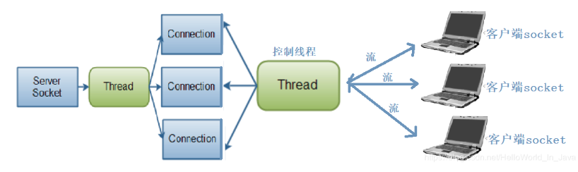

IO多路复用模型的实现的三种方式有select、poll、epoll三种，整个过程只在调用select、poll、epoll的时候才会阻塞，accept/recv是不会阻塞。三者的区别如下：  
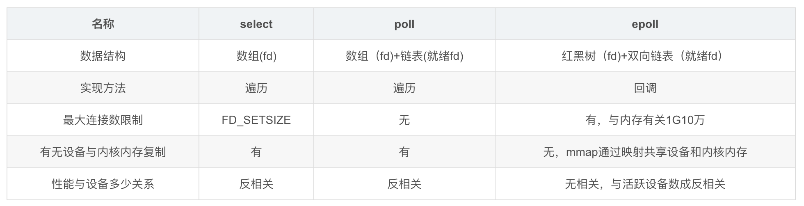

IO多路复用模型无论是select、poll还是epoll的实现方式下，都是由应用程序来做“拷贝数据”的，因此属于同步IO。  
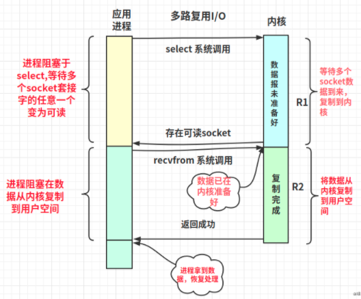

#### select的处理

select的实现用的是三个bitmap，用来记录可读、可写和异常的fd。
    
    
    ```plain
    #include <sys/select.h>
    #include <sys/time.h>
    #define FD_SETSIZE 1024  # 此处限制了最大连接数为1024
    #define NFDBITS (8 * sizeof(unsigned long))
    #define __FDSET_LONGS (FD_SETSIZE/NFDBITS)
    
    // 数据结构 (bitmap)
    typedef struct {
        unsigned long fds_bits[__FDSET_LONGS];
    } fd_set;
    
    // API
    int select(
        int max_fd, 
        fd_set *readset, 
        fd_set *writeset, 
        fd_set *exceptset, 
        struct timeval *timeout
    ) // 返回值就绪描述符的数目
    
    FD_ZERO(int fd, fd_set* fds)   // 清空集合
    FD_SET(int fd, fd_set* fds)    // 将给定的描述符加入集合
    FD_ISSET(int fd, fd_set* fds)  // 判断指定描述符是否在集合中 
    FD_CLR(int fd, fd_set* fds)    // 将给定的描述符从文件中删除 
    ```

select 系统调用是用来监视多个文件句柄的状态变化的。select函数原型如下：  
`int select (int nfds, fd_set *readfds, fd_set *writefds, fd_set *exceptfds, struct timeval *timeout); `  
函数的第一个参数是加集合的句柄值的最大值+1，而不是句柄数量+1。函数的最后一个参数timeout是一个超时时间值，其类型一个struct timeval结构的变量的指针。  
第2、3、4三个参数是一样的类型: fd_set* ，比如检测了三个socket，&rdfds,&wtfds,&exfds这三个参数分别用来记录这三个socker中可读的、可写的、以及异常的fd。  
比如只想检测某个socket是否有数据可读，我们可以这样：
    
    
    ```plain
    bind(listenfd);
    listen(listenfd);
    FD_ZERO(&allset);
    FD_SET(listenfd, &allset);
    for(;;)
    {
        select(...);
        if (FD_ISSET(listenfd, &rset)) 
        {/*有新的客户端连接到来*/
            clifd = accept();
            cliarray[] = clifd; /*保存新的连接套接字*/
            FD_SET(clifd, &allset);/*将新的描述符加入监听数组中*/
        }
    
        for(;;)
        {/*这个for循环用来检查所有已经连接的客户端是否由数据可读写*/
    
            fd = cliarray[i];
            if (FD_ISSET(fd , &rset))
                dosomething();
        }
    }
    ```

select的缺点为：

  * 单个进程所打开的FD是有限制的，通过FD_SETSIZE设置，默认1024；
  * 每次调用select，都需要把fd集合从用户态拷贝到内核态，这个开销在fd很多时会很大；
  * 对socket扫描时是线性扫描，采用轮询的方法，效率较低（高并发时）；

#### poll的处理

poll和select的区别是：poll用数组来存储FD，而不是bitmap，因此他没有了最大描述符1024的限制；其他和select相同；
        
        ```plain
        #include <poll.h>
        // 数据结构
        struct pollfd {
            int fd;                         // 需要监视的文件描述符
            short events;                   // 需要内核监视的事件
            short revents;                  // 实际发生的事件
        };
        // 用revent来判断一个fd发生了什么事件
        // API
        int poll(struct pollfd fds[], nfds_t nfds, int timeout);
        ```

select/poll在接收到一个连接时，会通知内核（发生从用户态复制句柄到内核态度），让操作系统内核去查询这些套接字上是否有事件发生，轮询完后，内核将句柄数据复制到用户态，让服务器应用程序处理已经发生的网络事件，这轮询的过程资源消耗较大，因此，select/poll一般只能处理几千的并发连接。


#### epoll的处理

epoll只能工作在linux下，epoll是基于双向链表和红黑树木来实现的。每一个epoll对象都有一个独立的eventpoll结构体。
    
    
    ```plain
    struct eventpoll {
        /*红黑树的根节点，这颗树中存储着所有添加到epoll中的需要监控的事件*/
        struct rb_root  rbr;
        /*双链表中则存放着将要通过epoll_wait返回给用户的满足条件的事件*/
        struct list_head rdlist;
    };
    ```

在epoll中，每一个事件都会创建一个epitem的结构体
    
    
    ```plain
    struct epitem{
        struct rb_node  rbn;    //  红黑树节点
        struct list_head    rdllink;    //  双向链表节点
        struct epoll_filefd  ffd;  //  事件句柄信息
        struct eventpoll *ep;    //  指向其所属的eventpoll对象
        struct epoll_event event; //  期待发生的事件类型
    }
    ```

epoll解决select的三个问题的方式：从api上可以看出，select，poll都是一个函数（每执行一次都会做一次fd的拷贝），epoll是三个函数：epoll_create, epoll_ctl和epoll_wait; epoll_create就是返回一个eventpoll的句柄；

  * epoll_ctl是注册要监听的事件类型（即将fd插入到红黑树中，红黑树的插入效率是logn，n为树的高度），在这个函数中，会把所有的fd拷贝进内核，且只copy这一次，解决了重复copy的问题。
  * epoll_ctl还会对每一个fd注册一个回调函数，一旦有事件发生，会执行回调函数（即将就绪的fd放到双向链表中），epoll_wait是查看双向链表中是否有就绪的fd，解决了循环遍历的问题。
  * epoll支持的最大连接数是系统可以打开的文件数，在1GB内存的机器上大约是10万左右，具体数目可以cat /proc/sys/fs/file-max查看，这个值和内存大小有关。
  * linux2.6 之后使用了mmap技术，数据不在需要从内核复制到用户空间，零拷贝


epoll有EPOLLLT和EPOLLET两种触发模式，LT是默认的模式，ET是“高速”模式。

  * LT模式下，只要这个fd还有数据可读，每次 epoll_wait都会返回它的事件，提醒用户程序去操作。libevent、asio都是用的LT模式，因为简单。

  * ET模式下，它只会提示一次，直到下次再有数据流入之前都不会再提示了，无论fd中是否还有数据可读。所以在ET模式下，read一个fd的时候一定要把它的buffer读完，或者遇到EAGAIN错误。  
epoll在ET模型的使用示例如下：
        
        ```plain
        #include <sys/socket.h>
        #include <sys/wait.h>
        #include <netinet/in.h>
        #include <netinet/tcp.h>
        #include <sys/epoll.h>
        #include <sys/sendfile.h>
        #include <sys/stat.h>
        #include <unistd.h>
        #include <stdio.h>
        #include <stdlib.h>
        #include <string.h>
        #include <strings.h>
        #include <fcntl.h>
        #include <errno.h> 
        
        #define MAX_EVENTS 10
        #define PORT 8080
        
        //设置socket连接为非阻塞模式
        void setnonblocking(int sockfd) {
            int opts;
        
            opts = fcntl(sockfd, F_GETFL);
            if(opts < 0) {
                perror("fcntl(F_GETFL)\n");
                exit(1);
            }
            opts = (opts | O_NONBLOCK);
            if(fcntl(sockfd, F_SETFL, opts) < 0) {
                perror("fcntl(F_SETFL)\n");
                exit(1);
            }
        }
        
        int main(){
            struct epoll_event ev, events[MAX_EVENTS];
            int addrlen, listenfd, conn_sock, nfds, epfd, fd, i, nread, n;
            struct sockaddr_in local, remote;
            char buf[BUFSIZ];
        
            //创建listen socket
            if( (listenfd = socket(AF_INET, SOCK_STREAM, 0)) < 0) 
            {
                perror("sockfd\n");
                exit(1);
            }
            setnonblocking(listenfd);
            bzero(&local, sizeof(local));
            local.sin_family = AF_INET;
            local.sin_addr.s_addr = htonl(INADDR_ANY);;
            local.sin_port = htons(PORT);
            if( bind(listenfd, (struct sockaddr *) &local, sizeof(local)) < 0) 
            {
                perror("bind\n");
                exit(1);
            }
            listen(listenfd, 20);//设置为监听描述符
        
            epfd = epoll_create(MAX_EVENTS);
            if (epfd == -1) 
            {
                perror("epoll_create");
                exit(EXIT_FAILURE);
            }
        
            ev.events = EPOLLIN;
            ev.data.fd = listenfd;
            if (epoll_ctl(epfd, EPOLL_CTL_ADD, listenfd, &ev) == -1) 
            {
                perror("epoll_ctl: listen_sock");
                exit(EXIT_FAILURE);
            }
        
            for (;;) 
            {
                nfds = epoll_wait(epfd, events, MAX_EVENTS, -1);//超时时间-1，永久阻塞直到有事件发生
                if (nfds == -1) 
                {
                    perror("epoll_pwait");
                    exit(EXIT_FAILURE);
                }
        
                for (i = 0; i < nfds; ++i) 
                {
                    fd = events[i].data.fd;
        
                    if (fd == listenfd) //如果是监听的listenfd，那就是连接来了，保存来的所有连接
                    {
                        //每次处理一个连接，while循环直到处理完所有的连接
                        while ((conn_sock = accept(listenfd,(struct sockaddr *) &remote, 
                                        (size_t *)&addrlen)) > 0) 
                        {
                            setnonblocking(conn_sock);
                            ev.events = EPOLLIN | EPOLLET;//边沿触发非阻塞模式
                            ev.data.fd = conn_sock;
                            //把连接socket加入监听结构体
                            if (epoll_ctl(epfd, EPOLL_CTL_ADD, conn_sock,
                                        &ev) == -1) {
                                perror("epoll_ctl: add");
                                exit(EXIT_FAILURE);
                            }
                        }
                        //已经处理完所有的连：accept返回-1，errno为EAGAIN
                        //出错：返回-1，errno另有其值
                        if (conn_sock == -1) 
                        {
                            if (errno != EAGAIN && errno != ECONNABORTED 
                                    && errno != EPROTO && errno != EINTR) 
                                perror("accept");
                        }
                        continue;//继续循环，但是不执行该循环后面的部分
                    }  
                    if (events[i].events & EPOLLIN) //可读事件
                    {
                        n = 0;
                        while ((nread = read(fd, buf + n, BUFSIZ-1)) > 0) 
                        {
                            n += nread;
                        }
                        if (nread == -1 && errno != EAGAIN) 
                        {
                            perror("read error");
                        }
                        ev.data.fd = fd;
                        ev.events = events[i].events | EPOLLOUT;
                        //修改该fd监听事件类型，监测是否可写
                        if (epoll_ctl(epfd, EPOLL_CTL_MOD, fd, &ev) == -1) 
                        {
                            perror("epoll_ctl: mod");
                        }
                    }
                    if (events[i].events & EPOLLOUT) //可写事件
                    {
                        sprintf(buf, "HTTP/1.1 200 OK\r\nContent-Length: %d\r\n\r\nHello World", 11);
                        int nwrite, data_size = strlen(buf);
                        n = data_size;
                        while (n > 0) 
                        {
                            nwrite = write(fd, buf + data_size - n, n);
                            if (nwrite < n) 
                            {
                                if (nwrite == -1 && errno != EAGAIN) 
                                {
                                    perror("write error");
                                }
                                break;
                            }
                            n -= nwrite;
                        }
                        //写完就关闭该连接socket
                        close(fd);
                    }
                }
            }
        
            return 0;
        }
        ```


### 4、信号量模型

信号量模型和异步IO的区别仅仅是：拷贝数据是由内核进程完成还是由应用程序完成。  
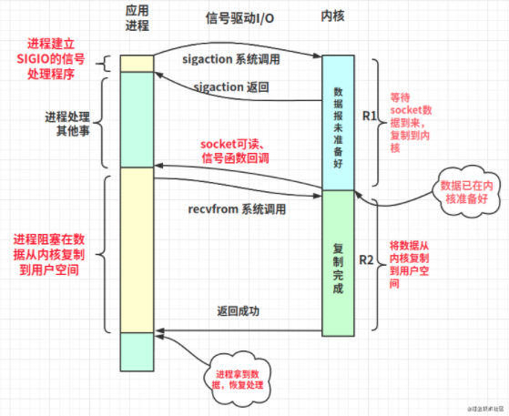

### 5、异步IO

如下图所示，应用程序完成系统调用后，就去处理其他事情了，一直等着内核通知数据”拷贝完成“（数据拷贝是内核进程完成的），二者属于异步IO。  
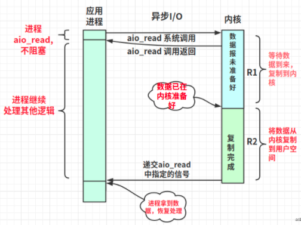

### 6、Proactor 和 Reactor

proactor和reactor是两种描述应用程序如何实现的架构设计，而不是网络模型。二者的区别：

  * proactor是基于异步IO的的网络模型，reactor是基于多路复用Io的网络模型；

  * Proactor不需要将数据从内核复制到用户空间，这一步是由系统完成的。

#### Reactor

reactor是基于多路复用IO的网络模型，他将应用程序侧的接收连接和数据copy工作分成不同的线程来处理，从而优化IO阻塞的问题。工作线程的数量不同可以分为以下两种模式：

  * 单线程+reactor：主线程负责接收连接，work线程负责处理请求；  
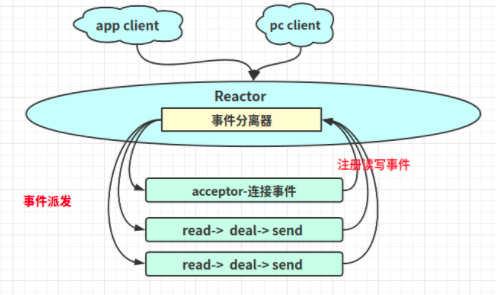

  * 多线程+reactor：主线程负责接收连接，每次从work线程池中取一个work来处理请求；  
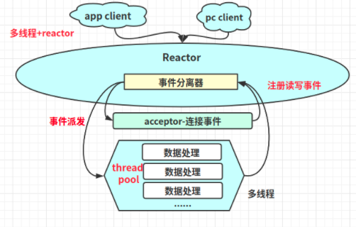

#### Proactor

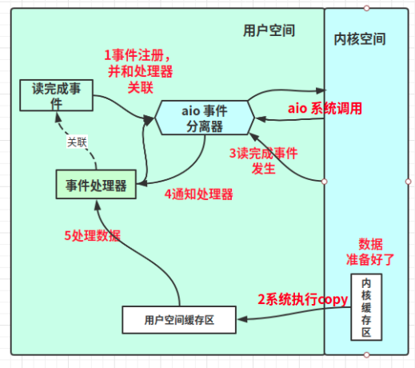


### 6、常见的几种网络模型实现

redis和nginx的网络模型都是epoll；  
brpc的网络模型也是epoll；  
Netty是基于NIO实现的，server端的流程图如下：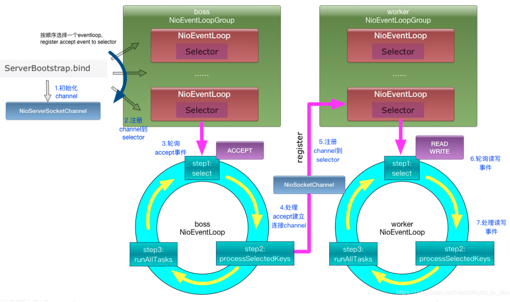  
Netty客户端的流程图：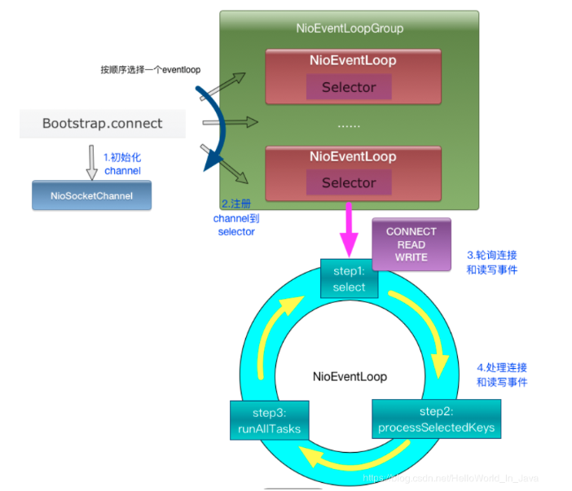

参考：  
<https://juejin.cn/post/6892687008552976398>
