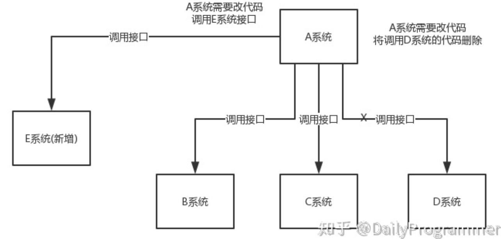
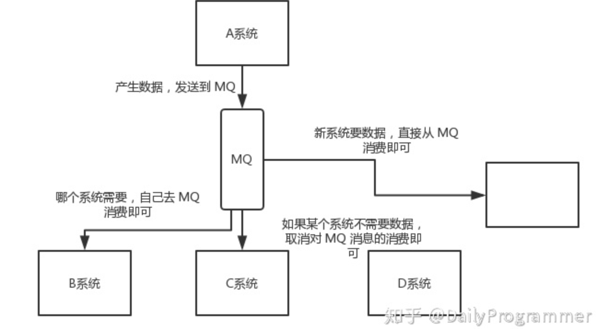
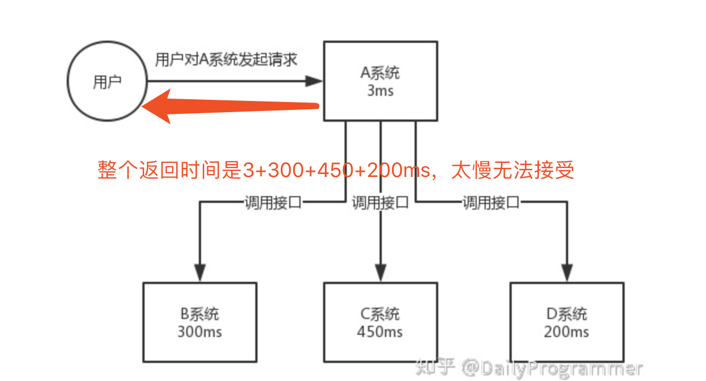
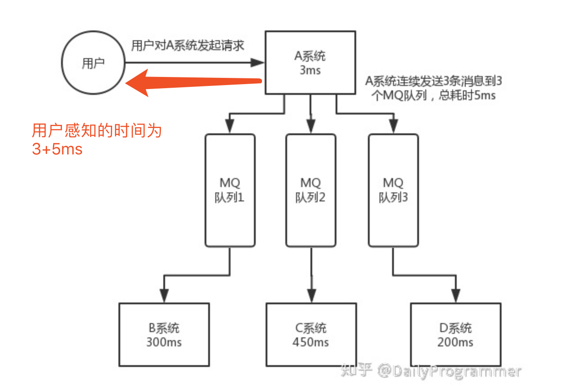
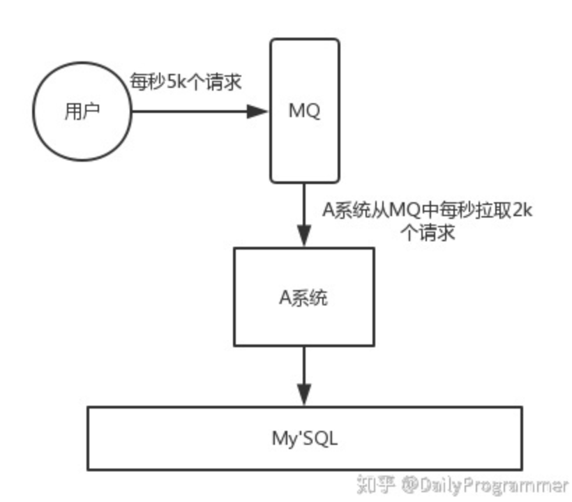

MQ的作用：解耦、异步、削峰  
常见的MQ有rocketMQ（阿里参照kafka设计思想用java实现的一套mq）、RabbitMQ、redis（本身支持MQ的功能）、kafka

### 解耦

  
比如A的信息需要同步给多个模块，一种实现是A中调用BCD甚至新加入的E的接口进行同步；如果同步的模块发生变化，A中逻辑就需要发生变化。用MQ实现为：A生产数据放入MQ，谁需要谁去消费；引入的问题是，需要保证MQ的高可用性。  

### 异步

对于比较耗时的操作，如下图：  
  
改为异步后，用户体验大幅度提升，但是也会引来不一致的问题，比如B模块操作完成，而C和D模块操作失败。  

### 削峰

用户请求暴增的情况下，可以用MQ起到一个缓冲的作用 。  

### redis和MQ的区别

redis多用于实时性较高的消息推送，但并不保证可靠（不保证不丢数据）。  
MQ保证可靠，但是会有一些延迟。
