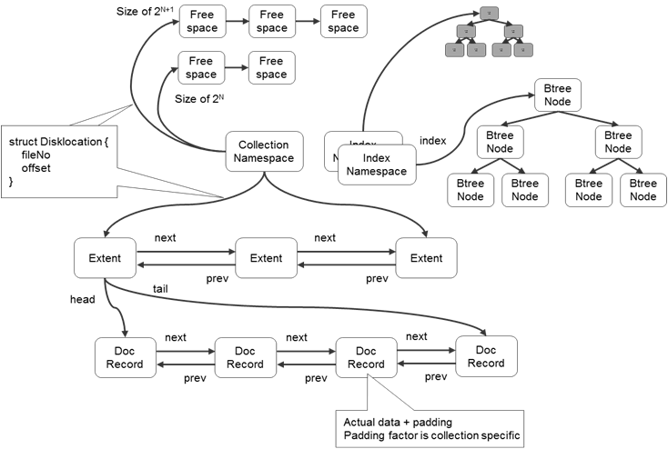
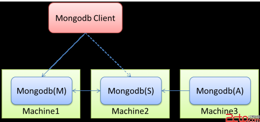
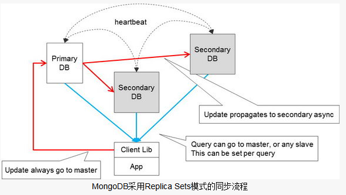
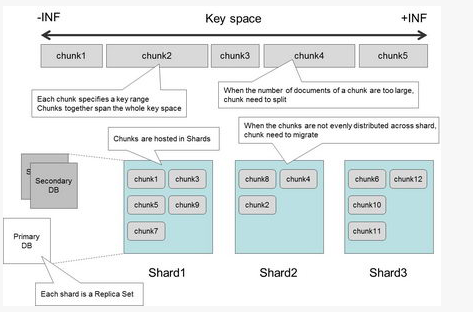
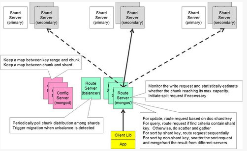
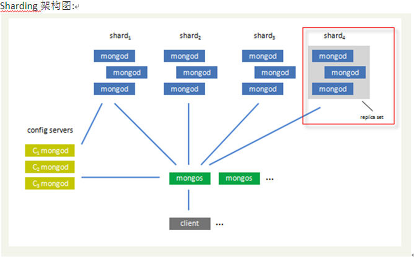

NoSql非关系型数据库，常见的集中NoSql数据库有MongoDB。提到数据库不可避免的提到CAP和ACID。ACID是关系型数据库  
CAP三要素只可以同时实现两点，不能兼顾三者，这三者是指：  
一致性consistency：什么时候访问的数据都是一致的。使用Nosql必须习惯于它的弱一致性。  
可用性availability：一般牺牲一致性来换取高可用性。  
分区容忍性partition tolerance：这一点是基本要求

（1）mongoDB的特点  
Mongodb是时下流行的NoSql数据库，特点是高性能、开源、无模式。特点有：

  * 面向集合存储，易存储对象类型的数据。
  * 模式自由。
  * 支持动态查询。
  * 支持完全索引，包含内部对象。
  * 支持查询。
  * 支持复制和故障恢复。
  * 使用高效的二进制数据存储，包括大型对象（如视频等）。
  * 自动处理碎片，以支持云计算层次的扩展性
  * 支持Python，PHP，Ruby，Java，C，C#，Javascript，Perl及C++语言的驱动程序，社区中也提供了对Erlang及.NET等平台的驱动程序。
  * 文件存储格式为BSON（一种JSON的扩展）。
  * 可通过网络访问。


（2）MongoDB内部存储空间的分配  
  
首先：mongoDB中数据是以collection为单位的，其实一个collection只存储一个名字空间（包括大小，块数，第一个块的位置，最后一个块的位置，被删除的块的信息，以及索引信息）。  
一个collection中的数据被划分为一个个的extent，extent之间是双向链表组织的。  
extent中保存的信息有：自己的位置，上一个extent以及下一个extent的位置，第一条以及最后一条doc的位置。  
doc之间也是用双向链表进行组织的。doc中存储的是一条条的数据。

（3）索引的组织  
数据库索引的方式有两种，一种是hash索引一种是Btree索引。  
hash索引不支持对部分索引键查询，以为它是对所有的字段组合取的hash。  
hash索引无法避免表扫描，因为有值相等的情况。  
hash索引遇到大量hash值相等的情况下，效率不比Btree高。  
hash索引只能满足相等，大于，小于的查询，不能进行范围的查询。

（4）内存映射MMAP  
MongoDB是通过内存映射的方式提高性能的，因此不要在32位的机器上使用mongodb。因为32位的机器的寻址空间为4G，其中1G被内核使用，0.5G被mongoDB的栈使用，因此数据空间只有2.5G。

（5）master-slaver方式  
  
Mongodb(M)表示主节点，Mongodb(S)表示备节点，Mongodb(A)表示仲裁节点。  
主备节点存储数据，仲裁节点不存储数据。客户端同时连接主节点与备节点，不连接仲裁节点。  
默认设置下，主节点提供所有增删查改服务，备节点不提供任何服务。但是可以通过设置使备节点提供查询服务，这样就可以减少主节点的压力，当客户端进行数据查询时，请求自动转到备节点上。这个设置叫做Read Preference Modes。  
仲裁节点是一种特殊的节点，它本身并没有不存储数据，主要的作用是决定哪一个备节点在主节点挂掉之后提升为主节点，所以客户端不需要连接此节点。这里虽然只有一个备节点，但是仍然需要一个仲裁节点来提升备节点级别。  
master——slaver同步的方式有：异步复制、强同步复制、以及半同步方式。异步复制是指master更新后，直接更新自己log，slaver自己同步，这种情况会出现丢信息的情况。强同步复制是指master先同步信息到slaver，全部同步成功后，再更新自己。半同步方式是指，只要成功同步的salver数目大于一个给定的值K后，master就可以同步信息到自己。

（6）replica sets  
  
红色箭头表示写操作可以写到Primary上，然后异步同步到多个Secondary上。  
蓝色箭头表示读操作可以从Primary或Secondary任意一个中读取。  
各个Primary与Secondary之间一直保持心跳同步检测，用于判断Replica Sets的状态。  
（7）chunk  
  
MongoDB的分片是指定一个分片key来进行，数据按范围分成不同的chunk，每个chunk的大小有限制。  
有多个分片节点保存这些chunk，每个节点保存一部分的chunk。  
每一个分片节点都是一个Replica Sets，这样保证数据的安全性。  
当一个chunk超过其限制的最大体积时，会分裂成两个小的chunk。  
当chunk在分片节点中分布不均衡时，会引发chunk迁移操作(move chunk)。

（8）sharding（分片）  
sharding是将一个大数据库按照一定规则拆分成多个小数据库的一门技术。常用的sharding方案有以下几种，  
按功能划分（垂直切分）  
将不同功能相关的表放到不同的数据库中，譬如将用户管理相关表放到shard 1上，将blog相关表放到shard 2上。。。这样做的好处是非常直观，当需要用户列表时，我就到shard 1上获取。。。。这样也有一个问题，当某一部分的功能其数据量或性能要求超出了可控的范围，我们就需要继续对其进行深入的sharding。  
按表中某一字段值的范围划分（水平切分）  
当伴随着某一个表的数据量越来越大，以至于不能承受的时候，就需要对她进行进一步的切分。一种选择是根据key的范围来做切分，譬如userID为1-10000的放到shard 10上，userID为10000到20000的放到shanrd 11上。。。这样的扩展就是可预见的。另一种是根据某一字段值得来划分，譬如根据用户名的首字母，如果是a-d，就属于shard 20，e-h就属于shard 21。。。这样做也存在不均衡性，当某个范围超出了shard所能承受的范围就需要继续切分。还有按日期切分等等，  
基于hash的切分  
类似于memcached的key hash算法，一开始确定切分数据库的个数，通过hash取模来决定使用哪台shard。这种方法能够平均的来分配数据，但是伴随着数据量的增大，需要进行扩展的时候，这种方式无法做到在线扩容。每增加节点的时候，就需要对hash算法重新运算，数据需要重新割接。  
基于路由表的切分  
前面的几种方式都是跟据应用的数据来决定操作的shard，基于路由表的切分是一种更加松散的方法。它单独维护一张路由表，根据用户的某一属性来查找路由表决定使用哪个shard，这种方式是一种更加通用的方案。譬如我们在系统中维护一张表-（用户所属省-〉shard），这样每个用户我们知道是哪个省的，去路由表查找，就知道它所在的shard。因为每次数据操作的时候都需要进行路由的查找，所以将这些内容存储到一台独立cache上是一个非常好的方式，譬如memcached。这种切分的方式同时也带来了另一个好处，当需要增加shard的时候，可以在不影响在线应用的情况下来执行，当然这也跟应用程序的架构设计相关，你的设计必须适用这种增加。  
虽然应用sharding会带来显而易见的好处，但是它也有一些固有的问题需要我们了解，这些问题大致分成以下几类，  
1。shard的扩容  
当当前的shard已经不能适用当前的应用需求时，就需要对shard数据库进行扩容，增加shard意味着需要对原有的shard数据进行迁移，这个过程是非常复杂，而且可能会导致数据的不一致（一边写、一边迁移）或者其他应用问题，因此扩容一般选择在凌晨等时间进行。  
2。联合多个shard的表数据查询  
这个是shard固有的问题，当遇到这样的问题时，你需要获取各个shard的数据，然后对这些数据进行汇总，很多时候因为现在的网络速度比较发达这个问题可以几乎被忽略掉。但是如果要进行数据的分析或挖掘，shard就会存在问题，通常面对这种对于数据要求不是那么实时的情况下，可以采用将shard数据同步到汇总数据库的方案，olap可以在这台汇总数据库上进行，这就需要在每台shard上进行数据的定时同步，这增加了程序的复杂性；如果要求实时的情况下，采用sharding方案会是一个毁灭性打击。  
3。其他  
我们现在做的系统就是采用的按照路由表切分的sharding方案，而且我们需要要求不是那么实时的汇总数据以提供数据的分析和挖掘，同时我们的基础数据都是在汇总数据库中进行管理，通过oracle的高级复制到shard节点上。在shard数据库向汇总数据库同步数据的时候，我们是通过oracle数据库的存储过程实现的，这种架构方式导致了数据库非常的复杂，同时还存在了一些其他问题，譬如同步会无缘无故的断掉。。。这就需要采用一些其他手段来维持数据的延迟一致性。  
(9) mongos  
  
mongos是路由节点，客户端通过mongos来进行读写。  
config服务器保存了两个映射关系，一个是key值的区间对应哪一个chunk的映射关系，另一个是chunk存在哪一个分片节点的映射关系。  
路由节点通过config服务器获取数据信息，通过这些信息，找到真正存放数据的分片节点进行对应操作。  
路由节点还会在写操作时判断当前chunk是否超出限定大小。如果超出，就分列成两个chunk。  
对于按分片key进行的查询和update操作来说，路由节点会查到具体的chunk然后再进行相关的工作。  
对于不按分片key进行的查询和update操作来说，mongos会对所有下属节点发送请求然后再对返回结果进行合并。  
（10）具体的例子：  
  
(11) mongodb的安全权限设置  
mongodb默认是没有用户名和口令的,启动后,可以直接用mongoDB连接,并且对所有的库具有root权限,为了安全,必须给其设置用户名和口令.  
只需要再启动的时候,指定auth参数.就可以阻止客户端的访问和连接,如下
    
    
    ```bash
    eg.>mongod -auth --dbpath=../data --logpath=../logs/mongodb.logs
    想要登录验证模块生效,必须在admin库中添加一个用户,同时要指定auth参数.
    D:\program files\mongo\bin>mongo
    MongoDB shell version: 1.8.1
    connecting to: test
    ]]
    >
     use admin
    switched to db admin
    > db.addUser("root","root123");
    {
            "user" : "root",
            "readOnly" : false,
            "pwd" : "81c5bca573e01b632d18a459c6cec418"
    }
    > db.auth("root","root123");
    1
    >
    ```

此时建立了系统root用户.  
也可以对某个特定的数据库设置用户,这样权限的细粒度划分,也方便进行用户管理.  
注意:建立指定权限的用户只能用系统用户来操作.
