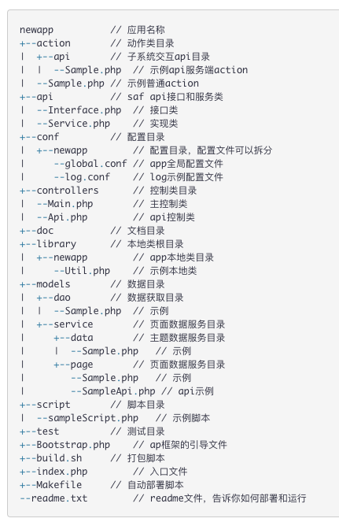
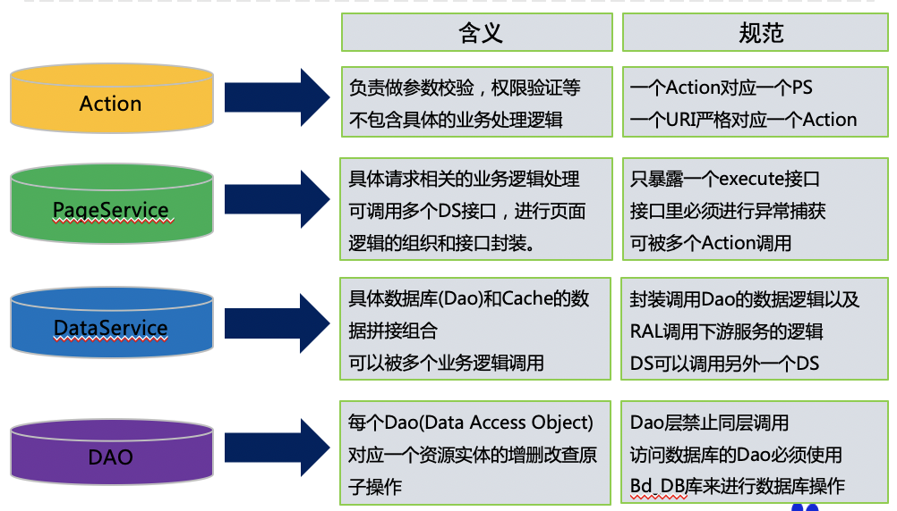
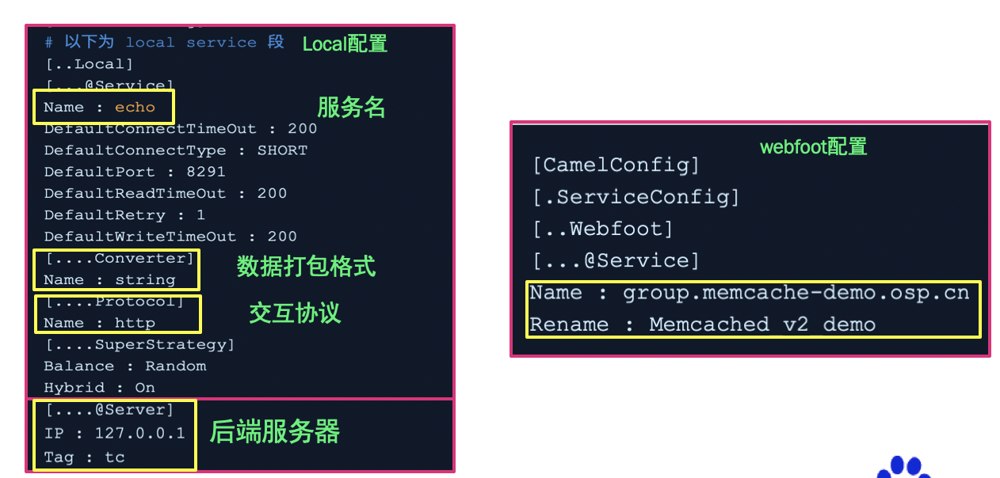
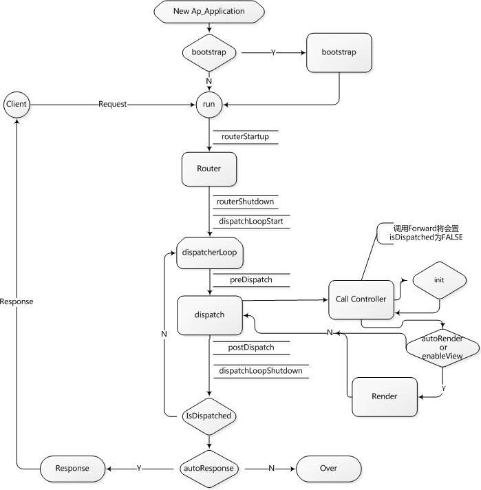
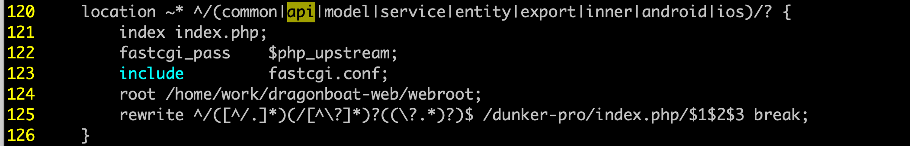
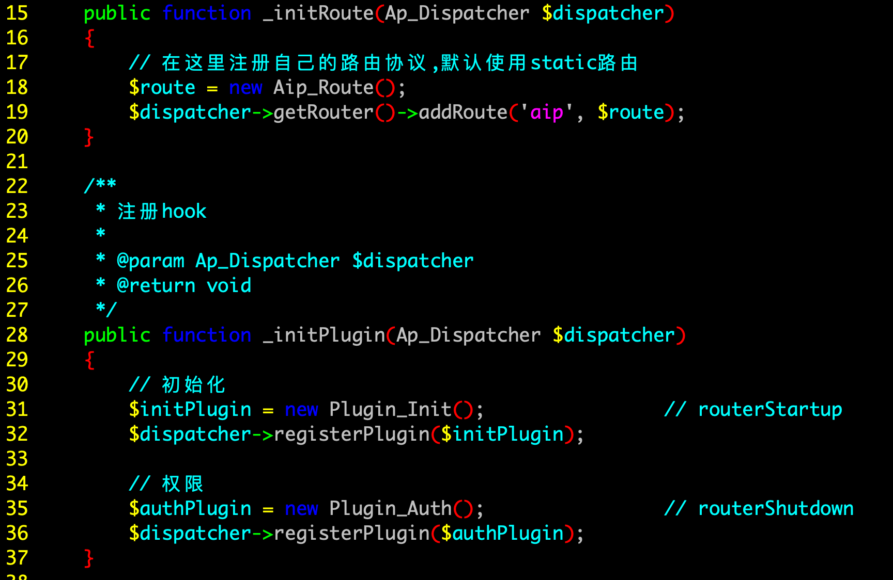
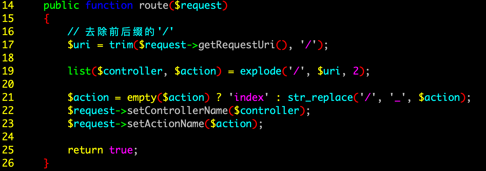
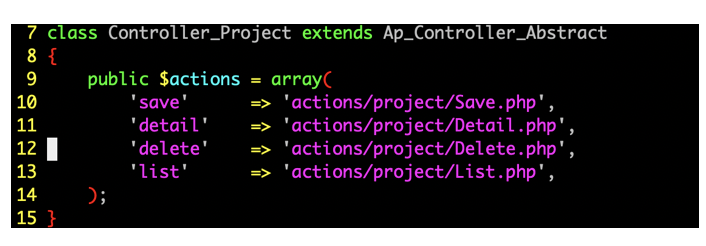
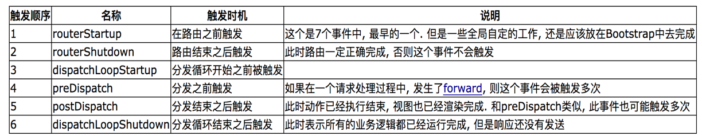
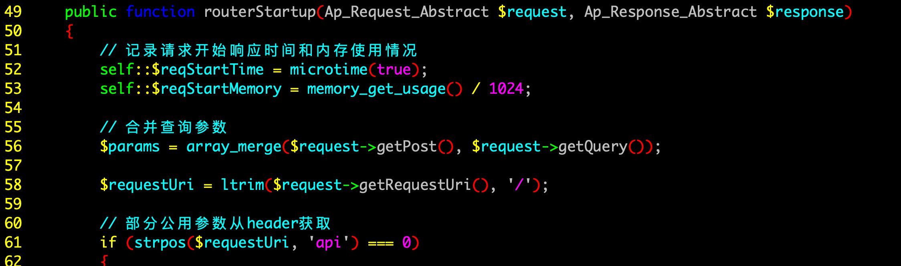

从使用上看，Odp框架和其他的php或者web框架项目比如django框架相比，规范比较严格，比如有严格的目录要求，类名和目录名要对应。

#### 1、odp项目的主要目录结构

  * app：应用程序目录，存放置产品线业务（app）代码；
  * conf：配置文件目录，包括app的配置、db的配置等, 比如代码中的auth.conf, bos.conf, db.conf；
  * log：odp运行环境中产生的日志，包括webserver日志、app日志、ral日志等
  * data：放置组件和app生成的本机数据、缓存等
  * bin：ODP的插件的执行命令。包括php，pcheck，ptest等
  * install：ODP组件安装信息存储目录。ocm命令读取的即为该目录中的信息;
  * php：php安装后所在的目录。php目录中的phplib目录为公共库目录，存放ODP和产品线的公共库；
  * template：用于存放php的页面模板；
  * webroot：默认的web文档目录，用于存放静态文件以及每个app的index.php
  * webserver：web服务的安装目录，支持lighttpd以及nginx；

Php-cgi 就是解析php脚本的程序而已， 作用和HHVM一样；  
Php-fpm是实现fastcgi协议的的进程管理器，有一个master和多个work，是一个进程管理池，用来处理web的请求；

#### 2、app项目基本的目录结构如下：

Odp框架app目录下的业务代码需要按照业务层规范来开发，Odp框架属于mvc框架，业务层粗略的可以分为controller，action、 model，controller是很薄的一层；action主要处理参数校验以及权限验证等；model层相比其他的框架划分的更细，下又分为 Pageservice、 dataservice以及dao层；

  * Action的类名：必须以大写的Action开头，继承自Ap_Action_Abstract，命名方式为驼峰， 下面只有execute方法。Action层一般会调用PS层的类，来做后续的处理。
  * model目录下有dao和service， service下又分为pageService和dataService；
  * 一个PageService层可对应多个Action,而一个Action则只能对应一个PageService。PageService层是唯一可以和action直接交互的，具体的数据处理逻辑应该在PageService层进行处理。pageService层和dataService层进行交互；
  * DataService层并不是和DB层直接交互，而是作为数据库操作的一个封装，并将数据库中需要处理的数据进行一个与Dao层需要的参数格式一致的一个处理，并处理dao层返回的失败或成功信息。
  * Dao层是直接和数据库进行交互；

综上可得数据的流向为： action -> pageService-> dataService-> Dao-> DB，然后一层层向上级返回信息，最后还是在action层中返回信息。  

#### 3、ral组件

服务除了访问mysql等数据库之外，还可能调用后端的服务，交互协议可能是http或者rpc，数据传输协议可能是string或者mcpack之类的；RAL组件就是ODP的资源访问层，实现了通过添加配置的方式就做到对后端服务端交互的支持;后端服务可以定义为IP或者bns group的形式；

  * RAL组件的服务配置支持local和webfoot等方式
  * 方便：添加相关配置即可实现与后端服务的交互
  * 支持并发调用和异步接口、支持负载均衡、健康检查等

#### 4、AP框架的流程

Odp框架的底层是ap框架，一个用户请求到来，首先会经过nginx转发，然后转交到ap框架；Ap框架的处理流程还原了一个请求在整个业务系统中执行的完整流程；  
Ap框架规定类名中必须包含路径信息，也就是以下划线分割的目录信息。Ap将依照类名中的目录信息，完成类的自动加载，而不需要通过include与require语句载入类的具体实现的文件。  
odp框架禁止添加include和require语句，所有的类都通过ap框架来加载，load一个类的方式是：类名按照_分割成路径，然后按照路径完成加载；  
ap目录映射规则（加载类的规则）  
数据模型的类寻址目录是从model开始的，比如Service_Page_A的目录的地址映射路径为：  
`{项目目录}/models/service/page/Sample.php`  

Ap框架首先会初始化一个ap_application的对象，然后先去读取app目录下每个app中的Bootstrap.php文件，做app初始化的工作。Bootstrap.php文件是Ap提供的一个全局配置的入口, 可以做很多全局自定义的工作。比如路由的定义，插件的定义等；  
run方法主要包括两部分，一部分是路由功能Router，一部分是分发功能dispatch；Ap的Router模块的主要功能是从中解析出model、Controller以及Action信息。

odp框架默认的路由协议Ap_Route_Static, 就是分析请求中的request_uri,在去除掉base_uri以后, 获取到真正的负载路由信息的request_uri片段,具体的策略是, 根据”/“对request_uri分段,依次得到Module,Controller,Action, 在得到Module以后,还需要根据Ap_Application::$modules来判断Module是否是合法的Module，如果不是，则认为Module并没有体现在request_uri中，而把原Module当做Controller,原Controller当做Action。”  
ap框架默认的model和controller为index；controller中会记录所有的actions的地址，action为真正的业务入口，通过调用action的execute方法调用底层的业务逻辑。

#### 4、下面以/api/project/list为例结合代码说明具体的流程；

一个请求到来后，先经过nginx的rewrite规则进行转发，转发规则如下：

可以看到请求转发到 /dunker-pro/index.php 文件；

Index.php入口文件中这两行的意义：  

Bd_Init::init（）方法中会new一个Ap_application的类，并返回Ap_application是ap框架的核心类；  
第二句是调用了Ap_application的boostrap和run方法；

boostrap方法主要是找到Boostrap.php文件并执行一系列的init方法；  
duncker_pro目录的Boostrap文件内容如下：

首先路由是使用的aip_router，自定义的路由如下：

规则为：干掉结尾的/, 将uri分为controller和action; action默认为index，其中如果有/替换为”_“作为真正的action；controller层只做action的转发；action中通过执行execute方法调用底层的业务逻辑，处理完成后将结果返回；

#### 5、ap插件

AP插件会触发以下的几个hook函数：  
  
插件Init中实现了routerStartUp方法，主要功能是初始化、参数格式化和打印URI请求日志（URI、开始时间、当前内存占用）。  

dispatchLoopShutdown方法，主要功能是打印日志，包括URI、耗时、内存占用；  

