### 1、redis为什么快

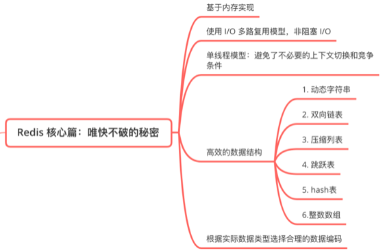  
Redis的qps可以达到10w/s，Redis将数据存储在内存中，读写操作不会因为磁盘的IO速度限制。基于内存的数据库和基于内存的数据库的区别：

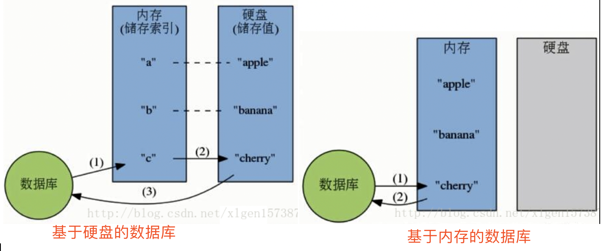

Redis是单进程单线程模型的kv数据库，由c语言编写，不比单进程多线程的基于内存的KV数据库memcached差。

  * Redis 6.0（redis的当前稳定版本：6.6）之后，开始支持使用多线程，可以通过设置进行设置，但默认是关闭的；
  * 以前的版本的“单线程”(4.0之后)并非指所有的操作只有一个线程处理，而是处理用户请求的线程只有一个，像数据持久化等会有其他的线程处理;
  * 高效的数据结构（后面会单独介绍）；
  * redis一直使用单线程的官方回答：cpu不是制约性能的原因，它受限于内存和网络；
  * redis的网络模型是epoll；


### 2、redis的数据结构

redis命令不区分大小写，但redis的key值区分大小写的。

  * string  
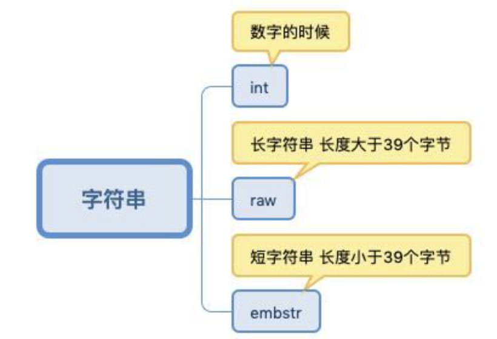


其中: embstr和raw都是由SDS动态字符串构成的。SDS结构ruxiatu :  
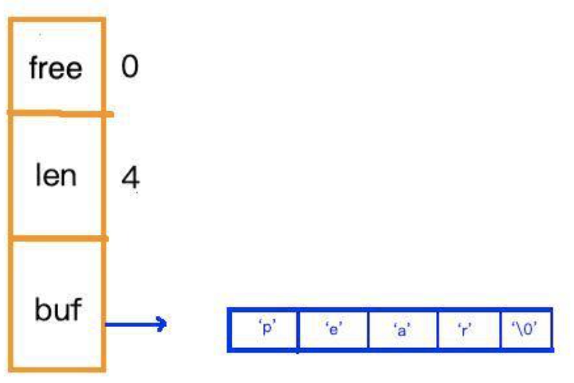
    
    
    ```plain
    127.0.0.1:6389> set name "test"
    OK
    127.0.0.1:6389> get name
    "test"
    127.0.0.1:6389> set age 11
    OK
    127.0.0.1:6389> get age
    "11"
    127.0.0.1:6389> incr age  (incr 是原子操作，如果两个client同时操作，不需要考虑锁的问题，因此常用来做统计)
    (integer) 12
    127.0.0.1:6389> get age
    "12"
    ```

  * list  
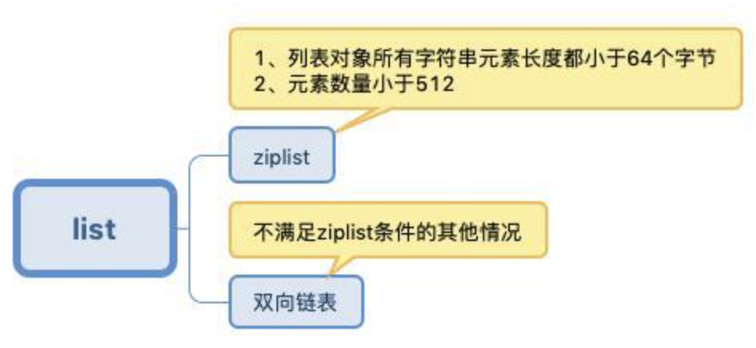  
ziplist为连续的字节数组，每个元素的长度不同，结构如下。  
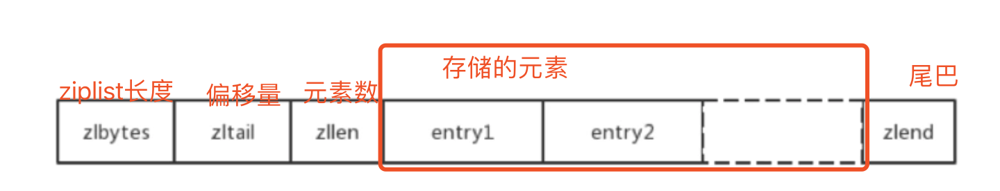  
元素的结构为：  
  
quicklist是将ziplist和双向链表融合。  
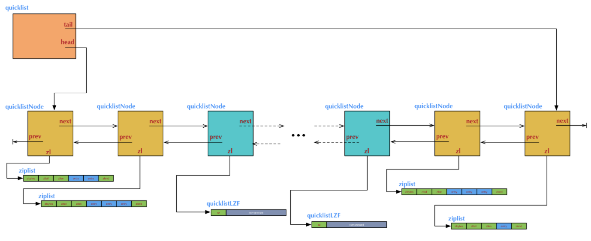


    
    
    ```plain
    127.0.0.1:6389> lpush mylist 1
    (integer) 1
    127.0.0.1:6389> lpush mylist "a"
    (integer) 2
    127.0.0.1:6389> lrange mylist 0 -1
    1) "a"
    2) "1"
    127.0.0.1:6389> rpush mylist "b"
    (integer) 3
    127.0.0.1:6389> lrange mylist 0 -1 （这个特性用来做翻页很方便）
    1) "a"
    2) "1"
    3) “b"
    #list在实现上是链表，所以lpush和rpush在效率上是一致的，这样产生的弊端是元素的定位会慢一些；
    #list可以用来做消息队列，也可以用来存储博客或者商品的评论
    ```

  * set  
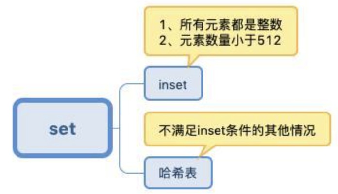  
用hashtable实现时候，不关注value值。


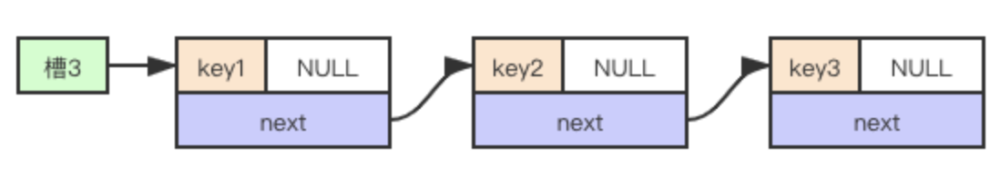
    
    
    ```plain
    127.0.0.1:6389> sadd myset "tooe"
    (integer) 1
    127.0.0.1:6389> sadd myset "one"
    (integer) 1
    127.0.0.1:6389> SMEMBERS myset
    1) "tooe"
    2) "one"
    127.0.0.1:6389> SISMEMBER myset "one"
    (integer) 1
    127.0.0.1:6389> sadd myset2 1
    (integer) 1
    127.0.0.1:6389> sadd myset2 2
    (integer) 1
    127.0.0.1:6389> SUNION myset myset2
    1) "2"
    2) "1"
    3) "tooe"
    4) “one"
    # set 可以用来保存标签等信息
    ```

  * zset  
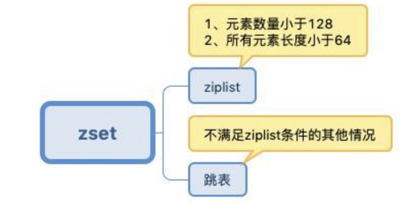  
跳表是拿空间换时间，来优化链表的查询效率。  
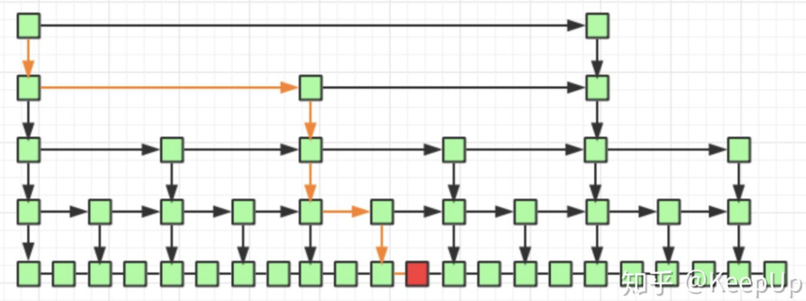


    
    
    ```plain
    127.0.0.1:6389> zadd myzset 1 baidu.com
    (integer) 1
    127.0.0.1:6389> zadd myzset 2 360.com
    (integer) 1
    127.0.0.1:6389> zadd myzset 3 yahoo.com
    (integer) 1
    127.0.0.1:6389> ZRANGE myzset 0 -1 WITHSCORES
    1) "baidu.com"
    2) "1"
    3) "360.com"
    4) "2"
    5) "yahoo.com"
    6) “3"
    # 有序集合，比如用来存url的评分
    ```

  * hash  
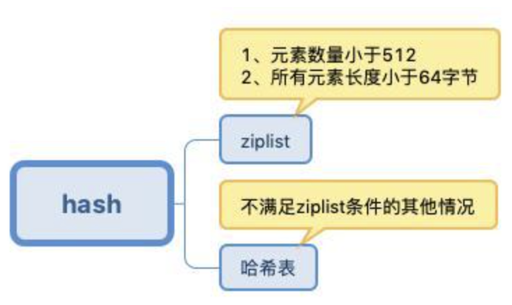


redis中的hash在不满足ziplist的时候使用hashtable实现的。  
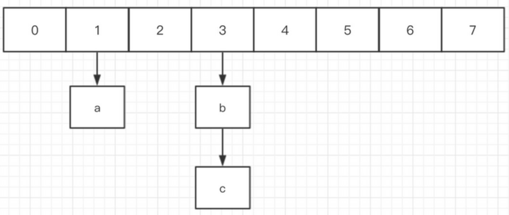  
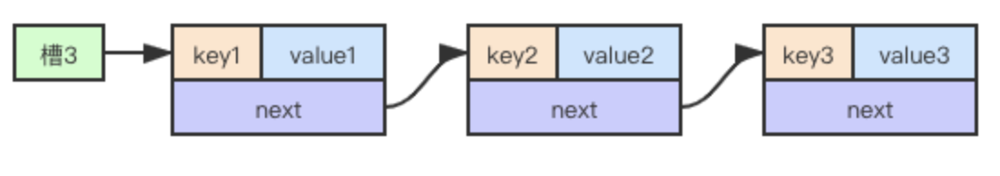  
这类结构容易存在扩容的问题，redis用rehash来解决；即当hashtable中的元素个数大于数组长度时，就开始搬迁到h[1]，完成后，删除旧的。rehash的过程会插入到每次的插入、删除等操作中。  
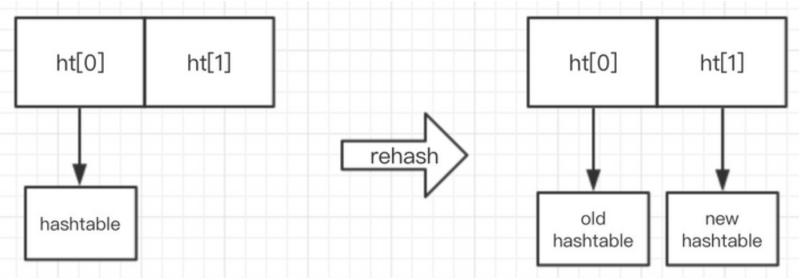
    
    
    ```plain
    127.0.0.1:6389> HMSET user:001 username aa passwd bb age 23
    OK
    127.0.0.1:6389> HGETALL user:001
    1) "username"
    2) "aa"
    3) "passwd"
    4) "bb"
    5) "age"
    6) "23"
    127.0.0.1:6389> HSET user:001 age 34
    (integer) 0
    127.0.0.1:6389> HGET user:001 age
    "34"
    ```

### 3、redis集群

#### 主从架构（一主二从）

单机的redis的qps最高只能达到10w+，如果要提高并发，可以使用集群；一主多从的支持10w+且支持水平扩容的，读写分离架构图：  
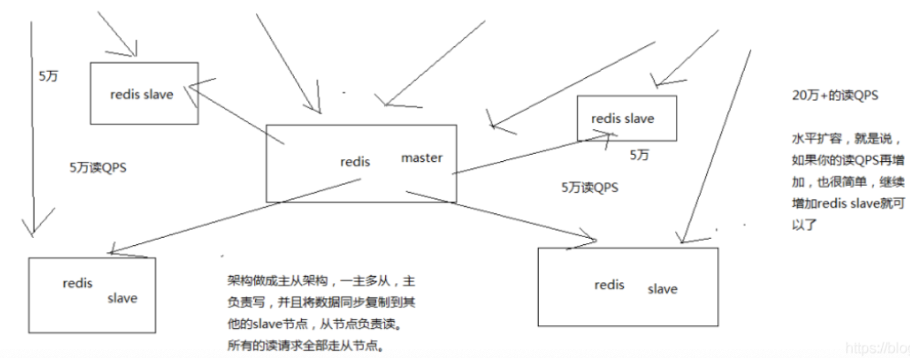

  * mater node一定要做数据持久化，并且冷备方案也要做；
  * slave node 做复制的时候不会block对自己的查询操作；它会用旧的数据集来提供服务，但是复制完成，删除旧的数据集，加载新的数据集时会暂停对外服务；
  * slave node 做复制时不会block master的正常工作；
  * master和slave数据同步支持断点续传；
  * slave node 用来做横向扩容，提供吞吐量；
  * slave不会处理过期key，由master删除过期的key，然后同步del给slave；（slave也会scan过期的key进行处理）
  * 主从数据复制有全量和部分两种方式，在redis2.8之前，每次slave启动，都会做数据的全量复制；在redis2.8之后，每次slave会传runid和offset，如果master发现runid和自己的runid一致且偏移量在缓存范围内，则执行部分复制；
  * 主从会相互发送heartbeat信息，master默认是10s发送一次，slave是1秒发送一次；
  * master向slave未同步完信息，直接down机会导致主从复制信息的丢失。
  * masterdown机后，会先根据最后同步时间过滤掉很久未同步的slave，然后优先选优先级最高的slave，其实是offset最大的slave，最终由投票选出slave升级为master


#### 哨兵机制（一主二从三哨兵）

单个slave挂掉不影响系统稳定性，如果master挂掉整个redis集群会down掉，解决方式是：哨兵机制sentinal；  
哨兵是一个独立的进程，监控多个redis实例；当master挂掉后会选举出一个新的master；当一个slave挂掉后会通知客户端；  
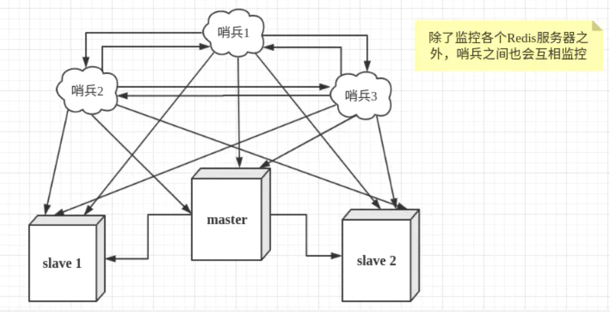  
单个哨兵并不可靠，通常会设置三个哨兵；这样保证一个哨兵挂掉后还能进行redis的监控和主备切换；  
哨兵 + redis 主从的部署架构，是不会保证数据零丢失的，只能保证 redis 集群的高可用性。  
**脑裂** （master的假down机导致的）：  
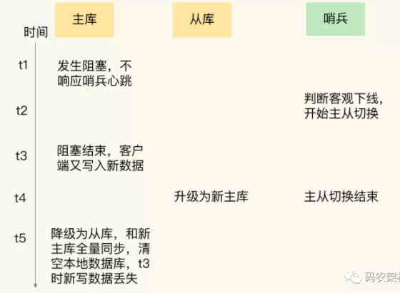  
解决方式是redis提供的两个配置，一方面组织客户端写入，一方面阻止新master的产生：  
min-slaves-to-write：这个配置项设置了主库能进行数据同步的最少从库数量；如果master和slave断开，他会拒绝客户端的写入请求；  
min-slaves-max-lag：这个配置项设置了主从库间进行数据复制时，从库给主库发送ACK消息的最大延迟（以秒为单位）。

客户端通过sentinel来连接redis，如下：
    
    
    ```plain
    from redis.sentinel import Sentinel
    
    def get_redis_conn_instance(self):
        conf = {
            'sentinel': [('10.153.225.21', 26379), ('10.153.224.16', 26379)],
            'master_group_name': 'mymaster',
            'connection_conf': {
                'socket_timeout': self.__conn_timeout,
                'retry_on_timeout': True,
                'socket_keepalive': True,
                'max_connections': 100,
                'db': 0,
                'encoding': 'UTF-8',
                'decode_responses': True,
            }
        }
        sentinel = Sentinel(conf['sentinel'], **conf['connection_conf'])    sentinel.discover_master(conf['master_group_name'])
        redis_conn = sentinel.master_for(conf['master_group_name'])
        
        try:
            redis_conn.ping()  # 测试redis是否可达
            self.__redis_conn = redis_conn
            return True
        except redis.exceptions.ConnectionError:
            logging.exception("can not connection redis!")
            return False
    ```

#### redis cluster

主从架构只是解决了qps的问题，没有解决大的数据量的问题。主从架构的限制是master内存的大小。如果需要存储1T的数据，就需要对master进行扩容。即redis cluster: redis cluster = 多 master + 多slave + 高可用

  * 主从架构：如果数据量很少，主要是承载高并发高性能的场景，比如缓存一般就几个G；
  * redis cluster: 主要是针对海量数据+高并发+高可用的场景，比如海量数据；


redis cluster采用无中心的架构，每个节点保存部分数据和整个集群状态,每个节点都和其他所有节点连接。节点之间通讯采用gossip协议。  
  
redis cluster采用的虚拟槽分区算法将数据分割到不同的节点。  
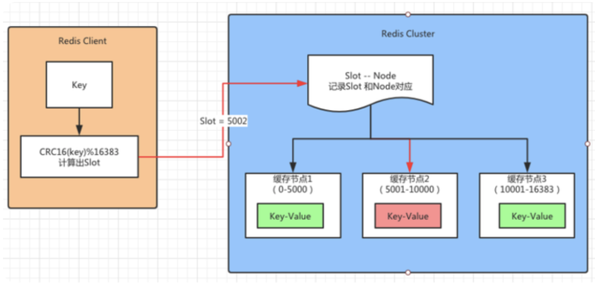

上图所示，假设有三个缓存节点分别是 1、2、3。Redis Cluster 将存放缓存数据的槽（Slot）分别放入这三个节点中：

  * 缓存节点1存放的是（0-5000）Slot 的数据
  * 缓存节点2存放的是（5001-10000）Slot 的数据
  * 缓存节点3存放的是（10000-16383）Slot 的数据


Redis Client需要根据一个 Key 获取对应的 Value 的数据的流程：

  * 首先通过 CRC16(key)%16383 计算出Slot的值，假设计算的结果是5002。
  * 将这个数据传送给 Redis Cluster，集群接收到以后会到一个对照表中查找这个 Slot=5002 属于那个缓存节点。
  * 发现属于“缓存节点 2”，于是顺着红线的方向调用缓存节点 2 中存放的 Key-Value 的内容并且返回给 Redis Client。


cluster中的每个节点与其他节点通信时，会带上自己的节点信息和其他的节点信息。  
每个节点用bit的数组保存自己管理的槽信息，如下图，如果为1则表示节点保存该槽位信息。  
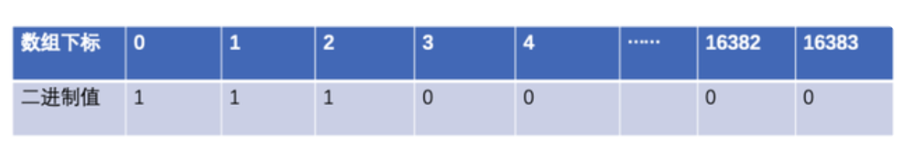  
每个节点会保存一个clusterState结构来存储群居的节点信息：  
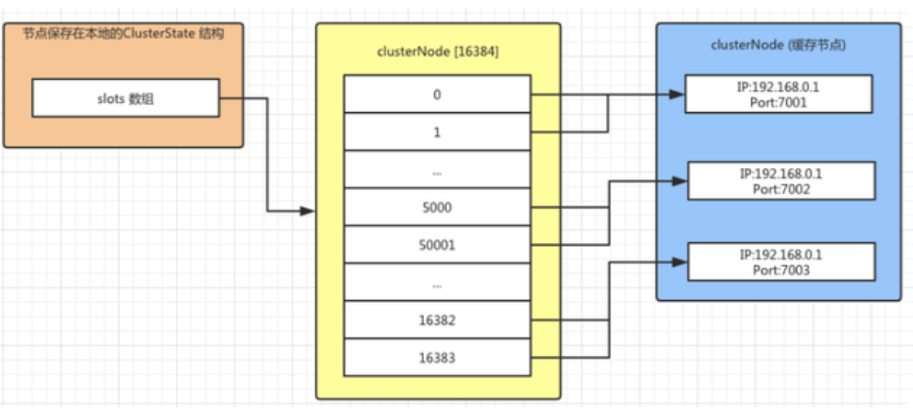

  * 在redis cluster集群中，salve节点不再提供读操作，读写都由master完成，slave节点仅仅为了提高可用性。
  * 如果cluster master下的某个master没有了slave ，其他master中有多余的slave 的话，集群会自动slave迁移，这在生产环境中，适当的添加冗余的slave 实例，可以很大程度上提高集群的高可用性。
  * 集群是去中心化的，任意一个master都可以对外提供读写操作；
  * 集群无法保证强一致性；


redis cluster的缺点：

  * redis cluster 只是用db0；
  * 对于mset、mget等mutl-key操作以及对事务的支持只能在一个slot上完场，即使同一个节点的多个slot之间也不能支持。
  * 不能将一个很大的键映射到多个slot；
  * master-slave架构只能是单层，不能是树形状；

#### redis cluster proxy

redis cluster proxy 是 redis 6.0新出现的集群代理。这个是独立于redis项目的。作用：
  * 解决了跨节点mset，mget的问题。
  * 自动路由，屏蔽master、slave的详细信息；


#### 集群中遇到的问题

  * fork进程导致高并发请求延迟: 控制redis的内存在10G以内
  * aof阻塞问题：优化硬盘写入速度，比如用SSD
  * 主从复制延迟问题：写监控脚本，超时就报警
  * 主从复制风暴问题：master-slave不用星状结构，用树状结构；


### 4、redis持久化

#### 为什么要持久化

redis持久化的意义在于故障恢复。  
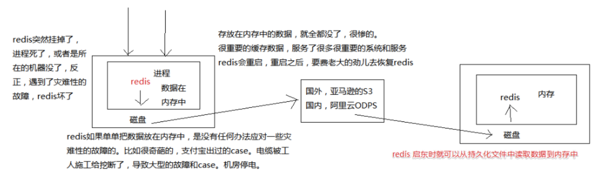  
redis有两种持久化备份的机制，RDB和AOF。

#### RDB

RDB是每隔几分钟，生成一份完整的快照。

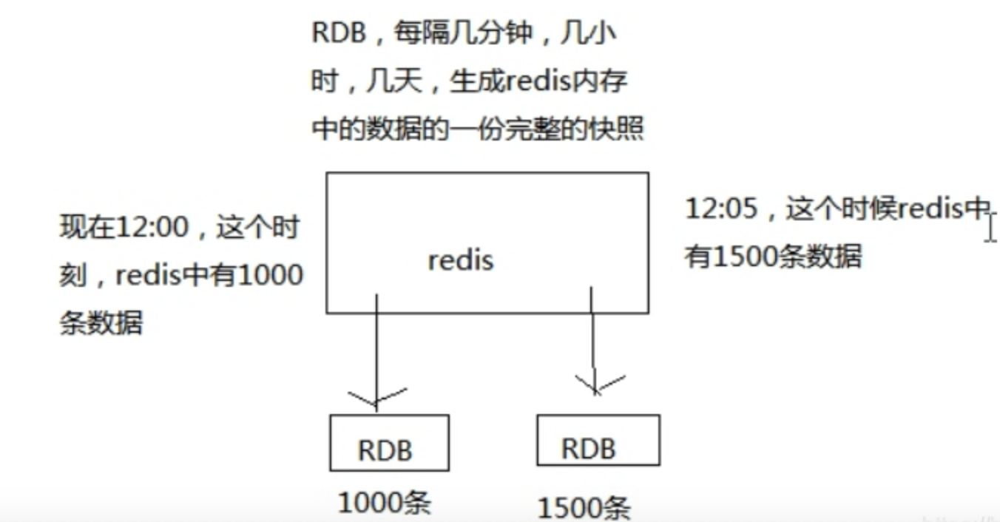  
RDB的优点：

  * 适合做冷备；
  * 性能影响小，只需要主进程fork一个子进程定时做RDB持久化即可；
  * 数据恢复快（相对于AOF），RDB直接将数据加载进内存即可；  
缺点：
  * 故障时，丢的数据多。比如5分钟存一次，那最近五分钟的数据都会丢失；

#### AOF

AOF是每条写入命令作为日志更新到AOF文件中。每隔一秒会强制将os cache中的数据刷入到磁盘；  
AOF默认是关闭的，对应的配置在“append only mode”区，需要将appendonly改为yes;  
appendfsync为always虽然能保证不丢数据，但性能及差；通常设置为 everysec（单机可以达到上万qps）；  
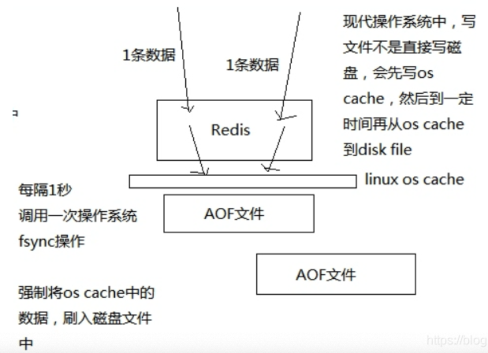  
由于AOF存放的是每条写入命令，所以会不断膨胀，当达到一定的大小时，会执行rewrite操作:即基于当前的redis内存，重新构造一个更小的aof文件，然后删除旧的aof文件。rewrite相关的配置：
  * auto-aof-rewrite-percentage: 增长百分比，比上一次增长多少内容的时候就会触发rewrite操作；
  * auto-aof-rewrite-min-size：超过该大小才会执 rewrite操作;  
AOF的优点：
  * 故障时数据丢的少
  * AOF是append-only模式，数据丢的少  
缺点：
  * 文件很大且只有一个，需要自己手动做备份；
  * 性能稍低，因为AOF会是每秒fsync一次日志文件，会对性能造成影响。
  * 数据恢复较慢，要一条条的执行命令；

#### 实操

两种持久化机制都会将数据存到磁盘上，还应该定时将数据备份到别的地方，比如阿里云，boss等云服务。  
如果同时使用RDB和AOF，在redis重启时，会优先使用AOF来重新构造数据。  
一般来说都是用RDB做冷备，用AOF防止数据丢失；  
企业的数据备份方案：写crontab定时调度脚本去做数据备份：
  * 小时级：每小时都copy一份rdb的备份，到一个目录中去，仅仅保留最近 48 小时的备份；
  * 日级：每天都保留一份当日的 rdb 的备份，到一个目录中去，仅仅保留最近 1 个月的备份；
  * 每天晚上将当前服务器上所有的数据备份，发送一份到远程的云服务上去；

### 5、redis过期策略

redis是基于内存的，内存有限制，所以会在数据达到一定的量之后将数据进行清理。
  * volatile-lru：设置了过期时间的key使用LRU算法淘汰；
  * allkeys-lru：所有key使用LRU算法淘汰；
  * volatile-lfu：设置了过期时间的key使用LFU算法淘汰；
  * allkeys-lfu：所有key使用LFU算法淘汰；
  * volatile-random：设置了过期时间的key使用随机淘汰；
  * allkeys-random：所有key使用随机淘汰；
  * volatile-ttl：设置了过期时间的key根据过期时间淘汰，越早过期越早淘汰；
  * noeviction：默认策略，当内存达到设置的最大值时，所有申请内存的操作都会报错(如set,lpush等)，只读操作如get命令可以正常执行；


redis中的lru是近似的，即随机选取N（5）个，从中选取访问时间最早的。

除了内存满的情况，redis的key过期也需要被清理。已过期未被访问的数据仍保持在内存中，消耗内存资源；

  * 惰性删除：当key被访问时检查该key的过期时间，若已过期则删除；
  * 定期删除：每隔一段时间，随机检查设置了过期的key并删除已过期的key；维护定时器消耗CPU资源；
  * 在RDB和AOF持久化中都不会将过期的key带入持久化文件；

### 6、redis多线程

#### redis单线程处理流程

  * 用户提交命令；
  * 主线程获取socket；
  * 主线程读取socket；
  * 主线程解析并执行用户命令；
  * 主线程回写socket；
  * 用户获取响应数据；  
cpu处理是不耗费时间的，瓶颈在内存和网络IO：即主要耗时在主线程读取和回写socket；

#### redis开始支持多线程的原因

  * redis的单线程可以达到8w-10w的qps，但有些场景下有上亿的交易量，qps要求更高；
  * 常规的做法是利用分布式的架构进行数据分区，但这种方案的缺点是管理的redis服务器太多，维护成本大；
  * redis因为是单线程，同一时刻只有一个线程在执行，耗时的操作会导致读写并发的下降；
  * 分析redis的耗时，只要在网络IO上（cpu的耗时很低，不是瓶颈），提高网络IO，最简单的方式是多线程：即由多个IO线程来分摊redis同步IO的负荷；  
官方建议线程数要小于内核数量，比如4核机器设置2-3个线程，一旦超过8个线程，意义就已经不大；


#### redis多线程的流程图

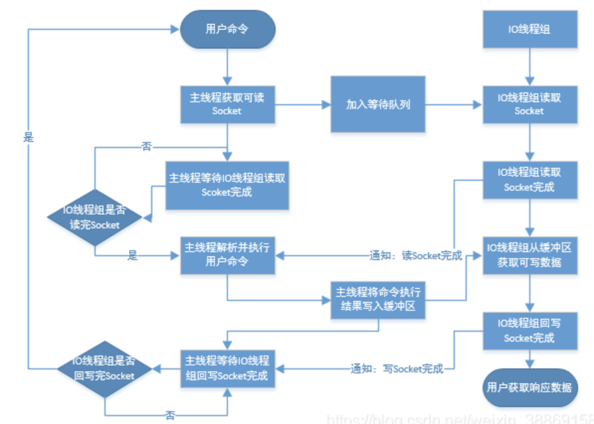

  * 多线程是指一个主线程和多个IO线程；
  * IO线程只负责socket数据的读写；一个线程要么是在读，要么是在写，不会既读又写；
  * IO线程可以发挥多核的优势；
  * 命令的执行还是由主线程执行，因此不会有并发的问题；


#### redis多线程模型和memcached的区别

  * redis处理是在主线程中进行，解决了并发的问题；
  * memcache是传统的master-worker模式，处理也是由worker线程处理，线程模型如下：  
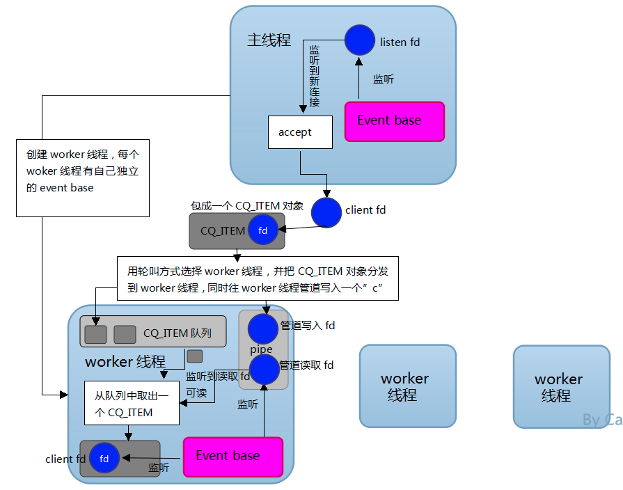

### 7、其他

redis 6.0新引入了ACl（访问控制权限），基于此功能可以设置多个用户，并且给多个用户单独设置命令权限和数据权限；  
redis 6.0引入了基于RESP3协议的客户端缓存。  
redis支持lua脚本，作用是减少网络开销，可复用，原子性。


