#### 1、一个k8s集群中环境角色如下：

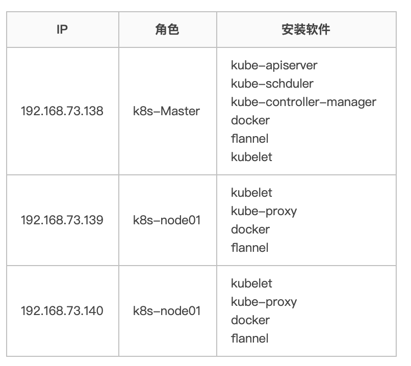

架构图为：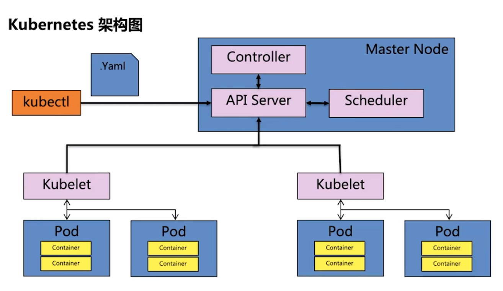

或者如图：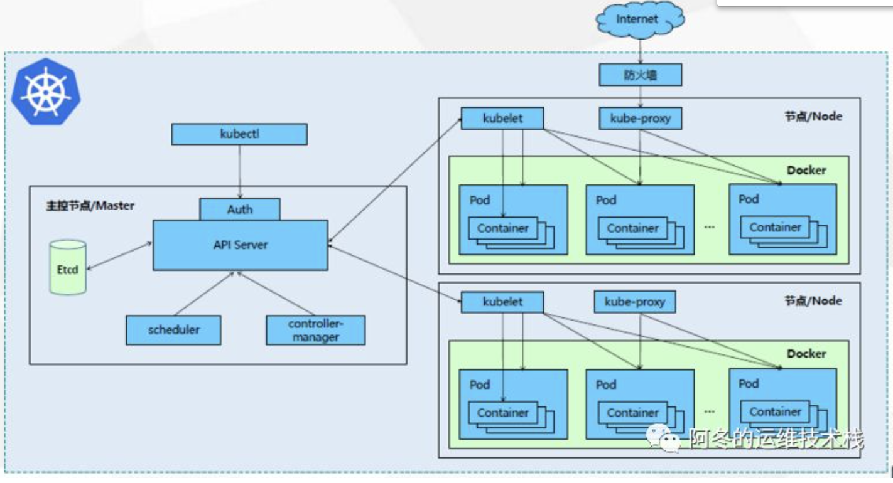

或者：  
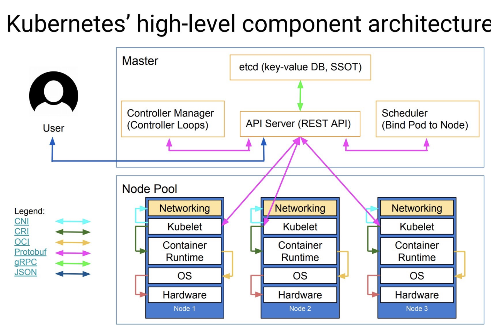

其中master的架构为：  
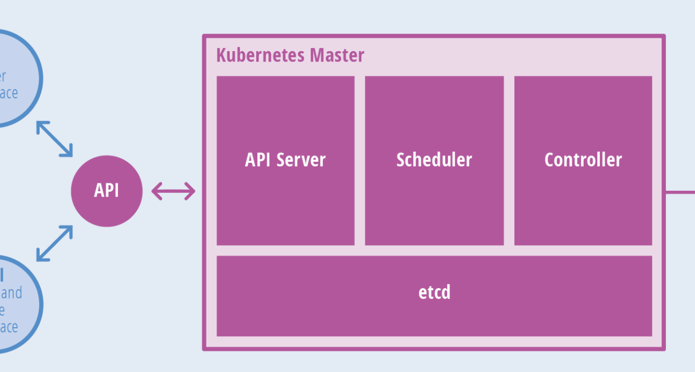  
分层的架构：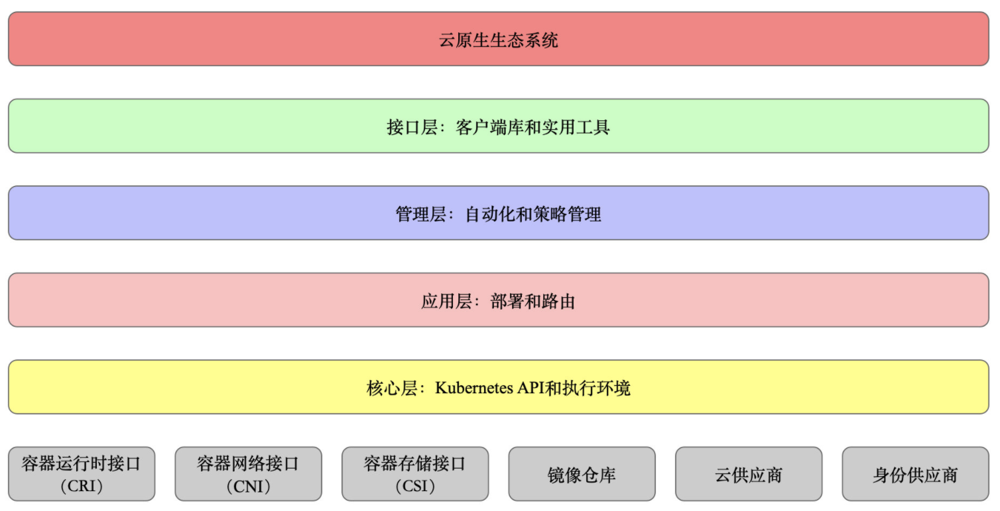

从图中可以看出：  
一个kubenetes集群有一个master节点，和多个node节点；  
master组件：

  * kube-apiserver：集群的统一入口，所有对象资源的增删改查都交给apiservice处理后，再转交给etcd进行存储，默认创建的命名空间的有default、kube-system、kube-public、kube-node-lease四个；
  * kube-controller-manager：处理集群后台任务；
  * kube-scheduler： 根据调度算法为新创建的pod选择一个合适的node；（挖资源）
  * etcd: 分布式键值存储系统，用于保存集群状态数据，比如pod，service信息等；  
node组件：
  * kubelet：node节点上的agent，管理本机运行容器的生命周期，比如创建容器，和master同步容器和pod状态等；
  * kube-proxy：运行在node节点上的一个网络代理，用来做负载均衡和网络转发的，提供一个虚拟的ip，将多个pod上的服务以service的形式对外提供服务；
  * flannel：是一套网络方案，使同机或者多台机器上pod通信成为可能；
  * docker： 容器；

#### 2、kubenetes中的名词

  * namespace： 命名空间，是k8s在多个用户之间划分集群资源的一种方法；使用namespace可以做到在一个物理集群上划分多个虚拟的集群；namespace为集群中的pods、services和deployments提供了作用域；
  * pod：最小的部署单元，一组容器的集合，容器共享网络命名空间
  * replicaSet：预期的pod副本数量
  * deployment： 无状态应用部署  
deployment并不直接管理pod，他是通过replicaSet来进行管理；三者关系如下：


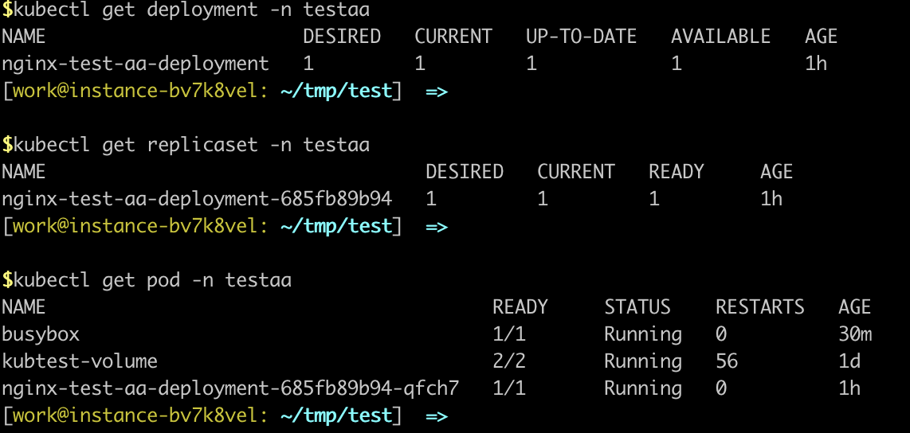

  * statefulset：有状态应用部署
  * heapster：做数据收集，收集每一个node下的（cpu、mem，filesystem等监控数据）， 他以pod的形式运行在kube-system下；
  * kubectl：一个cli的命令行工具；
  * helm： 是kubenetes的一个包管理器，想python的pip，centos的yum一样；
  * K8s pod eviction策略： pod驱逐策略，也就是挖资源策略；
  * Volumne: 卷，可以持久化的存储容器的资源；（容器销毁后，容器内的资源会被释放，可以通过volumen的形式保存下来）。volume的类型有emptyDir（空目录，pod销毁后volume的内容会丢失）、hostPath（将os上已经存在的目录映射到容器，pod销毁后volume的内容会保存下来）、外部存储（最常用，比如将bos、nfs、hdfs的文件mount到容器，这种方式将数据存储和k8s集群进行隔离，不考虑存储运维这是最好的volume的方式）
  * headless service： 如果service定义时clusterIP定义为None，则为headless service。这类服务通过dns返回的是pod的列表，而不是clusterip。这类服务应用的场景：客户端来做负载均衡的情况或者pod之间需要相互访问的情况（因为没有clusterip，每一个pod会有一个dns，保证了pod之间可以相互访问）；

#### 3、docker

##### 3.1 docker容器技术对于计算机界好比与集装箱之于运输业；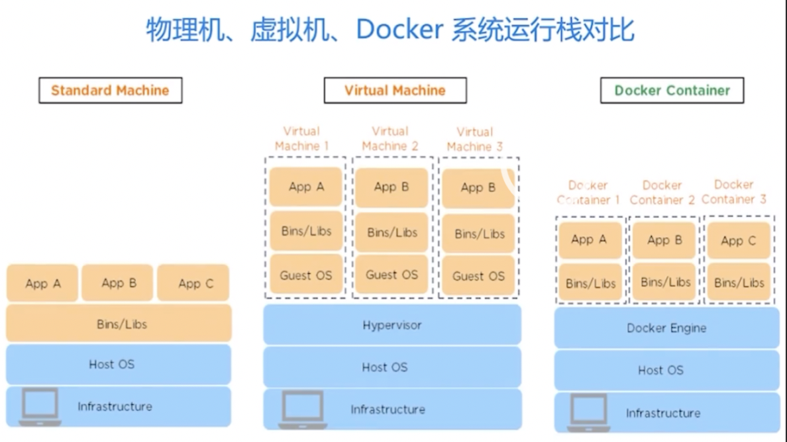

##### 3.2 docker的作用：

  * 环境的一致性：可以保证从开发到测试部署整个过程使用同一个环境，提高开发效率；
  * 多平台兼容性：docker服务可以在任意有docker环境的平台部署；
  * 隔离性：docker容器是隔离的，可以解耦依赖关系，方便弹性扩展；

##### 3.3 docker是一个c/s的服务：

  * docker仓库：存储所有的docker镜像；
  * docker镜像：一个docker镜像对应一个docker服务；
  * docker容器：启动的一个docker镜像；
  * docker宿主机：任意一台装有docker环境的服务器，可以pull、push、启动、停止一个docker服务；
  * docker客户端：docker client命令工具；  
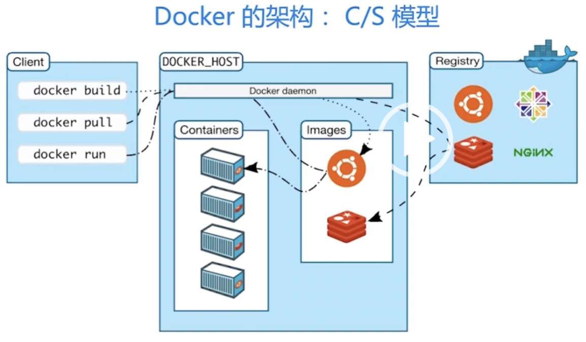


##### 3.4 Dockerfile

Dockerfile是生成image的源文件，Dockerfile有自己的语法：

  * FROM：基于哪个docker image 来生成；
  * COPY：将当前目录的某文件copy到镜像的什么位置
  * EXPOSE：对外提供什么端口服务；
  * CMD：容器启动时应该跑什么脚本；

##### 3.5 docker 常用问题：

  * 拉取的镜像默认在/var/lib/docker下（var盘容易慢，可以指定到其他的目录）
  * 镜像如果不指定tag，默认tag为latest；
  * 镜像如果删不掉可以用-f，或者删除依赖的父镜像后再删除；
  * docker的三大技术支柱：
    * cgroup：使得资源限制成为可能；
    * namspace：内核级别的资源隔离方式；
    * AUFS：advanced multilayered unificationfile system

##### 3.6 docker常用的命令：
          
          ```plain
          * docker pull：拉取镜像
          * docker images ：列举当前的docker 镜像
          * docker rmi 删除某个镜像
          * docker built -t [name]:[tag] [dockerfile path] : 用本地的dockerfile构建一个镜像；
          * docker push ： 镜像推送到仓库
          * docker run -it  bin/bash ： 运行镜像
          * docker ps： 查看运行中的镜像；
          * docker kill [容器id]：终止容器；
          * docker run -v host机的目录:docker实例内的目录 -p host主机的端口:映射后的端口
          * docker logs [container id]: 查看docker容器的日志;
          * docker exec -it [container id] bash: 容器内执行bash命令
          ```


#### 4、docker、docker swarm & k8s的关系

  * Docker swarm 是docker官方推出的容器调度服务平台；
  * kubenetes的基础是docker容器；kubenetes解决的是容器的集群化编排和生命周期管理；
  * docker是单机方案，解决的是应用程序的镜像化和容器化，能力仅限于单机；  
docker swarm和k8s的区别如下图：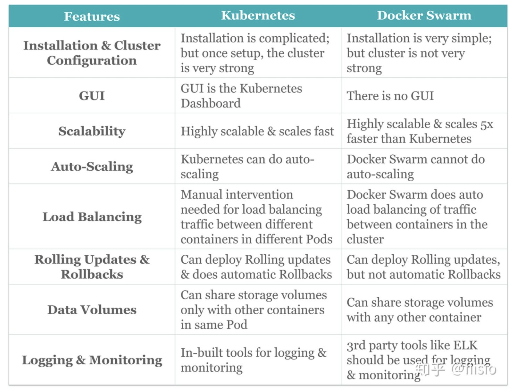

#### 5、helm、k8s、tiller的关系

##### 5.1 helm出现的原因

用k8s管理一个应用需要deployment、service、pod等大量的yaml文件，每次更新、部署或者回滚需要更新和维护大量的配置文件，而helm就是解决这些问题。helm配置文件可以自己定义，也可以使用一些工具进行生成。

##### 5.2 helm主要模块

  * helm client：Helm是客户端运行的一个命令，将这些配置打包一个chart中，而chart被保存到chart仓库中，通过chart仓库可以存储和分享chart，并且可以做到发布可配置；解决了k8s应用部署的版本控制、打包、发布、删除、更新等操作；
  * Tiller：服务端，以deployment的形式运行在k8s集群中，他可以接收helm client的请求，生成响应的配置，再通知k8s进行部署；

#### 6、kubenetes常用的命令

##### 6.1 命名空间和集群操作
        
        ```plain
        * kubectl get namespace  查看所有的命名空间
        * kubectl create namespace <命名空间名> 
        * kubectl create -f ./命名空间配置.yaml #创建一个namespace
        * kubectl delete namespace <命名空间名> 删除命名空间
        * kubectl cluster-info 查看集群消息
        * kubectl get nodes -o wide 查看所有的node信息
        * kubectl describe node 
        ```

##### 6.2 pod操作

pod的配置文件如下：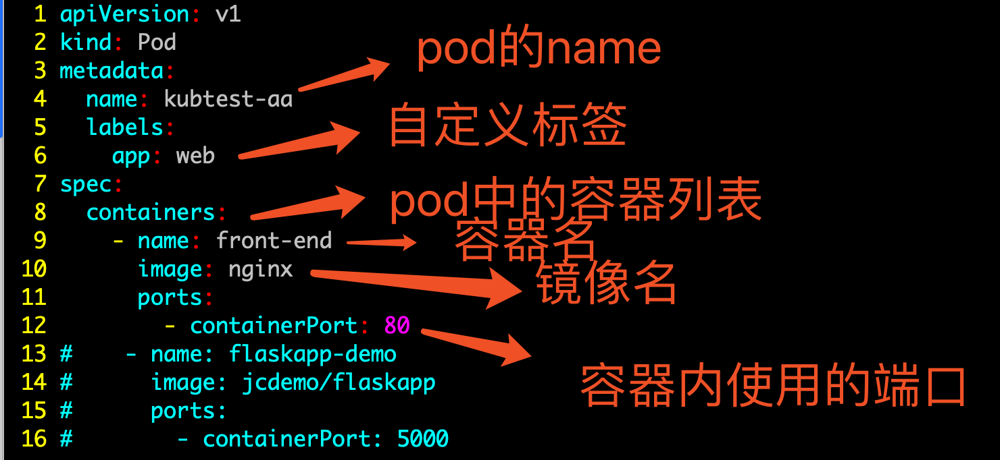


一个详细的pod的yaml配置：
    
    
    ```plain
    apiVersion: v1  #版本号
    kind: Pod       #Pod
    metadata:       #元数据
      name: string       #Pod名称
      namespace: string    #Pod所属的命名空间
      labels:      #自定义标签
        - name: string     #自定义标签名字
      annotations:       #自定义注释列表
        - name: string
    spec:         #Pod中容器的详细定义
      containers:      #Pod中容器列表
      - name: string     #容器名称
        image: string    #容器的镜像名称
        imagePullPolicy: [Always | Never | IfNotPresent] #获取镜像的策略 Alawys表示下载镜像 IfnotPresent表示优先使用本地镜像，否则下载镜像，Nerver表示仅使用本地镜像
        command: [string]    #容器的启动命令列表，如不指定，使用打包时使用的启动命令
        args: [string]     #容器的启动命令参数列表
        workingDir: string     #容器的工作目录
        volumeMounts:    #挂载到容器内部的存储卷配置
        - name: string     #引用pod定义的共享存储卷的名称，需用volumes[]部分定义的的卷名
          mountPath: string    #存储卷在容器内mount的绝对路径，应少于512字符
          readOnly: boolean    #是否为只读模式
        ports:       #需要暴露的端口库号列表
        - name: string     #端口号名称
          containerPort: int   #容器需要监听的端口号
          hostPort: int    #容器所在主机需要监听的端口号，默认与Container相同
          protocol: string     #端口协议，支持TCP和UDP，默认TCP
        env:       #容器运行前需设置的环境变量列表
        - name: string     #环境变量名称
          value: string    #环境变量的值
        resources:       #资源限制和请求的设置
          limits:      #资源限制的设置
            cpu: string    #Cpu的限制，单位为core数，将用于docker run --cpu-shares参数
            memory: string     #内存限制，单位可以为Mib/Gib，将用于docker run --memory参数
          requests:      #资源请求的设置
            cpu: string    #Cpu请求，容器启动的初始可用数量
            memory: string     #内存请求，容器启动的初始可用数量
        livenessProbe:     #对Pod内个容器健康检查的设置，当探测无响应几次后将自动重启该容器，检查方法有exec、httpGet和tcpSocket，对一个容器只需设置其中一种方法即可
          exec:      #对Pod容器内检查方式设置为exec方式
            command: [string]  #exec方式需要制定的命令或脚本
          httpGet:       #对Pod内个容器健康检查方法设置为HttpGet，需要制定Path、port
            path: string
            port: number
            host: string
            scheme: string
            HttpHeaders:
            - name: string
              value: string
          tcpSocket:     #对Pod内个容器健康检查方式设置为tcpSocket方式
             port: number
           initialDelaySeconds: 0  #容器启动完成后首次探测的时间，单位为秒
           timeoutSeconds: 0   #对容器健康检查探测等待响应的超时时间，单位秒，默认1秒
           periodSeconds: 0    #对容器监控检查的定期探测时间设置，单位秒，默认10秒一次
           successThreshold: 0
           failureThreshold: 0
           securityContext:
             privileged:false
        restartPolicy: [Always | Never | OnFailure]#Pod的重启策略，Always表示一旦不管以何种方式终止运行，kubelet都将重启，OnFailure表示只有Pod以非0退出码退出才重启，Nerver表示不再重启该Pod
        nodeSelector: obeject  #设置NodeSelector表示将该Pod调度到包含这个label的node上，以key：value的格式指定
        imagePullSecrets:    #Pull镜像时使用的secret名称，以key：secretkey格式指定
        - name: string
        hostNetwork:false      #是否使用主机网络模式，默认为false，如果设置为true，表示使用宿主机网络
        volumes:       #在该pod上定义共享存储卷列表
        - name: string     #共享存储卷名称 （volumes类型有很多种）
          emptyDir: {}     #类型为emtyDir的存储卷，与Pod同生命周期的一个临时目录。为空值
          hostPath: string     #类型为hostPath的存储卷，表示挂载Pod所在宿主机的目录
            path: string     #Pod所在宿主机的目录，将被用于同期中mount的目录
          secret:      #类型为secret的存储卷，挂载集群与定义的secre对象到容器内部
            scretname: string  
            items:     
            - key: string
              path: string
          configMap:     #类型为configMap的存储卷，挂载预定义的configMap对象到容器内部
            name: string
            items:
            - key: string
              path: string
    
    ```

pod的常用操作如下：
    
    
    ```plain
    * kubectl run <deploy名> —image=<image名>--replicas=1 —namespace=<空间名>  用命令创建一个deployment
    * kubectl get pods  --namespace=<命名空间>
    * kubectl create -f yaml配置文件 --namespace=<命名空间> 创建pod
    * kubectl get pod <pod name> —namespace=<命名空间> --output=yaml  输出pod的yaml配置
    * kubectl describe pod  <pod name> —namespace=<命名空间> 查看pod的详细信息 
    * kubectl get pod <pod名> —namepsace=<命名空间> —show-labels 查看pod的label信息
    * Kubectl exec -it <pod名> —namepsace=<命名空间>  bash  进入到pod内
    * kubectl delete pod <pod name> 删除pod
    ```

##### 6.3 deployment操作

deployment配置的样例：
    
    
    ```plain
    apiVersion: extensions/v1beta1   
    kind: Deployment                 
    metadata:
      name: string               #Deployment名称
    spec:
      replicas: 3 #目标副本数量
      strategy:
        rollingUpdate:  
          maxSurge: 1      #滚动升级时最大同时升级1个pod
          maxUnavailable: 1 #滚动升级时最大允许不可用的pod个数
      template:         
        metadata:
          labels:
            app: string  #模板名称
        sepc: #定义容器模板，该模板可以包含多个容器
          containers:                                                                   
            - name: string                                                           
              image: string 
              ports:
                - name: http
                  containerPort: 8080 #对service暴露端口
    ```

常用操作：
    
    
    ```plain
    * kubectl create -f  <deploy.yaml配置> —namespace=<命名空间> 创建deployment
    * kubectl get pod -l app=<app名> —namespace=<命名空间> 通过标签查找pod
    ```

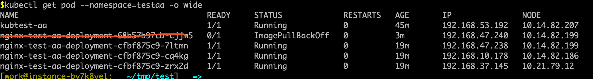
    
    
    ```plain
    * kubectl get pod --show-labels —namespace=<命名空间> 查看标签
    * kubectl describe deploy/<deploy名> —namespace=<命名空间> 查看详情
    * kubectl set image deploy/<deploy名> 镜像名=镜像名:tag —namespace=<命名空间>  deploy镜像升级
    * Kubectl rollout undo deploy/<deploy名> —namespace=<命名空间> 回滚到上一个版本-
    * kubectl rollout undo deploy/<deploy名> —to-revision=<版本> —namespace=<命名空间> 回滚到指定版本
    * kubectl rollout status deploy/<deploy名> 镜像名=镜像名:tag —namespace=<命名空间> 查看发布状态，比如升级后可以看
    ```


    
    
    ```plain
    *  kubectl rollout history deploy/<deploy名> 镜像名=镜像名:tag —namespace=<命名空间> #查看历史发布
    ```

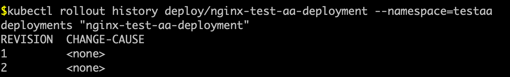
    
    
    ```plain
    * kubectl edit deploy/<deploy名> —namespace=<命名空间> 修改发布的配置
    * kubectl scale deploy/<deploy名>—replicas=<分片数> —namespace=<命名空间>  指定分片数来扩容或者缩容
    ```

k8s的升级方式有：

  * 1、recreate：删除已经存在的旧版本的pod，重新创建新版本的pod。好处是能保持服务版本的一致性，坏处是服务会间断；
  * 2、rollingUpdate的方式：滚动升级，逐步替换已经存在的pod，支持设置最大不可用pod数量和最小升级间隔时间等参数：
    * minReadySeconds:Kubernetes在等待设置的时间后才进行升级
    * 如果没有设置该值，Kubernetes会假设该容器启动起来后就提供服务了
    * 如果没有设置该值，在某些极端情况下可能会造成服务服务正常运行
  * maxSurge:
    * 升级过程中最多可以比原先设置多出的POD数量
    * 例如：maxSurage=1，replicas=5,则表示Kubernetes会先启动1一个新的Pod后才删掉一个旧的POD，整个升级过程中最多会有5+1个POD
  * maxUnavaible:
    * 升级过程中最多有多少个POD处于无法提供服务的状态
    * 当maxSurge不为0时，该值也不能为0
    * 例如：maxUnavaible=1，则表示Kubernetes整个升级过程中最多会有1个POD处于无法服务的状态。

##### 6.4 service操作

service更像是一个网关层，负责pod的流量入口，分发和负载均衡；他会提供一个统一的ip来访问这一组pod，而不用关心pod的替换、变更等造成的pod的ip变更；  
创建service的配置文件：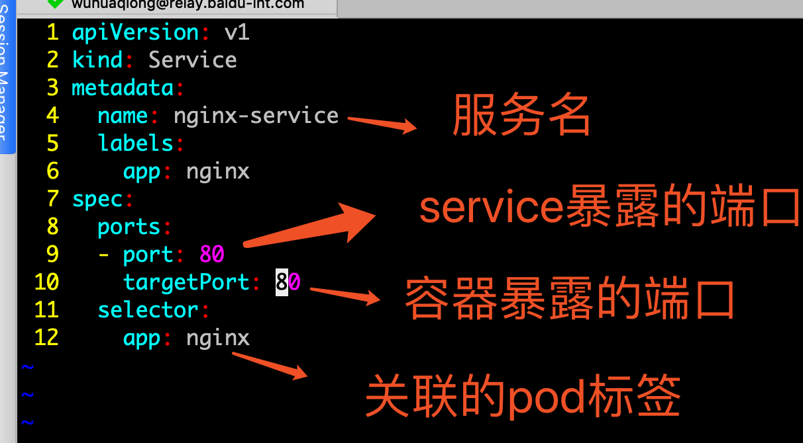


配置的样例：
    
    
    ```plain
    apiVersion: v1
    kind: Service
    matadata:                                #元数据
      name: string                           #service的名称
      namespace: string                      #命名空间
      labels:                                #自定义标签属性列表
        - name: string
      annotations:                           #自定义注解属性列表
        - name: string
    spec:                                    #详细描述
      selector: []                           #label selector配置，将选择具有label标签的Pod作为管理 范围
      type: string                           #service的类型，指定service的访问方式，默认为clusterIp
      clusterIP: string                      #虚拟服务地址
      sessionAffinity: string                #是否支持session
      ports:                                 #service需要暴露的端口列表
      - name: string                         #端口名称
        protocol: string                     #端口协议，支持TCP和UDP，默认TCP
        port: int                            #服务监听的端口号
        targetPort: int                      #需要转发到后端Pod的端口号
        nodePort: int                        #当type = NodePort时，指定映射到物理机的端口号
      status:                                #当spce.type=LoadBalancer时，设置外部负载均衡器的地址
        loadBalancer:                        #外部负载均衡器
          ingress:                           #外部负载均衡器
            ip: string                       #外部负载均衡器的Ip地址值
            hostname: string                 #外部负载均衡器的主机名
    
    ```

常用的操作：
    
    
    ```plain
    * kubctl create -f <service.yaml文件> -n <命名空间> 根据配置生成一个service
    * kubectl expose deployment <deployment名> —port=<服务端口> --target-port=<容器端口> --type=NodePort -n <命名空间>  可以直接将一组deployment组合成一个service
    * kubectl get svc -n <命名空间> 查找service
    * Kubectl get endpoints <service名>  -n <命名空间> 查找service的所有叶子节点
    ```

Kubenetes service转发后端服务的四种方式：

  * clusterIp： 提供集群内部的一个虚拟ip（和pod的ip不在同一个网段），供pod内部进行访问；
  * NodePort: 这种方式除了提供一个虚拟ip，还为每一个node提供了一个nodeip+nodeport的方式供外部进行访问；
  * loadbalance：负载均衡。Client端为多个server的形式，load balance根据策略，选择出往哪个server发送请求；k8s的lb是通过ingress实现的，ingress是一种k8s的路由转发机制， ingress是整个k8s集群的接入层，负责集群内外的通讯；  
Ingress和service的关系如下图：  
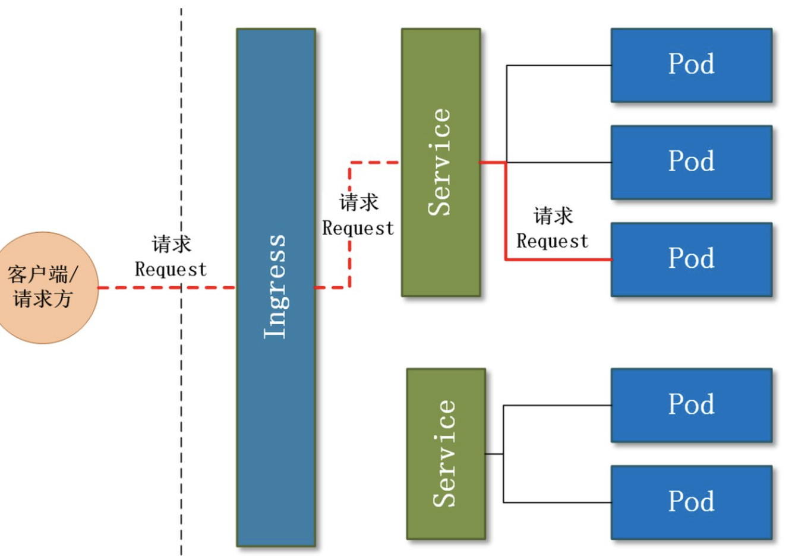


##### 6.5 port、nodePort、targetPort的区别

  * port: service暴露在cluster ip上的端口，port是提供给集群内部客户访问service的入口
  * nodePort： k8s提供给集群外部客户访问service的入口
  * targetPort：是pod上的端口，容器内服务占用的端口；

##### 6.6 configmap

k8s的配置管理组件，比如A服务和B服务需要一些公用的环境配置，如果将这些环境配置打到镜像中，更新配置就需要重新打镜像。可以独立成configmap，与镜像解耦，且A和B镜像都可以使用；
  * configmap受到namespace的限制，只有同一个namespace下的pod可以引用；
  * configmap挂载到pod中可以通过env和volumne两种方式，volume挂载的方式使用更方便一些，支持热更新。  
创建方式：
        
        ```plain
        * kubectl create configmap nginxconfig --from-file /server/yaml/nginx/nginx.conf #通过文件创建，from-file可以有多个
        * kubectl create configmap <test-config> --from-literal=env_model=prd -n <命名空间> ###命令行的方式创建
        * kubectl create -f xxxxconfigmap.yaml  #以yaml资源文件创建
        
        ```

  * Env方式挂载configmap  
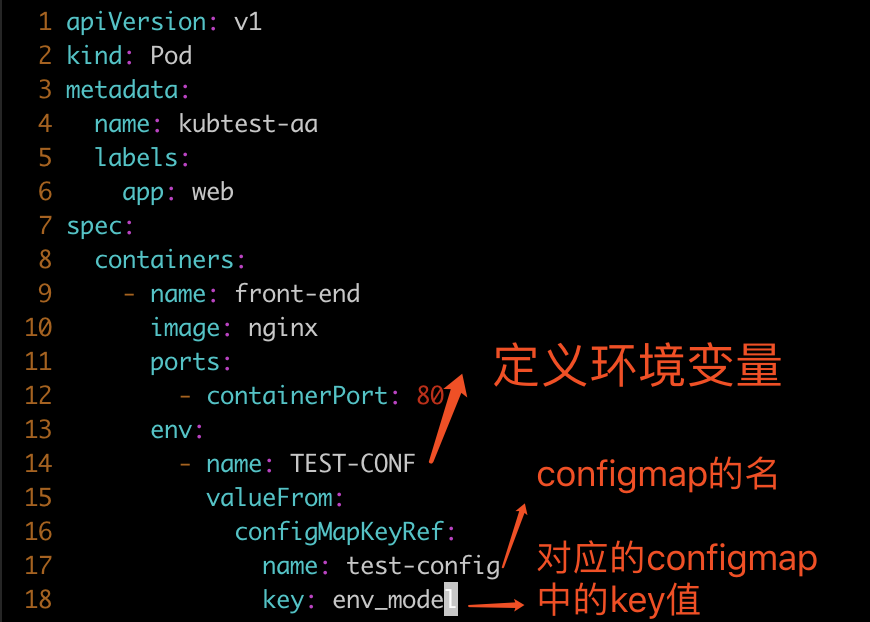
  * volume方式挂载configmap  
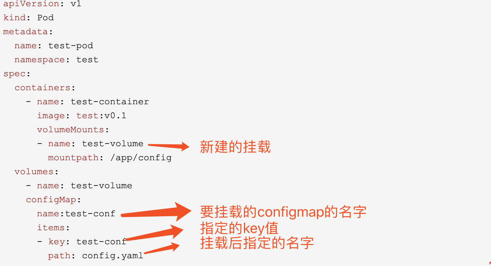


