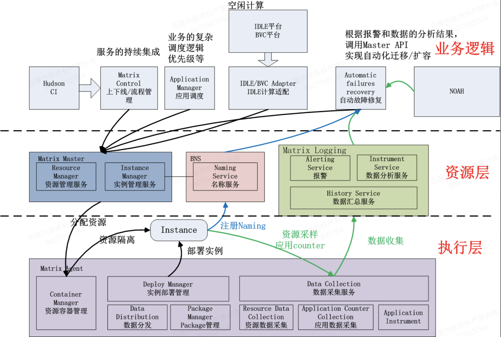
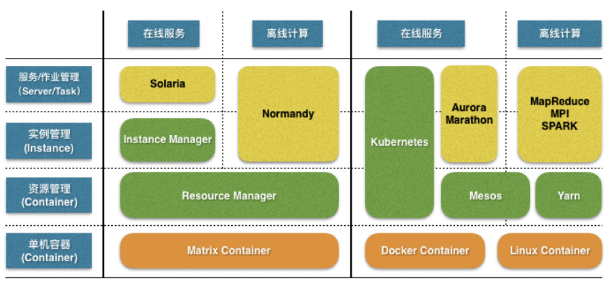
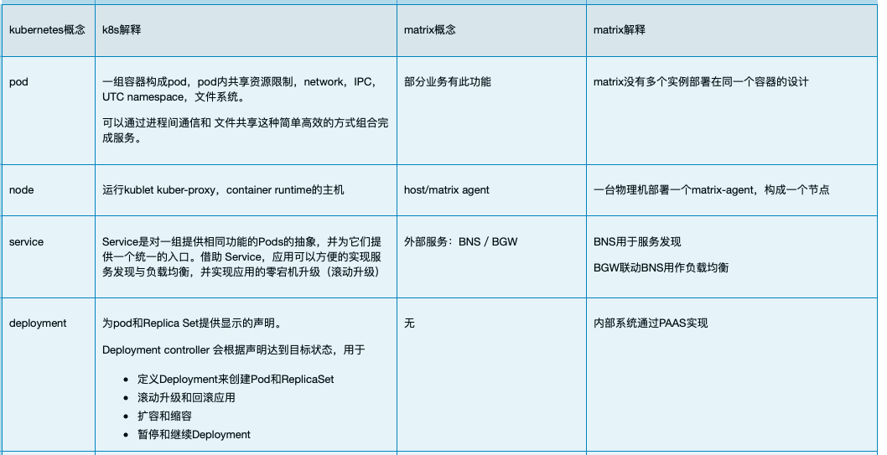
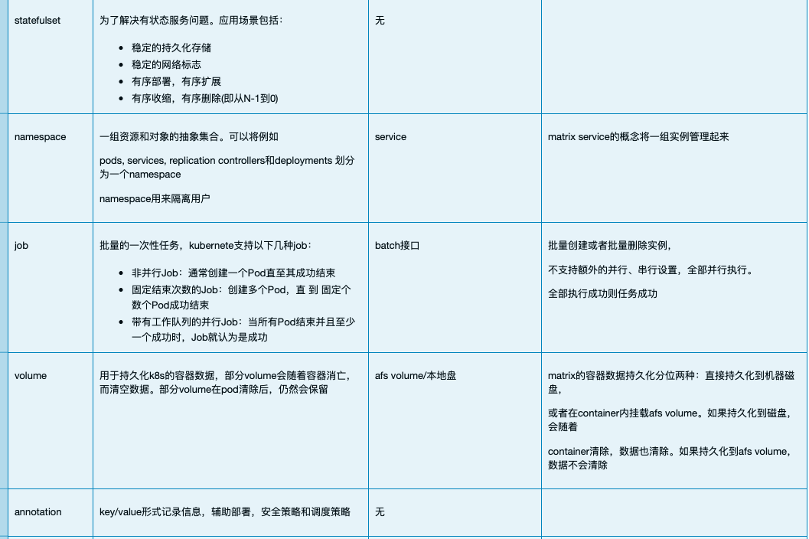
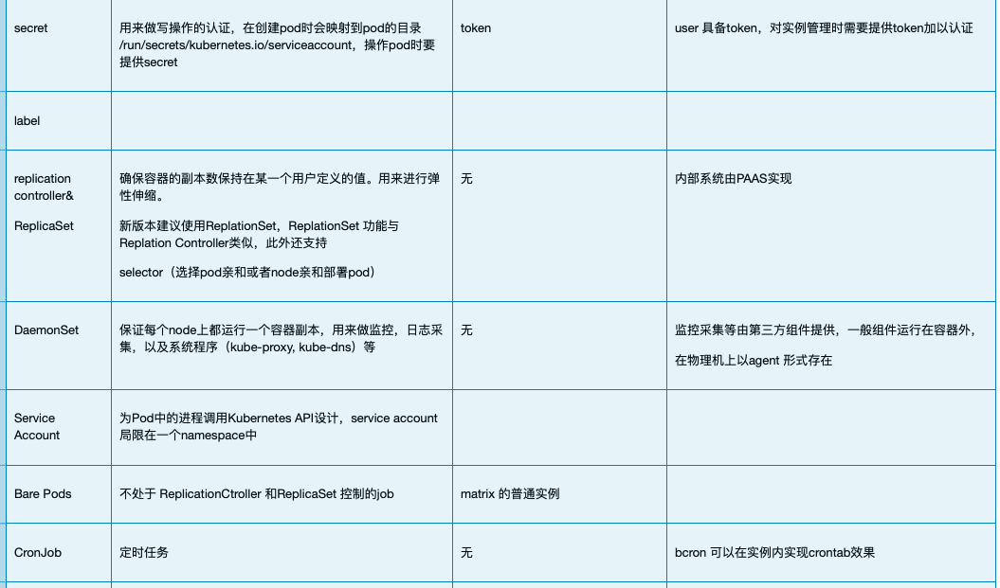
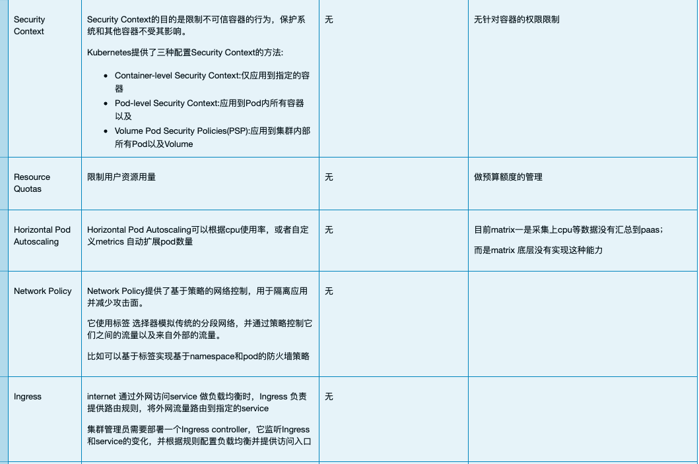
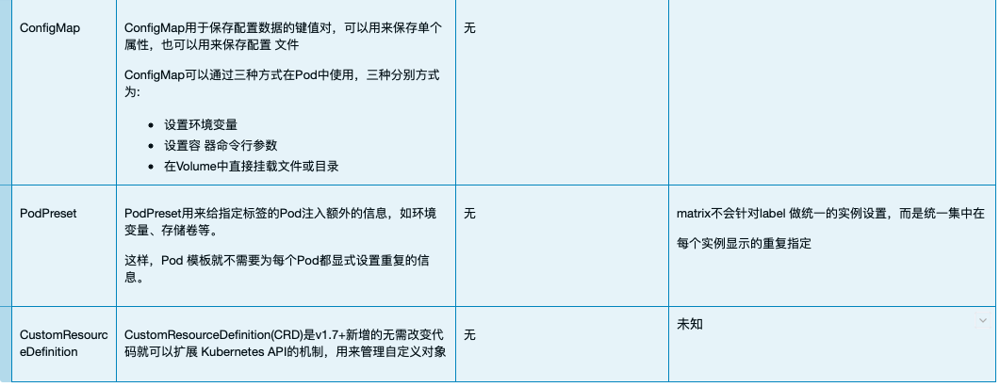

#### 1、matrix的生态

  * Matrix: 百度最早的容器调度系统，在2012年就已经发布，对应于docker， docker是在2013年开源。
  * solaria：索拉里，matrix上的服务托管系统，协助用户完成日常线上服务的运维工作。
  * normandy：构建与集群操作系统matrix之上，面向离线计算框架而设计的统一资源调度系统。
  * opera：可视化的基于matrix的容器管理平台；

#### 2、matrix中的概念

  * instance：Matrix中最小的运行单位是实例（Instance），一个Instance提交给Matrix，至少需要包含如下要素
    * 实例名（Instance ID）：Instance ID = offset.Service Name
    * 包（Package）：这个实例的可执行文件、配置、以及脚本等，按照特定规则（例如Archer规范）打出的压缩包（的远程源路径）。
    * 资源需求（Resource）：实例在单机运行起来需要的资源，例如CPU需要2个core（归一化），内存需要40G，硬盘空间需要400M，网卡带宽需要10MB（还有硬盘IO等等，Matrix Team正在努力实现）
    * 实例标记（Tag）：可以认为类比于传递给包的命令行参数，例如这个实例需要哪块数据等等，Tag通过K-V方式组织
  * container：一个Instance提交给Matrix，Matrix会根据资源需求选定一台服务器，建立资源容器（Container）将Instance启动在这个资源容器中。
    * 一个Container中有且仅有一个Instance，Container的生命周期和Instance相同。
    * 单机上各个资源容器相互之间有一定的隔离性，不会相互干扰。
    * 除了提供资源隔离，Container还负责一些轻量级的虚拟化，以提高易用性，例如所有Instance都可以认为自己独占/home、/tmp目录（实际上Container作了虚拟）。
  * Service：是Matrix对OP的最小运维单位，上线/升级/回滚等都是以Service粒度完成。
    * 一个Service不能跨Matrix集群，如果需要在多个机房（集群）部署，请分别提交不同的Service（例如BS.jx，BS.tc）
    * Matrix概念上认为一些资源需求相同，包相同的实例组成一个Service，一个Service中各个实例按照 . 命名。
    * Matrix可以容忍短时间一个Service内各个实例资源/包层面不同（例如一个Service升级的过程中）。
  * Application:概念上，一组相关服务的DAG图组成一个应用，例如Nova应用可以包含AS/BS/CS/PFS/UFS等Service。
    * 一个应用可以包含不同Matrix集群的Service。
    * 当前Application的概念在Matrix中相当弱化，更多由应用自己考虑这一层的概念，后继不排除Marix会在这一层中提供一些高级功能，例如根据服务的依赖管理来自动管理应用。

#### 3、基于matrix的业务分层

#### 4、matrix生态和k8s生态的层级对比关系

#### 5、和k8s的功能对比：

  
  
  
  

