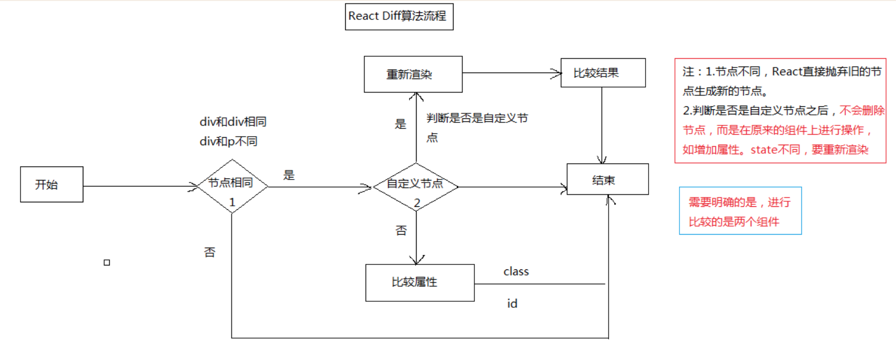
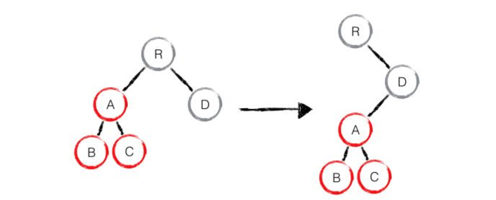
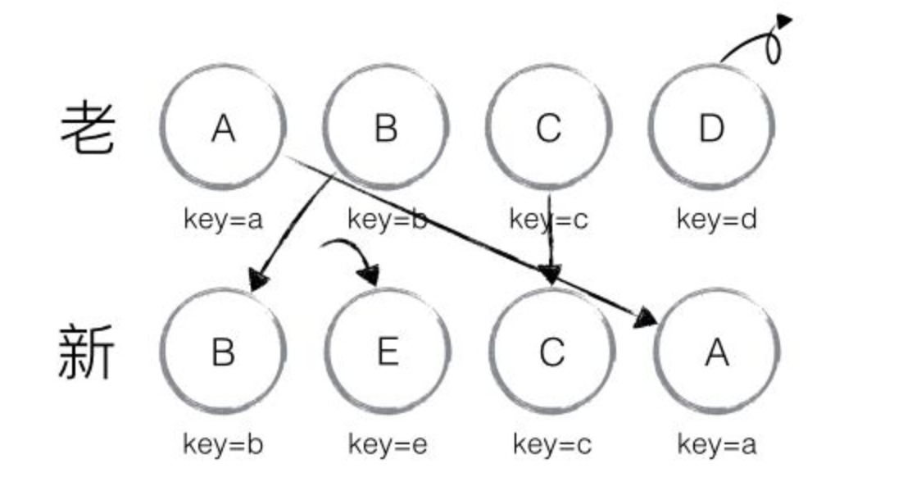
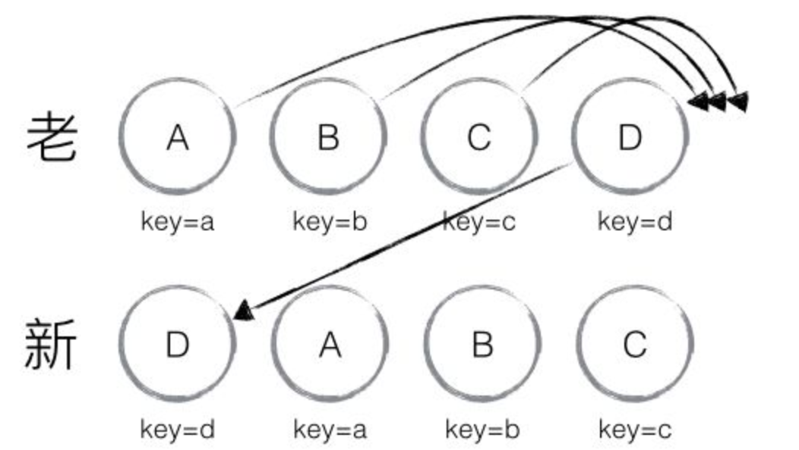

因为虚拟DOM是内存数据，性能是极高的，而对实际DOM进行操作的仅仅是Diff部分，因而能达到提高性能的目的。这样就需要每次获取dom的diff。  
react diff  
（1）diff 流程  
  
（2）tree diff:  
假设： web ui 中 dom节点跨层级移动的操作很少，可以忽略不计。  
优化：两棵树只比较同层节点是否相等，如果不等，直接删除，否则新建。  
缺点： 如果出现跨层操作，比如将A整个移动到D下，整个处理过程为：create A -> create B -> create C -> delete A， 效率很低。  
指导原则： 不要使用dom节点的跨层级操作，可以用dom的显示和隐藏进行控制。  
  
（2）component diff  
假设：相同类的两个组件拥有相同的结构，不同类的两个组件的结构不同。  
优化：相同类的两个组件按照virtual dom的方式继续进行比较，不同类的两个组件直接替换，不进行比较，相同类的两个组件可以通过shouldComponentUpdate来进行比较。  
缺点： 两个component结构相似单直接导致替换，但实际开发中情况很少。  
指导原则：定义组件的shouldComponentUpdate

（3）element diff  
假设：同一层的一组节点可以通过定个唯一的key来进行区分  
优化：同一层的一组节点定义唯一的key，通过key进行比较和重建  
重建方式: 遍历新的节点顺序，如果当前的节点在旧的结构中的挂载Index < 当前的遍历Index值，则对当前节点进行移动，否则不移动。  
  
缺点：如果将最后的一个节点移动到了行首，会导致整个链上的节点的移动，效率很低。  
指导原则：不要讲最后一个节点移动到行首。  
  
diff的差异比较过程如下：  
首先对新集合的节点进行循环遍历，for (name in nextChildren)，通过唯一 key 可以判断新老集合中是否存在相同的节点，if (prevChild === nextChild)，如果存在相同节点，则进行移动操作，但在移动前需要将当前节点在老集合中的位置与 lastIndex 进行比较，if (child._mountIndex < lastIndex)，则进行节点移动操作，否则不执行该操作。这是一种顺序优化手段，lastIndex 一直在更新，表示访问过的节点在老集合中最右的位置（即最大的位置），如果新集合中当前访问的节点比 lastIndex 大，说明当前访问节点在老集合中就比上一个节点位置靠后，则该节点不会影响其他节点的位置，因此不用添加到差异队列中，即不执行移动操作，只有当访问的节点比 lastIndex 小时，才需要进行移动操作。  
以上图为例，可以更为清晰直观的描述 diff 的差异对比过程：

  * 从新集合中取得 B，判断老集合中存在相同节点 B，通过对比节点位置判断是否进行移动操作，B 在老集合中的位置 B._mountIndex = 1，此时 lastIndex = 0，不满足 child._mountIndex < lastIndex 的条件，因此不对 B 进行移动操作；更新 lastIndex = Math.max(prevChild._mountIndex, lastIndex)，其中 prevChild._mountIndex 表示 B 在老集合中的位置，则 lastIndex ＝ 1，并将 B 的位置更新为新集合中的位置prevChild._mountIndex = nextIndex，此时新集合中 B._mountIndex = 0，nextIndex++ 进入下一个节点的判断。
  * 从新集合中取得 A，判断老集合中存在相同节点 A，通过对比节点位置判断是否进行移动操作，A 在老集合中的位置 A._mountIndex = 0，此时 lastIndex = 1，满足 child._mountIndex < lastIndex的条件，因此对 A 进行移动操作enqueueMove(this, child._mountIndex, toIndex)，其中 toIndex 其实就是 nextIndex，表示 A 需要移动到的位置；更新 lastIndex = Math.max(prevChild._mountIndex, lastIndex)，则 lastIndex ＝ 1，并将 A 的位置更新为新集合中的位置 prevChild._mountIndex = nextIndex，此时新集合中A._mountIndex = 1，nextIndex++ 进入下一个节点的判断。
  * 从新集合中取得 D，判断老集合中存在相同节点 D，通过对比节点位置判断是否进行移动操作，D 在老集合中的位置 D._mountIndex = 3，此时 lastIndex = 1，不满足 child._mountIndex < lastIndex的条件，因此不对 D 进行移动操作；更新 lastIndex = Math.max(prevChild._mountIndex, lastIndex)，则 lastIndex ＝ 3，并将 D 的位置更新为新集合中的位置 prevChild._mountIndex = nextIndex，此时新集合中D._mountIndex = 2，nextIndex++ 进入下一个节点的判断。
  * 从新集合中取得 C，判断老集合中存在相同节点 C，通过对比节点位置判断是否进行移动操作，C 在老集合中的位置 C._mountIndex = 2，此时 lastIndex = 3，满足 child._mountIndex < lastIndex 的条件，因此对 C 进行移动操作 enqueueMove(this, child._mountIndex, toIndex)；更新 lastIndex = Math.max(prevChild._mountIndex, lastIndex)，则 lastIndex ＝ 3，并将 C 的位置更新为新集合中的位置 prevChild._mountIndex = nextIndex，此时新集合中 C._mountIndex = 3，nextIndex++ 进入下一个节点的判断，由于 C 已经是最后一个节点，因此 diff 到此完成。  
以上主要分析新老集合中存在相同节点但位置不同时，对节点进行位置移动的情况，如果新集合中有新加入的节点且老集合存在需要删除的节点，那么 React diff 又是如何对比运作的呢？  
以下图为例：
  * 从新集合中取得 B，判断老集合中存在相同节点 B，由于 B 在老集合中的位置 B._mountIndex = 1，此时lastIndex = 0，因此不对 B 进行移动操作；更新 lastIndex ＝ 1，并将 B 的位置更新为新集合中的位置B._mountIndex = 0，nextIndex++进入下一个节点的判断。
  * 从新集合中取得 E，判断老集合中不存在相同节点 E，则创建新节点 E；更新 lastIndex ＝ 1，并将 E 的位置更新为新集合中的位置，nextIndex++进入下一个节点的判断。
  * 从新集合中取得 C，判断老集合中存在相同节点 C，由于 C 在老集合中的位置C._mountIndex = 2，lastIndex = 1，此时 C._mountIndex > lastIndex，因此不对 C 进行移动操作；更新 lastIndex ＝ 2，并将 C 的位置更新为新集合中的位置，nextIndex++ 进入下一个节点的判断。
  * 从新集合中取得 A，判断老集合中存在相同节点 A，由于 A 在老集合中的位置A._mountIndex = 0，lastIndex = 2，此时 A._mountIndex < lastIndex，因此对 A 进行移动操作；更新 lastIndex ＝ 2，并将 A 的位置更新为新集合中的位置，nextIndex++ 进入下一个节点的判断。
  * 当完成新集合中所有节点 diff 时，最后还需要对老集合进行循环遍历，判断是否存在新集合中没有但老集合中仍存在的节点，发现存在这样的节点 D，因此删除节点 D，到此 diff 全部完成。  
react diff代码实现解析  
（1）component的mountComponent完成组件的第一次render，receiveComponent完成组件的更新处理。组件的setState的实现即是调用receiveComponent的处理。  
（2）receiveComponent的处理流程: receiveComponent = function(nextElement, newState)
  * 更新当前组件的currentElement（保存组件的render类型，p还是div，还是自定义的element类型1或者自定义的element2）this._currentElement = nextElement || this._currentElement (组件的render类型对应diff原则中的不同类型的组件重新渲染原则)
  * newState = 旧的state merge newState
  * 如果组件有自定义的shouldComponentUpdate方法，如果此方法返回为false，不再进行更新直接返回。
  * 如果组件有定义componentWillUpdate（更新前的处理方法），调用此方法，表示开始更新。
  * 重新执行组件的render方法，拿到新的element（nextRenderedElemnt）（此过程在内存中进行，而非真正的渲染）
  * 调用全局的shouldUpdateComponent(prevRenderedElement, nextRenderedElement)方法，此方法的输入为两个element，如果element类型为基础类型，直接返回false，否则递归调用子元素的此方法
  * shouldUpdateComponent(prevRenderedElement, nextRenderedElement)返回为false的情况下（为基础节点或者两个非基础节点，但类型不同），则直接将整个dom节点进行替换，并更新到dom中。  
（3）shouldUpdateComponent(prevRenderedElement, nextRenderedElement) 为整个diff实现的主要方法，流程如下：（判断：当前节点是进行全局替换还是进行局部比较替换）（生成新的element以及element进行比较的过程是在内存中进行，而非替换真正的dom，所以效率是极高的）
  * 判断prevElement是否为基础类型，如果是基础类型，直接返回nextElement是否为基础类型，如果是基础类型，调用prevElement的更新操作，否则执行render以及整个替换操作
  * prevElement不是基础类型，并且nextElement也不是基础类型，并且type类型相同且key相同，执行子节点的update操作，否则直接进行整个节点的替换操作  
（4）receiveComponent逻辑
  * 文本类型：receiveComponent = function (newTextString) { $(‘[data-reactid=“‘+this._rootNodeId+’”]’).html(newTextString); }
  * 基本类型的更新： 首先更新当前节点的props属性，然后递归调用，更新每个子节点（updateDOMChildren）（子节点或者为文本类型或者为基本类型，如果子节点为自定义类型如何处理？）属性的更新过程： 如果在新的属性中不包含的属性，删掉，如果是新添加的属性，添加，否则进行值替换。这些操作为真正的dom操作，不同类型的属性的更新和生效方式也不同，需要特别处理。
  * 自定义类型：  
(5) updateDOMChildren的处理逻辑（全局的diffQueue队列，diff方法，以及获取到diffQueue后的patch更新操作），所以关键是diff和patch方法。diff操作对应diff原则中的element diff
  * diff方法处理流程： diff(diffQueue, nextChildrenElements)


  1. nextChildrenElements利用key或者id处理成map形式,方便下面的diff处理（flatternChildren）
  2. 调用gennerateComponentChildren生成新的nextChildren，此方法中根据新旧child的不同调用上面提到的shouldUpdateReactComponent方法做到最小粒度度更新
  3. 对新旧children进行比较，标记上三种状态： move_existing(新的componet在旧的中存在，只移动)，insert_makeup(新的不存在或者新旧类型不同，需要新建并且插入)， remove_node(旧的组件在新的中不存在或者类型发生了变化，需要删除)


  * 得到diffQueue后执行patch操作流程


  1. 第一遍遍历queue删除所有标记为要删除的节点
  2. 第二遍处理插入和要修改的节点


最终迷你版本的react js实现如下： (这个已经不记得转载的哪里的了)
    
    
    ```bash
    //component类，用来表示文本在渲染，更新，删除时应该做些什么事情
    function ReactDOMTextComponent(text) {
        //存下当前的字符串
        this._currentElement = '' + text;
        //用来标识当前component
        this._rootNodeID = null;
    }
    
    //component渲染时生成的dom结构
    ReactDOMTextComponent.prototype.mountComponent = function(rootID) {
        this._rootNodeID = rootID;
        return '<span data-reactid="' + rootID + '">' + this._currentElement + '</span>';
    }
    
    ReactDOMTextComponent.prototype.receiveComponent = function(nextText) {
        var nextStringText = '' + nextText;
        //跟以前保存的字符串比较
        if (nextStringText !== this._currentElement) {
            this._currentElement = nextStringText;
            //替换整个节点
            $('[data-reactid="' + this._rootNodeID + '"]').html(this._currentElement);
    
        }
    }
    
    
    //component类，用来表示文本在渲染，更新，删除时应该做些什么事情
    function ReactDOMComponent(element) {
        //存下当前的element对象引用
        this._currentElement = element;
        this._rootNodeID = null;
    }
    
    //component渲染时生成的dom结构
    ReactDOMComponent.prototype.mountComponent = function(rootID) {
    
        //赋值标识
        this._rootNodeID = rootID;
        var props = this._currentElement.props;
        var tagOpen = '<' + this._currentElement.type;
        var tagClose = '</' + this._currentElement.type + '>';
    
        //加上reactid标识
        tagOpen += ' data-reactid=' + this._rootNodeID;
    
        //拼凑出属性
        for (var propKey in props) {
    
            //这里要做一下事件的监听，就是从属性props里面解析拿出on开头的事件属性的对应事件监听
            if (/^on[A-Za-z]/.test(propKey)) {
                var eventType = propKey.replace('on', '');
                //针对当前的节点添加事件代理,以_rootNodeID为命名空间
                $(document).delegate('[data-reactid="' + this._rootNodeID + '"]', eventType + '.' + this._rootNodeID, props[propKey]);
            }
    
            //对于children属性以及事件监听的属性不需要进行字符串拼接
            //事件会代理到全局。这边不能拼到dom上不然会产生原生的事件监听
            if (props[propKey] && propKey != 'children' && !/^on[A-Za-z]/.test(propKey)) {
                tagOpen += ' ' + propKey + '=' + props[propKey];
            }
        }
        //获取子节点渲染出的内容
        var content = '';
        var children = props.children || [];
    
        var childrenInstances = []; //用于保存所有的子节点的componet实例，以后会用到
        var that = this;
        $.each(children, function(key, child) {
            //这里再次调用了instantiateReactComponent实例化子节点component类，拼接好返回
            var childComponentInstance = instantiateReactComponent(child);
            childComponentInstance._mountIndex = key;
    
            childrenInstances.push(childComponentInstance);
            //子节点的rootId是父节点的rootId加上新的key也就是顺序的值拼成的新值
            var curRootId = that._rootNodeID + '.' + key;
            //得到子节点的渲染内容
            var childMarkup = childComponentInstance.mountComponent(curRootId);
            //拼接在一起
            content += ' ' + childMarkup;
    
        })
    
        //留给以后更新时用的这边先不用管
        this._renderedChildren = childrenInstances;
    
        //拼出整个html内容
        return tagOpen + '>' + content + tagClose;
    }
    
    ReactDOMComponent.prototype.receiveComponent = function(nextElement) {
        var lastProps = this._currentElement.props;
        var nextProps = nextElement.props;
    
        this._currentElement = nextElement;
        //需要单独的更新属性
        this._updateDOMProperties(lastProps, nextProps);
        //再更新子节点
        this._updateDOMChildren(nextElement.props.children);
    }
    
    ReactDOMComponent.prototype._updateDOMProperties = function(lastProps, nextProps) {
        var propKey;
        //遍历，当一个老的属性不在新的属性集合里时，需要删除掉。
    
        for (propKey in lastProps) {
            //新的属性里有，或者propKey是在原型上的直接跳过。这样剩下的都是不在新属性集合里的。需要删除
            if (nextProps.hasOwnProperty(propKey) || !lastProps.hasOwnProperty(propKey)) {
                continue;
            }
            //对于那种特殊的，比如这里的事件监听的属性我们需要去掉监听
            if (/^on[A-Za-z]/.test(propKey)) {
                var eventType = propKey.replace('on', '');
                //针对当前的节点取消事件代理
                $(document).undelegate('[data-reactid="' + this._rootNodeID + '"]', eventType, lastProps[propKey]);
                continue;
            }
    
            //从dom上删除不需要的属性
            $('[data-reactid="' + this._rootNodeID + '"]').removeAttr(propKey)
        }
    
        //对于新的属性，需要写到dom节点上
        for (propKey in nextProps) {
            //对于事件监听的属性我们需要特殊处理
            if (/^on[A-Za-z]/.test(propKey)) {
                var eventType = propKey.replace('on', '');
                //以前如果已经有，说明有了监听，需要先去掉
                lastProps[propKey] && $(document).undelegate('[data-reactid="' + this._rootNodeID + '"]', eventType, lastProps[propKey]);
                //针对当前的节点添加事件代理,以_rootNodeID为命名空间
                $(document).delegate('[data-reactid="' + this._rootNodeID + '"]', eventType + '.' + this._rootNodeID, nextProps[propKey]);
                continue;
            }
    
            if (propKey == 'children') continue;
    
            //添加新的属性，或者是更新老的同名属性
            $('[data-reactid="' + this._rootNodeID + '"]').prop(propKey, nextProps[propKey])
        }
    
    }
    
    //全局的更新深度标识
    var updateDepth = 0;
    //全局的更新队列，所有的差异都存在这里
    var diffQueue = [];
    
    ReactDOMComponent.prototype._updateDOMChildren = function(nextChildrenElements) {
        updateDepth++
        //_diff用来递归找出差别,组装差异对象,添加到更新队列diffQueue。
        this._diff(diffQueue, nextChildrenElements);
        updateDepth--
        if (updateDepth == 0) {
            //在需要的时候调用patch，执行具体的dom操作
            this._patch(diffQueue);
            diffQueue = [];
        }
    }
    
    
    //差异更新的几种类型
    var UPATE_TYPES = {
        MOVE_EXISTING: 1,
        REMOVE_NODE: 2,
        INSERT_MARKUP: 3
    }
    
    
    //普通的children是一个数组，此方法把它转换成一个map,key就是element的key,如果是text节点或者element创建时并没有传入key,就直接用在数组里的index标识
    function flattenChildren(componentChildren) {
        var child;
        var name;
        var childrenMap = {};
        for (var i = 0; i < componentChildren.length; i++) {
            child = componentChildren[i];
            name = child && child._currentelement && child._currentelement.key ? child._currentelement.key : i.toString(36);
            childrenMap[name] = child;
        }
        return childrenMap;
    }
    
    
    //主要用来生成子节点elements的component集合
    //这边注意，有个判断逻辑，如果发现是更新，就会继续使用以前的componentInstance,调用对应的receiveComponent。
    //如果是新的节点，就会重新生成一个新的componentInstance，
    function generateComponentChildren(prevChildren, nextChildrenElements) {
        var nextChildren = {};
        nextChildrenElements = nextChildrenElements || [];
        $.each(nextChildrenElements, function(index, element) {
            var name = element.key ? element.key : index;
            var prevChild = prevChildren && prevChildren[name];
            var prevElement = prevChild && prevChild._currentElement;
            var nextElement = element;
    
            //调用_shouldUpdateReactComponent判断是否是更新
            if (_shouldUpdateReactComponent(prevElement, nextElement)) {
                //更新的话直接递归调用子节点的receiveComponent就好了
                prevChild.receiveComponent(nextElement);
                //然后继续使用老的component
                nextChildren[name] = prevChild;
            } else {
                //对于没有老的，那就重新新增一个，重新生成一个component
                var nextChildInstance = instantiateReactComponent(nextElement, null);
                //使用新的component
                nextChildren[name] = nextChildInstance;
            }
        })
    
        return nextChildren;
    }
    
    
    
    //_diff用来递归找出差别,组装差异对象,添加到更新队列diffQueue。
    ReactDOMComponent.prototype._diff = function(diffQueue, nextChildrenElements) {
        var self = this;
        //拿到之前的子节点的 component类型对象的集合,这个是在刚开始渲染时赋值的，记不得的可以翻上面
        //_renderedChildren 本来是数组，我们搞成map
        var prevChildren = flattenChildren(self._renderedChildren);
        //生成新的子节点的component对象集合，这里注意，会复用老的component对象
        var nextChildren = generateComponentChildren(prevChildren, nextChildrenElements);
        //重新赋值_renderedChildren，使用最新的。
        self._renderedChildren = []
        $.each(nextChildren, function(key, instance) {
            self._renderedChildren.push(instance);
        })
    
        /**注意新增代码**/
        var lastIndex = 0; //代表访问的最后一次的老的集合的位置
    
        var nextIndex = 0; //代表到达的新的节点的index
        //通过对比两个集合的差异，组装差异节点添加到队列中
        for (name in nextChildren) {
            if (!nextChildren.hasOwnProperty(name)) {
                continue;
            }
            var prevChild = prevChildren && prevChildren[name];
            var nextChild = nextChildren[name];
            //相同的话，说明是使用的同一个component,所以我们需要做移动的操作
            if (prevChild === nextChild) {
                //添加差异对象，类型：MOVE_EXISTING
                /**注意新增代码**/
                prevChild._mountIndex < lastIndex && diffQueue.push({
                        parentId: self._rootNodeID,
                        parentNode: $('[data-reactid=' + self._rootNodeID + ']'),
                        type: UPATE_TYPES.MOVE_EXISTING,
                        fromIndex: prevChild._mountIndex,
                        toIndex: nextIndex
                    })
                    /**注意新增代码**/
                lastIndex = Math.max(prevChild._mountIndex, lastIndex);
    
            } else { //如果不相同，说明是新增加的节点
                //但是如果老的还存在，就是element不同，但是component一样。我们需要把它对应的老的element删除。
                if (prevChild) {
                    //添加差异对象，类型：REMOVE_NODE
                    diffQueue.push({
                        parentId: self._rootNodeID,
                        parentNode: $('[data-reactid=' + self._rootNodeID + ']'),
                        type: UPATE_TYPES.REMOVE_NODE,
                        fromIndex: prevChild._mountIndex,
                        toIndex: null
                    })
    
                    //如果以前已经渲染过了，记得先去掉以前所有的事件监听，通过命名空间全部清空
                    if (prevChild._rootNodeID) {
                        $(document).undelegate('.' + prevChild._rootNodeID);
                    }
    
                    /**注意新增代码**/
                    lastIndex = Math.max(prevChild._mountIndex, lastIndex);
    
                }
                //新增加的节点，也组装差异对象放到队列里
                //添加差异对象，类型：INSERT_MARKUP
                diffQueue.push({
                    parentId: self._rootNodeID,
                    parentNode: $('[data-reactid=' + self._rootNodeID + ']'),
                    type: UPATE_TYPES.INSERT_MARKUP,
                    fromIndex: null,
                    toIndex: nextIndex,
                    markup: nextChild.mountComponent(self._rootNodeID + '.' + name) //新增的节点，多一个此属性，表示新节点的dom内容
                })
            }
            //更新mount的index
            nextChild._mountIndex = nextIndex;
            nextIndex++;
        }
    
    
    
        //对于老的节点里有，新的节点里没有的那些，也全都删除掉
        for (name in prevChildren) {
            if (prevChildren.hasOwnProperty(name) && !(nextChildren && nextChildren.hasOwnProperty(name))) {
                //添加差异对象，类型：REMOVE_NODE
                diffQueue.push({
                        parentId: self._rootNodeID,
                        parentNode: $('[data-reactid=' + self._rootNodeID + ']'),
                        type: UPATE_TYPES.REMOVE_NODE,
                        fromIndex: prevChildren[name]._mountIndex,
                        toIndex: null
                    })
                    //如果以前已经渲染过了，记得先去掉以前所有的事件监听
                if (prevChildren[name]._rootNodeID) {
                    $(document).undelegate('.' + prevChildren[name]._rootNodeID);
                }
            }
        }
    }
    
    
    
    //用于将childNode插入到指定位置
    function insertChildAt(parentNode, childNode, index) {
        var beforeChild = parentNode.children().get(index);
        beforeChild ? childNode.insertBefore(beforeChild) : childNode.appendTo(parentNode);
    }
    
    ReactDOMComponent.prototype._patch = function(updates) {
        var update;
        var initialChildren = {};
        var deleteChildren = [];
        for (var i = 0; i < updates.length; i++) {
            update = updates[i];
            if (update.type === UPATE_TYPES.MOVE_EXISTING || update.type === UPATE_TYPES.REMOVE_NODE) {
                var updatedIndex = update.fromIndex;
                var updatedChild = $(update.parentNode.children().get(updatedIndex));
                var parentID = update.parentID;
    
                //所有需要更新的节点都保存下来，方便后面使用
                initialChildren[parentID] = initialChildren[parentID] || [];
                //使用parentID作为简易命名空间
                initialChildren[parentID][updatedIndex] = updatedChild;
    
    
                //所有需要修改的节点先删除,对于move的，后面再重新插入到正确的位置即可
                deleteChildren.push(updatedChild)
            }
    
        }
    
        //删除所有需要先删除的
        $.each(deleteChildren, function(index, child) {
            $(child).remove();
        })
    
    
        //再遍历一次，这次处理新增的节点，还有修改的节点这里也要重新插入
        for (var k = 0; k < updates.length; k++) {
            update = updates[k];
            switch (update.type) {
                case UPATE_TYPES.INSERT_MARKUP:
                    insertChildAt(update.parentNode, $(update.markup), update.toIndex);
                    break;
                case UPATE_TYPES.MOVE_EXISTING:
                    insertChildAt(update.parentNode, initialChildren[update.parentID][update.fromIndex], update.toIndex);
                    break;
                case UPATE_TYPES.REMOVE_NODE:
                    // 什么都不需要做，因为上面已经帮忙删除掉了
                    break;
            }
        }
    }
    
    
    
    function ReactCompositeComponent(element) {
        //存放元素element对象
        this._currentElement = element;
        //存放唯一标识
        this._rootNodeID = null;
        //存放对应的ReactClass的实例
        this._instance = null;
    }
    
    //用于返回当前自定义元素渲染时应该返回的内容
    ReactCompositeComponent.prototype.mountComponent = function(rootID) {
        this._rootNodeID = rootID;
        //拿到当前元素对应的属性值
        var publicProps = this._currentElement.props;
        //拿到对应的ReactClass
        var ReactClass = this._currentElement.type;
        // Initialize the public class
        var inst = new ReactClass(publicProps);
        this._instance = inst;
        //保留对当前comonent的引用，下面更新会用到
        inst._reactInternalInstance = this;
    
        if (inst.componentWillMount) {
            inst.componentWillMount();
            //这里在原始的reactjs其实还有一层处理，就是  componentWillMount调用setstate，不会触发rerender而是自动提前合并，这里为了保持简单，就略去了
        }
        //调用ReactClass的实例的render方法,返回一个element或者一个文本节点
        var renderedElement = this._instance.render();
        //得到renderedElement对应的component类实例
        var renderedComponentInstance = instantiateReactComponent(renderedElement);
        this._renderedComponent = renderedComponentInstance; //存起来留作后用
    
        //拿到渲染之后的字符串内容，将当前的_rootNodeID传给render出的节点
        var renderedMarkup = renderedComponentInstance.mountComponent(this._rootNodeID);
    
        //之前我们在React.render方法最后触发了mountReady事件，所以这里可以监听，在渲染完成后会触发。
        $(document).on('mountReady', function() {
            //调用inst.componentDidMount
            inst.componentDidMount && inst.componentDidMount();
        });
    
        return renderedMarkup;
    }
    
    ReactCompositeComponent.prototype.receiveComponent = function(nextElement, newState) {
    
        //如果接受了新的，就使用最新的element
        this._currentElement = nextElement || this._currentElement
    
        var inst = this._instance;
        //合并state
        var nextState = $.extend(inst.state, newState);
        var nextProps = this._currentElement.props;
    
    
        //改写state
        inst.state = nextState;
    
    
        //如果inst有shouldComponentUpdate并且返回false。说明组件本身判断不要更新，就直接返回。
        if (inst.shouldComponentUpdate && (inst.shouldComponentUpdate(nextProps, nextState) === false)) return;
    
        //生命周期管理，如果有componentWillUpdate，就调用，表示开始要更新了。
        if (inst.componentWillUpdate) inst.componentWillUpdate(nextProps, nextState);
    
    
        var prevComponentInstance = this._renderedComponent;
        var prevRenderedElement = prevComponentInstance._currentElement;
        //重新执行render拿到对应的新element;
        var nextRenderedElement = this._instance.render();
    
    
        //判断是需要更新还是直接就重新渲染
        //注意这里的_shouldUpdateReactComponent跟上面的不同哦 这个是全局的方法
        if (_shouldUpdateReactComponent(prevRenderedElement, nextRenderedElement)) {
            //如果需要更新，就继续调用子节点的receiveComponent的方法，传入新的element更新子节点。
            prevComponentInstance.receiveComponent(nextRenderedElement);
            //调用componentDidUpdate表示更新完成了
            inst.componentDidUpdate && inst.componentDidUpdate();
    
        } else {
            //如果发现完全是不同的两种element，那就干脆重新渲染了
            var thisID = this._rootNodeID;
            //重新new一个对应的component，
            this._renderedComponent = this._instantiateReactComponent(nextRenderedElement);
            //重新生成对应的元素内容
            var nextMarkup = _renderedComponent.mountComponent(thisID);
            //替换整个节点
            $('[data-reactid="' + this._rootNodeID + '"]').replaceWith(nextMarkup);
    
        }
    
    }
    
    
    //用来判定两个element需不需要更新
    //这里的key是我们createElement的时候可以选择性的传入的。用来标识这个element，当发现key不同时，我们就可以直接重新渲染，不需要去更新了。
    var _shouldUpdateReactComponent = function(prevElement, nextElement) {
        if (prevElement != null && nextElement != null) {
            var prevType = typeof prevElement;
            var nextType = typeof nextElement;
            if (prevType === 'string' || prevType === 'number') {
                return nextType === 'string' || nextType === 'number';
            } else {
                return nextType === 'object' && prevElement.type === nextElement.type && prevElement.key === nextElement.key;
            }
        }
        return false;
    }
    
    
    
    function instantiateReactComponent(node) {
        //文本节点的情况
        if (typeof node === 'string' || typeof node === 'number') {
            return new ReactDOMTextComponent(node);
        }
        //浏览器默认节点的情况
        if (typeof node === 'object' && typeof node.type === 'string') {
            //注意这里，使用了一种新的component
            return new ReactDOMComponent(node);
    
        }
        //自定义的元素节点
        if (typeof node === 'object' && typeof node.type === 'function') {
            //注意这里，使用新的component,专门针对自定义元素
            return new ReactCompositeComponent(node);
    
        }
    }
    
    
    
    //ReactElement就是虚拟dom的概念，具有一个type属性代表当前的节点类型，还有节点的属性props
    //比如对于div这样的节点type就是div，props就是那些propibutes
    //另外这里的key,可以用来标识这个element，用于优化以后的更新，这里可以先不管，知道有这么个东西就好了
    function ReactElement(type,key,props){
      this.type = type;
      this.key = key;
      this.props = props;
    }
    
    
    //定义ReactClass类,所有自定义的超级父类
    var ReactClass = function() {}
        //留给子类去继承覆盖
    ReactClass.prototype.render = function() {}
    
    //setState
    ReactClass.prototype.setState = function(newState) {
    
        //还记得我们在ReactCompositeComponent里面mount的时候 做了赋值
        //所以这里可以拿到 对应的ReactCompositeComponent的实例_reactInternalInstance
        this._reactInternalInstance.receiveComponent(null, newState);
    }
    
    
    React = {
        nextReactRootIndex: 0,
        createClass: function(spec) {
            //生成一个子类
            var Constructor = function(props) {
                    this.props = props;
                    this.state = this.getInitialState ? this.getInitialState() : null;
                }
                //原型继承，继承超级父类
            Constructor.prototype = new ReactClass();
            Constructor.prototype.constructor = Constructor;
            //混入spec到原型
            $.extend(Constructor.prototype, spec);
            return Constructor;
    
        },
        createElement: function(type, config, children) {
            var props = {},propName;
            config = config || {}
            //看有没有key，用来标识element的类型，方便以后高效的更新，这里可以先不管
            var key = config.key || null;
    
            //复制config里的内容到props
            for (propName in config) {
                if (config.hasOwnProperty(propName) && propName !== 'key') {
                    props[propName] = config[propName];
                }
            }
            //处理children,全部挂载到props的children属性上
            //支持两种写法，如果只有一个参数，直接赋值给children，否则做合并处理
            var childrenLength = arguments.length - 2;
            if (childrenLength === 1) {
                props.children = $.isArray(children) ? children : [children] ;
            } else if (childrenLength > 1) {
                var childArray = Array(childrenLength);
                for (var i = 0; i < childrenLength; i++) {
                    childArray[i] = arguments[i + 2];
                }
                props.children = childArray;
            }
            return new ReactElement(type, key,props);
        },
        render: function(element, container) {
            var componentInstance = instantiateReactComponent(element);
            var markup = componentInstance.mountComponent(React.nextReactRootIndex++);
            $(container).html(markup);
            //触发完成mount的事件
            $(document).trigger('mountReady');
        }
    }
    ```
    
    
    ```bash
    <!DOCTYPE html>
    <html>
    <head>
    <meta http-equiv="content-type" content="text/html;charset=utf-8">
    <script src="http://apps.bdimg.com/libs/jquery/2.1.4/jquery.js"></script>
    <script src="./react-little.js"></script>
    
    
    <style type="text/css">
      #container{
        width: 500px;
        background-color: #fafafa;
        min-height: 200px;
        margin: 100px auto;
        text-align: center;
        padding: 20px;
    
      }
      #container p{
        display: inline-block;
        border: 1px solid #999;
        padding: 5px 5px;
        cursor: pointer;
      }
    
      #container input{
        width: 200px;
        border: 1px solid #999;
        padding: 6px;
        vertical-align: 1px;
      }
    
    
    </style>
    
    </head>
    
    <body>
    
    <div id="container"></div>
    
    <script type="text/javascript">
    
    var TodoList = React.createClass({
      getInitialState: function() {
        return {items: []};
      },
      add:function(){
        var nextItems = this.state.items.concat([this.state.text]);
        this.setState({items: nextItems, text: ''});
      },
      onChange: function(e) {
        this.setState({text: e.target.value});
      },
      render: function() {
        var createItem = function(itemText) {
          return React.createElement("div", null, itemText);
        };
    
        var lists = this.state.items.map(createItem);
        var input = React.createElement("input", {onkeyup: this.onChange.bind(this),value: this.state.text});
        var button = React.createElement("p", {onclick: this.add.bind(this)}, 'Add#' + (this.state.items.length + 1))
        var children = [input,button].concat(lists)
    
        return React.createElement("div", null,children);
      }
    });
    
    
    React.render(React.createElement(TodoList), document.getElementById("container"));
    
    
    </script>
    </body>
    
    
    </html>
    ```
