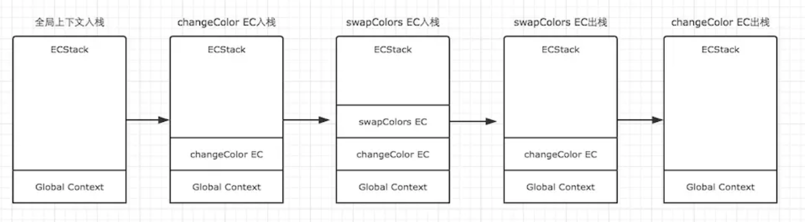
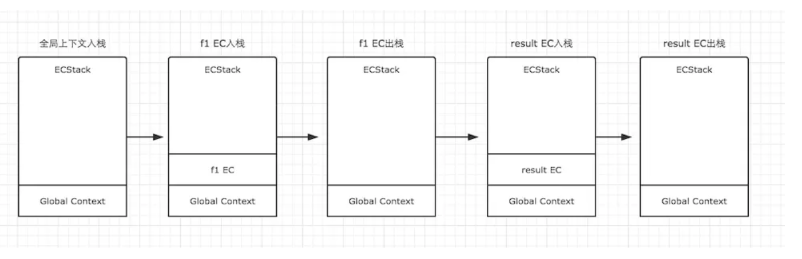
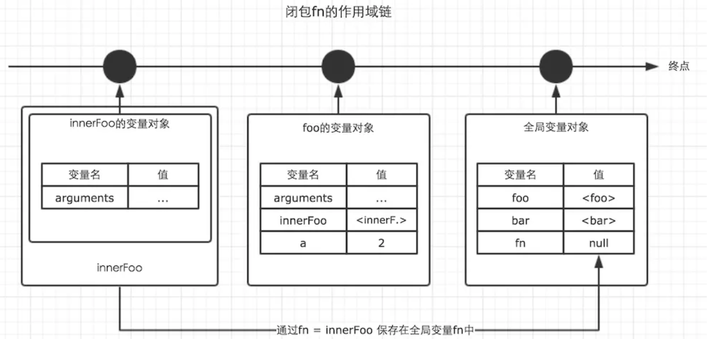
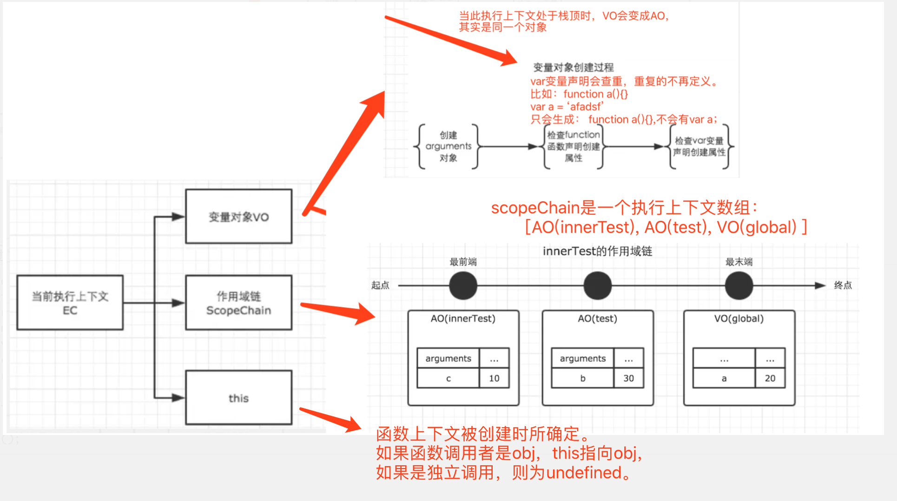

1、call的一种实现， apply的实现同下，唯一不同的是传入的arguments是全部的变量数组
    
    
    ```bash
    var a = {
        name: 'zhangsan'
    }
    
    var b = function(age) {
    console.log(this.name)
    console.log(age)
    }
    Function.prototype.call2 = function(context){
      //  call 和 apply的作用 是在 要绑定的obj上添加一个fn， fn为当前要执行的fn，通过执行obj.fn改变真正执行时候的this
      context.fn = this
      var args = Array.prototype.slice.call(arguments,1);
      var result = context.fn(...args)
        delete context.fn
      return result
    }
    b.call2(a, '23')
    ```

2、执行上下文：js引擎在执行一段代码之前，会将当前代码中用到的变量、函数以及this放到一个object中。
    
    
    ```bash
    var a = 1;
    function fun() {
       'use strict';
          var a = 2;
          return this.a;
    }
    fun();//严格模式下函数中的this为undefined，非严格模式下this = window （非严格模式下this为undefined时会默认指向window）
    var a = 1;
    Var obj = {
        a: 2,
        b: function(){
            function test(){
                console.log(this.a)
            }
            test()
        }
    }
    obj.b()  // 同样在输出为1 而不是2
    var a = 1;
    Var obj = {
        a: 2,
        b: function(){
           console.log(this.a)
        }
    }
    Obj.b()  // this为obj，输出为2
    var t = obj.b
    t() // 输出为1 此时代码执行的上下文为window
    ```

3、箭头函数的this是不变的
    
    
    ```bash
    var a = 1;
    var obj = {
      a: 2
    };
    var fun = () => console.log(this.a); // 箭头函数会捕获当前上下文的this作为执行的this并且保持不变，此处为window
    fun();//1
    fun.call(obj)//1
    function Fun() {
      this.name = 'Damonare';
    }
    Fun.prototype.say = () => {
       console.log(this);
    }
    var f = new Fun();
    f.say();//window  say在定义时已经确定上下文是window
    ```

4、构造函数中的this代表实例对象
    
    
    ```plain
    function Fun() {
      this.name = 'Damonre';
      this.age = 21;
      this.sex = 'man';
      this.run = function () {
        return this.name + '正在跑步';
      }
    }
    var a = new Fun();
    a.run() // Damonre
    ```

5、
    
    
    ```bash
    function Fun() {
      this.name = 'Damonare';
        this.say = () => {
                  console.log(this);
            }
    }
    var f = new Fun();
    f.say();//Fun的实例对象  此时的箭头函数的上下文为构造函数，构造函数的上下文为实例对象
    ```

6、执行执行上下文的创建流程  
（1）默认是全局上下文global context， 每遇到一个函数会创建一个函数执行上下文，进入栈， 只有在栈顶时才会激活执行上下文。  
  
（2）闭包的执行上下文创建过程
    
    
    ```bash
    function f1(){
        var n=999;
        function f2(){
            alert(n);
        }
        return f2;
    }
    var result=f1();
    result();
    ```

  
  
通过闭包的作用域链可以发现，innerFoo在全局中保留了一个引用，导致未被回收。  
（3）一个执行上下文的结构如下：  
  
执行过程中对属性的查找是按照作用域链条进行查找，并且查找过程是不可逆的， 只能向后查找，因此全局的无法访问内部函数的变量。
    
    
    ```bash
    var a = 20;
    function test() {
      var b = a + 10;
      function innerTest() {
        var c = 10;
        console.log(f); // f最后没查找到， 返回为undefined。
        return a + b + c;  // 此处对a的访问，首先查找AO(innerTest),然后查找AO(test), 最后查找vo(global)查找到。
      }
      return innerTest();
    }
    test();
    ```
