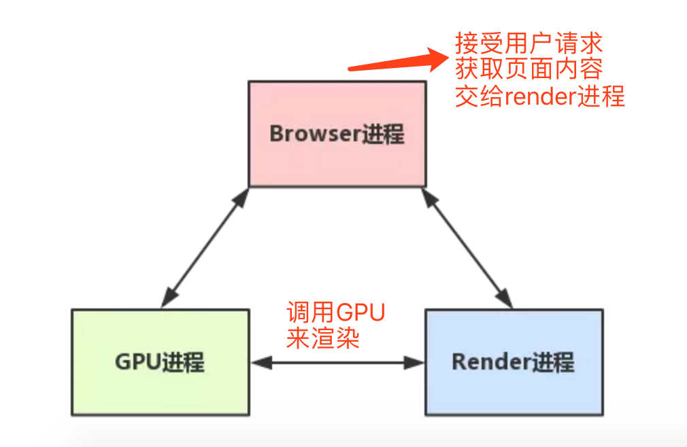
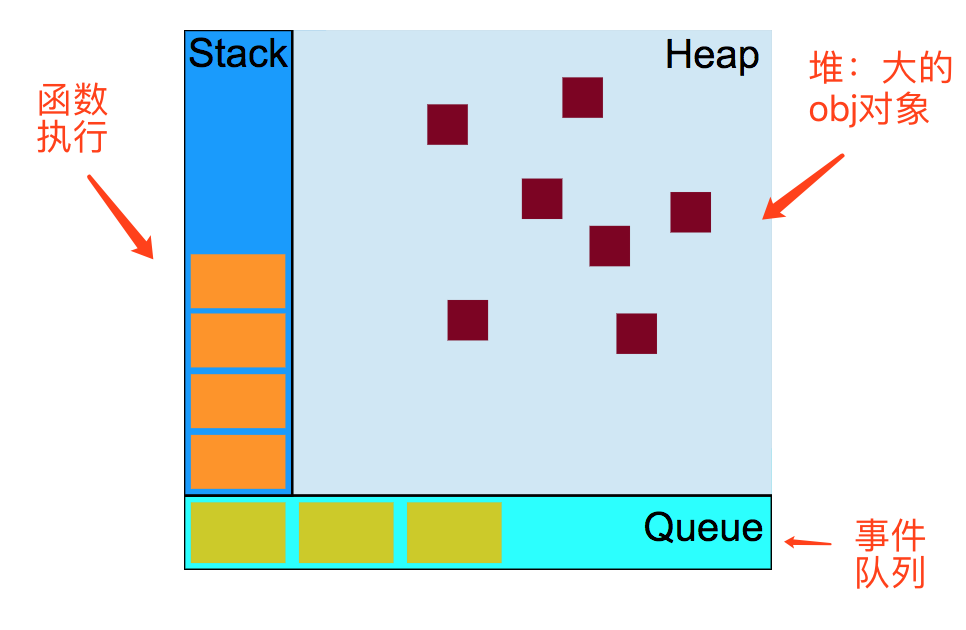
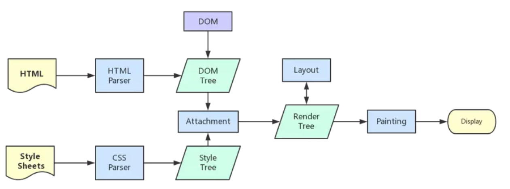
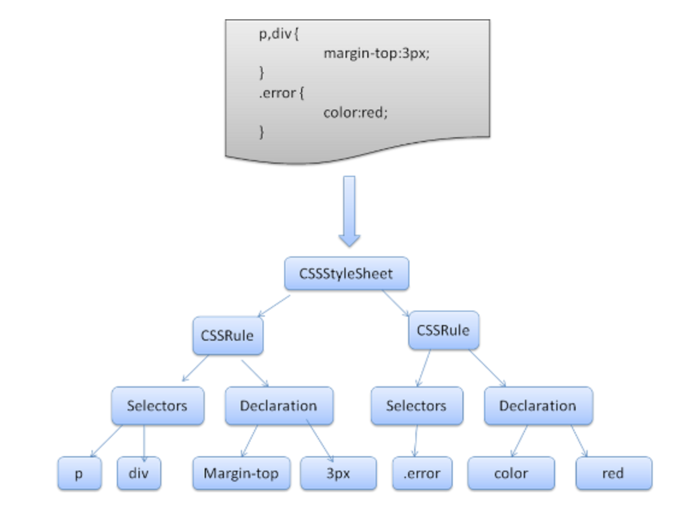
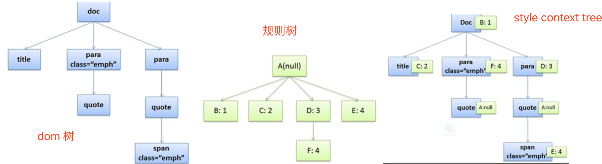

1、浏览器是多进程的比如chrome

  * browser进程：与用户交互、浏览器的前进后退、各个tab页面的管理等
  * GPU进程：3D页面绘制等
  * 浏览器渲染进程（Render进程，其内部是多线程的）每个tab对应一个，相互独立。  
  
2、如上所述Render进程是多线程的
  * JS引擎线程—– 主线程（JS内核负责解析和运行代码，一个Render进程只有一个JS引擎线程）
  * GUI渲染线程：负责渲染浏览器界面，当界面需要repaint或者reflow时就会执行。
  * 事件触发线程：事件被触发时，将事件添加到事件处理队列等待JS引擎被执行。
  * 定时触发线程：setTimeout、setInterval所在线程
  * 异步请求线程：XMLHttpRequest在连接后通过浏览器开一个线程请求  
3、JS引擎和渲染引擎之间的关系
  * JS引擎线程和GUI渲染线程是互斥的，JS引擎执行时，GUI渲染线程会被挂起。
  * JS引擎花费时间过多时，会出现浏览器卡死的情况。
  * JS是单线程是指解释和执行JS的线程只有一个，即主线程、JS引擎线程。  
4、JS的运行机制如下
  * 所有的同步任务都在主线程上执行，形成一个函数执行栈
  * 主线程之外有个任务队列
  * 一旦stack为空，主线程就去读取任务队列中的异步任务进行执行
  * 主线程循环重复上面三个步骤
  * 事件触发线程注册函数，当事件触发时，被推入event loop（消息队列的形式，消息队列中每一条信息都对应着一个事件）
  * 主线程函数栈执行完后，循环从消息队列中取消息进行处理  
  
5、web worker & share worker
  * JS引擎向浏览器申请开一个子线程做一些耗时处理（此子线程不能操作dom，完全受JS引擎的控制）
  * share worker是浏览器的多个tab共享的，web worker属于单独的一个tab  
6、宏任务（macro-task）和微任务(micro-task)的执行
  * 宏任务： script\setTimeout\setTimeInterval\setTimeImmediate\
  * 微任务： promise、process.nextTick、mutationObserver
  * 根据html standard，在每个macro-task执行完之后，UI都会重新渲染，如果再micro-task中完成数据的处理，则当前task执行完之后就可以得到最终的UI，但如果在一个新的task中进行执行，需要两次渲染才能得到最终的UI，这也是promise要好于setTimeOut的地方。
        
        ```bash
        setTimeout(function(){
             console.log('定时器开始啦’)
         });
        
         new Promise(function(resolve){
             console.log('马上执行for循环啦’);
             for(var i = 0; i < 10000; i++){
                 i == 99 && resolve();
             }
         }).then(function(){
             console.log('执行then函数啦’)
         });
         console.log('代码执行结束’);
        ```

// 浏览器的执行结果为 马上执行for循环啦 -> 代码执行结束 -> 执行then函数啦 -> 定时器开始啦


1.整体script作为第一个宏任务进入主线程，这是第一轮宏任务。  
2.遇到setTimeout，其回调函数被分发到宏任务Event Queue中，这是第二个宏任务。  
3.继续执行，打印【马上执行for循环啦】  
4.遇到promise.then()微任务，这是第一轮宏任务下的微任务，因为整体script是第一轮宏任务嘛  
5.继续执行，打印【代码执行结束】  
6.现在整体script作为第一轮宏任务，去检查这一轮下的微任务，发现有一个promise.then()，去执行它  
（至此现在第一轮宏任务，以及这一轮宏任务下的微任务都被执行过了）  
7.开始第二轮宏任务，发现宏任务队列里有一个setTimeout，执行它，就打印了【定时器开始啦】  
// 注意： node中的执行结果和上面是不同的  
7、浏览器渲染流程  
  
style Tree的结构  


  * Dom树构建的过程包括符号化和构建树两个过程，符号化采用符号识别算法
  * DomContentLoaded仅当dom加载完成不包括样式表，onload事件是dom、样式、图片、脚本全都执行完毕了
  * 从上图可以看到、Css的加载不会阻塞dom树的解析但会阻塞render树的渲染
  * Web模式是同步的，遇到script标签，会执行完js再进行后续的解析，遇到引用外部的script，同样会等到js下载完，这样会阻塞后续的资源下载，因此出现了预解析。
  * 预解析分析引用的外部资源，同步进行下载以提高速度，但并不构建dom树。
  * 渲染树和dom树不是一一对应的，不可见的dom元素不会插入到渲染树中，display为none的元素也不会插入。  
8、dom树的构建过程
  * 二进制字节流 — -1—> 字符流 —–2—-> 词语 ——-3–> 多个节点 -—-4——->Dom树
  * 1是根据页面的编码格式， 2根据词法分析（基于状态机的符号识别算法）
  * 4可以利用栈（所有的标签都是闭合的），3是存储类似于
  * 在步骤3中会识别出全局的JavaScript代码，此时dom树尚未创建，因此不能访问dom。  
9、layout(reflow)和repaint，layout就是计算元素的大小位置等信息，确定每个元素在页面上的位置
  * Layout(reflow):表示元素的内容、结构、尺寸位置发生了变化，需要重新计算样式和渲染树
  * repaint:元素的背景色、边框文字颜色发生变化。
  * reflow的成本要高于repaint，应该尽量避免reflow，回流一定伴随着重绘，重绘却会单独出现  
10、引起layout（reflow）的情况
  * dom结构改变比如删除一个节点
  * render树变化，比如padding变化
  * 窗口resize
  * font字体大小发生变化
  * 获取一些属性时会引发回流，比如： offset（height/width…）、scroll（height/width…）、client（height/width…）,width，height，getComputedStyle等
        
        ```bash
        var s = document.body.style;
        s.padding = "2px"; // 回流+重绘
        s.border = "1px solid red"; // 再一次 回流+重绘
        s.color = "blue"; // 再一次重绘
        s.backgroundColor = "#ccc"; // 再一次 重绘
        s.fontSize = "14px"; // 再一次 回流+重绘
        // 添加node，再一次 回流+重绘
        document.body.appendChild(document.createTextNode('abc!'));
        ```

11、reflow的优化方案
  * style的改变一次性改，比如通过class改变
  * 避免循环添加dom，统一处理一次添加
  * 将复杂的元素绝对或者固定定位，脱离文档流，减少回流代价  
12、防止浏览器卡死的方式
  * 优化循环
        
        ```bash
        function chunk(array, process, context) {
            setTimeout(function inner() {
                var item = array.shift();
                process.call(context, item);
                if (array.length > 0) {
                    setTimeout(inner, 100);
                }
           }, 100);
        }   //  此处递归操作直接用inner 而不是直接调用chunk的原因如下：
        Var  chunkObj = chunk
        chunObj(array, process, context) // 可以正常执行
        chunk = function(array, process, context) { console.log(‘fadfdasfds’)}
        chunObj(array, process, context) // 不能正常执行，其内部的 chunk已经被新的定义替代
        ```

  * 如果函数体内有不相干的、执行也没有先后的操作，则可以用chunk方式进行拆分或者直接交给浏览器去调度
        
        ```bash
        function doSomething(){
          setTimeout（dosomething1, 0）
          setTimeout（dosomething2, 0）
        }
        * 优化递归操作
        function fac(num) {
            var tmp = {}
          return (function fn(n){
              var res;
              if (tmp[n]){
             res= tmp[n];
             console.log('match'+n)   // 此处通过暂存数据，将减少递归层次， 这种优化牺牲了空间，还有一种方式是中间的结果不暂存， 利用迭代操作进行优化。
            } else {
              if(n <= 1) res = 1;
              else res = fn(n-2) + fn(n-1)
            }
            tmp[n] = res;
            return res;
          })(num)
        }
        ```

  * 减少dom操作： 例如改变style的三个值不如通过设置一个class效率更高  
13、外链css的下载会阻塞JS的执行
        
        ```bash
        <html>
        <body>
            <h2>Hello</h2>
            <script>
            function printH2() {
                console.log('first script', document.querySelectorAll('h2'));
            }
            printH2()
            setTimeout(printH2)   //  JS脚本之前如果没有css标签，这部分的执行是不会被阻塞的
            </script>
            <link rel="stylesheet" href="http://cdn.bootcss.com/bootstrap/4.0.0-alpha.4/css/bootstrap.css">
            <h2>World</h2>
            <script>
            console.log('second script’); //   此处的执行会受到css的下载的影响
            </script>
        </body>
        </html>
        ```

14、两个js的执行并非等到完全下载完
        
        ```bash
        <body>
        <script src="1.js"></script>  // 如果1下载5s， 2下载10s，1在5s后执行，2在10s后执行
        <script src="2.js"></script>  // 如果1下载10s， 2下载5s, 1在10s后执行，1执行完再执行2
        </body>
        ```

15：渲染过程的一个例子（一下为firefox的例子）
        
        ```bash
        <doc>
        <title>A few quotes</title>
        <para class="emph">
          Franklin said that <quote>"A penny saved is a penny earned."</quote>
        </para>
        <para>
          FDR said <quote>"We have nothing to fear but <span class="emph">fear itself.</span>"</quote>
        </para>
        </doc>
        ```

css 规则如下：
        
        ```bash
         /* rule 1 */ doc { display: block; text-indent: 1em; }
        /* rule 2 */ title { display: block; font-size: 3em; }
        /* rule 3 */ para { display: block; }
        /* rule 4 */ [class="emph"] { font-style: italic; }
        ```

对应的dom树、css规则树以及style context tree分别为：(此段描述的未 attachment的过程：其实就是dom树上的每个节点，找到其对应的style的过程)  

  * css rule tree结构为（css rule tree是根据dom树构建出来的，所以4节点有两个
  * CSS匹配HTML元素是一个相当复杂和有性能问题的事情。所以，你就会在N多地方看到很多人都告诉你，DOM树要小，CSS尽量用id和class，千万不要过渡层叠下去
  * chrom中不存在规则树，他直接将节点的style存在了dom树的节点上
  * 接下来开始计算CSS样式（每个dom节点的）—>构建Render Tree -> Layout(定位坐标和大小，换行、position, overflow, z-index等）—>composition -> paint


