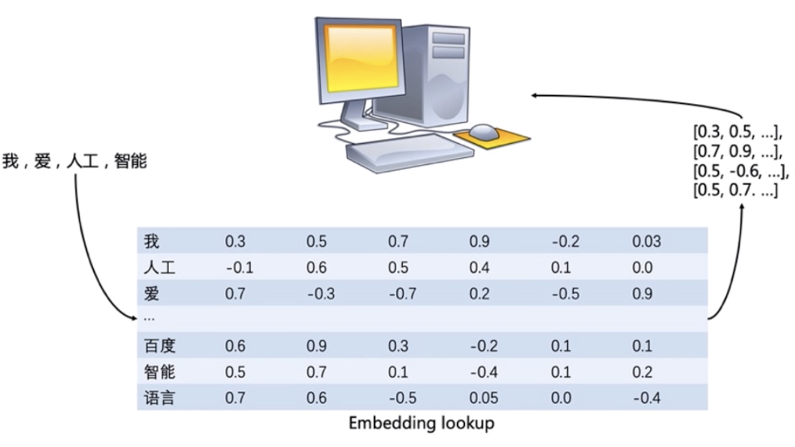
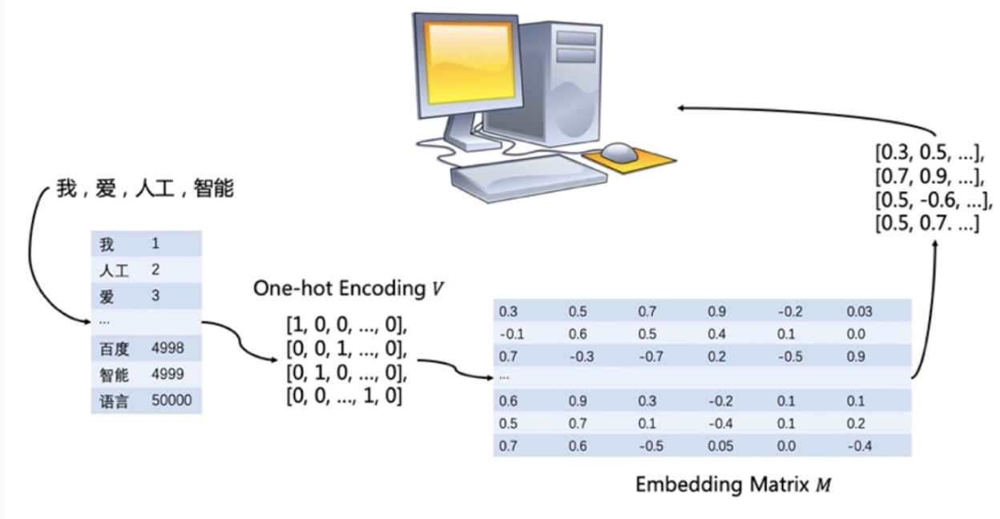
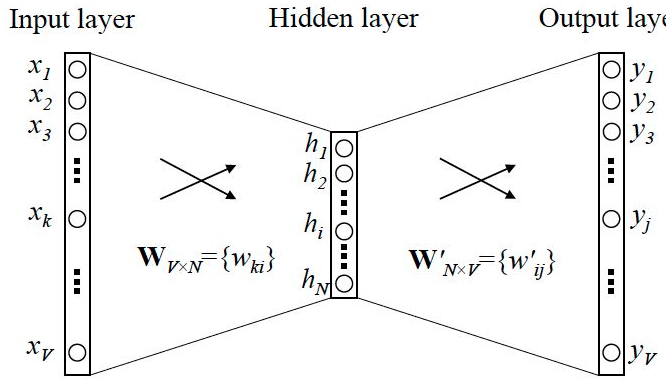
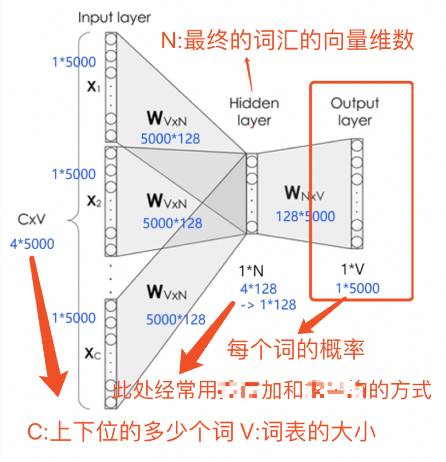
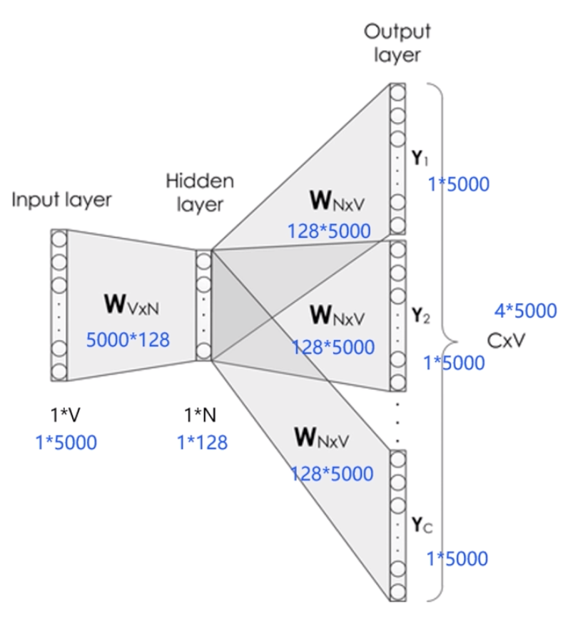
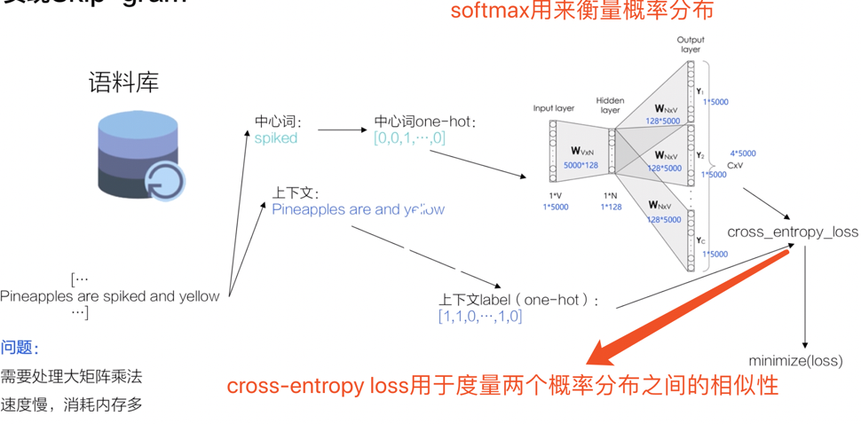
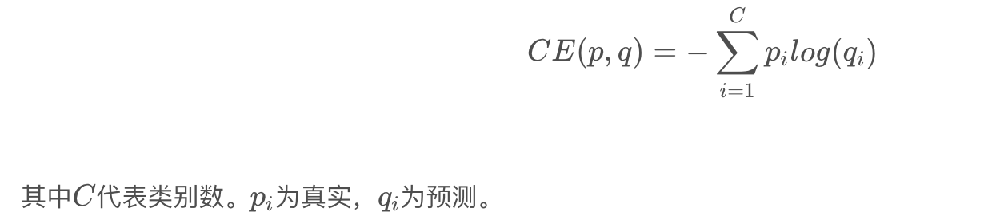
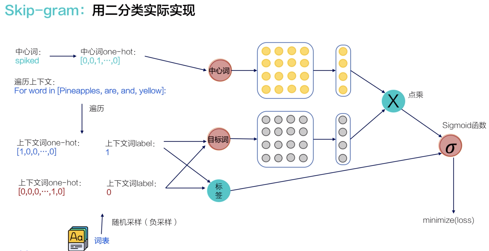
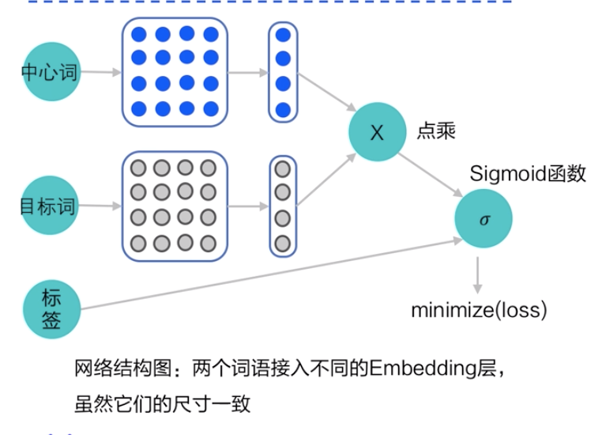

自然语言处理 = 文本处理 + 机器学习  
文本处理的首要任务是文本表示，也就是将文字等符号数学化。

#### Distributional representation 和 Distributed representations

属于文本表示的两种思路，而不是具体的算法，并且不是一个维度上的对比；

  * Distributional representation：通过观察一个词的上下文，来得到这个词的语义，与之相对的是wordnet的方式；
  * Distributed representations: 用在deep learning中，每个词语不是表示成稀疏的变量，而是表示为一个低纬度、稠密的向量，向量的每一项没有具体的指征意义。（词的分布式表示）


#### 词向量和语言模型

词向量是用一个向量的形式表示词，词向量可以作为很多模型的输入，比如计算相似度，做high-level的文本分类、命名实体识别、情感分析等任务；  


#### 词向量One-hot embedding

构建词表，比如n维，根据词表将词在文本中的频次构建n维向量表示文本；  
缺点：丢失上下文信息；依赖词表大小，维度过大，过于稀疏；



#### Word2vec

word2vec: 根据神经网络，从大量无标注的文本中提取有用的信息而产生；word2vec可以理解为是一种降维的方式。

假设如下是一个三层的神经网络：如果上下文只考虑一个词，那就相当于用当前词x预测下一个词y，x和y用什么来表示？one hot encoder; 

假设词表大小是|V|，则x和y都是一个|V|* 1维的向量。  
从输入层到隐藏层、从隐藏层到输出层的两个权重矩阵可以用反向传播算法来求得到；  
假设隐层层的节点数是N，则从输入层到隐藏层的权重矩阵是N * V维，根据one hot encoder的表示，x中只有一个1，这样只有这一个位置的权重被激活，得到的这个N维的向量就可以唯一的表示x。

同理从隐藏层到输出层，由于y中只有一个位置为1，这样同样能得到一个N维的向量来表示y;这两个向量分别被称为输入向量和输出向量；一般会使用输入向量；从这里可以看出，word2vec实际是一个降维的操作，将|V|维的one hot encoder向量降到N维的向量；



#### CBOW & skip-Gram

embedding的两个训练算法CBOW和skip-Gram，前者的训练速度会更快，后者对生僻字的处理更好：

  * CBOW：拿一个词的上下文来预测整个词语本身,输入是C个词串联组成的向量；  


  * Skip-Gram：拿这个词来预测它周围的上下文，输出为C个词y串联的向量;  



#### skip_grammar训练

skip-gram的训练流程如下：  


其中交叉熵的计算公式：  


为了降低训练成本，提高训练效率，可以随机构造负样本，将问题处理成一个二分类的问题。  




使用paddlepaddle训练的forward函数：
    
    
    ```plain
    #定义skip-gram训练网络结构
    #这里我们使用的是paddlepaddle的1.8.0版本
    #一般来说，在使用fluid训练的时候，我们需要通过一个类来定义网络结构，这个类继承了fluid.dygraph.Layer
    class SkipGram(fluid.dygraph.Layer):
        def __init__(self, vocab_size, embedding_size, init_scale=0.1):
            #vocab_size定义了这个skipgram这个模型的词表大小
            #embedding_size定义了词向量的维度是多少
            #init_scale定义了词向量初始化的范围，一般来说，比较小的初始化范围有助于模型训练
            super(SkipGram, self).__init__()
            self.vocab_size = vocab_size
            self.embedding_size = embedding_size
    
            #使用paddle.fluid.dygraph提供的Embedding函数，构造一个词向量参数
            #这个参数的大小为：[self.vocab_size, self.embedding_size]
            #数据类型为：float32
            #这个参数的名称为：embedding_para
            #这个参数的初始化方式为在[-init_scale, init_scale]区间进行均匀采样
            self.embedding = Embedding(
                size=[self.vocab_size, self.embedding_size],
                dtype='float32',
                param_attr=fluid.ParamAttr(
                    name='embedding_para',
                    initializer=fluid.initializer.UniformInitializer(
                        low=-0.5/embedding_size, high=0.5/embedding_size)))
    
            #使用paddle.fluid.dygraph提供的Embedding函数，构造另外一个词向量参数
            #这个参数的大小为：[self.vocab_size, self.embedding_size]
            #数据类型为：float32
            #这个参数的名称为：embedding_para_out
            #这个参数的初始化方式为在[-init_scale, init_scale]区间进行均匀采样
            #跟上面不同的是，这个参数的名称跟上面不同，因此，
            #embedding_para_out和embedding_para虽然有相同的shape，但是权重不共享
            self.embedding_out = Embedding(
                size=[self.vocab_size, self.embedding_size],
                dtype='float32',
                param_attr=fluid.ParamAttr(
                    name='embedding_out_para',
                    initializer=fluid.initializer.UniformInitializer(
                        low=-0.5/embedding_size, high=0.5/embedding_size)))
    
        #定义网络的前向计算逻辑
        #center_words是一个tensor（mini-batch），表示中心词
        #target_words是一个tensor（mini-batch），表示目标词
        #label是一个tensor（mini-batch），表示这个词是正样本还是负样本（用0或1表示）
        #用于在训练中计算这个tensor中对应词的同义词，用于观察模型的训练效果
        def forward(self, center_words, target_words, label):
            #首先，通过embedding_para（self.embedding）参数，将mini-batch中的词转换为词向量
            #这里center_words和eval_words_emb查询的是一个相同的参数
            #而target_words_emb查询的是另一个参数
            center_words_emb = self.embedding(center_words)
            target_words_emb = self.embedding_out(target_words)
    
            #center_words_emb = [batch_size, embedding_size]
            #target_words_emb = [batch_size, embedding_size]
            #我们通过点乘的方式计算中心词到目标词的输出概率，并通过sigmoid函数估计这个词是正样本还是负样本的概率。
            word_sim = fluid.layers.elementwise_mul(center_words_emb, target_words_emb)
            word_sim = fluid.layers.reduce_sum(word_sim, dim = -1)
            word_sim = fluid.layers.reshape(word_sim, shape=[-1])
            pred = fluid.layers.sigmoid(word_sim)
            
            #通过估计的输出概率定义损失s函数，注意我们使用的是sigmoid_cross_entropy_with_logits函数
            #将sigmoid计算和cross entropy合并成一步计算可以更好的优化，所以输入的是word_sim，而不是pred
            
            loss = fluid.layers.sigmoid_cross_entropy_with_logits(word_sim, label)
            loss = fluid.layers.reduce_mean(loss)
            #返回前向计算的结果，飞桨会通过backward函数自动计算出反向结果。
            return pred, loss
    ```
    
    
    ```plain
    #开始训练，定义一些训练过程中需要使用的超参数
    batch_size = 512
    epoch_num = 3
    embedding_size = 200
    step = 0
    learning_rate = 0.001
    
    #定义一个使用word-embedding查询同义词的函数
    #这个函数query_token是要查询的词，k表示要返回多少个最相似的词，embed是我们学习到的word-embedding参数
    #我们通过计算不同词之间的cosine距离，来衡量词和词的相似度
    #具体实现如下，x代表要查询词的Embedding，Embedding参数矩阵W代表所有词的Embedding
    #两者计算Cos得出所有词对查询词的相似度得分向量，排序取top_k放入indices列表
    def get_similar_tokens(query_token, k, embed):
        W = embed.numpy()
        x = W[word2id_dict[query_token]]
        cos = np.dot(W, x) / np.sqrt(np.sum(W * W, axis=1) * np.sum(x * x) + 1e-9)
        flat = cos.flatten()
        indices = np.argpartition(flat, -k)[-k:]
        indices = indices[np.argsort(-flat[indices])]
        for i in indices:
            print('for word %s, the similar word is %s' % (query_token, str(id2word_dict[i])))
    
    #将模型放到GPU上训练（fluid.CUDAPlace(0)），如果需要指定CPU，则需要改为fluid.CPUPlace()
    with fluid.dygraph.guard(fluid.CUDAPlace(0)):
        #通过我们定义的SkipGram类，来构造一个Skip-gram模型网络
        skip_gram_model = SkipGram(vocab_size, embedding_size)
        #构造训练这个网络的优化器
        adam = fluid.optimizer.AdamOptimizer(learning_rate=learning_rate, parameter_list = skip_gram_model.parameters())
    
        #使用build_batch函数，以mini-batch为单位，遍历训练数据，并训练网络
        for center_words, target_words, label in build_batch(
            dataset, batch_size, epoch_num):
            #使用fluid.dygraph.to_variable函数，将一个numpy的tensor，转换为飞桨可计算的tensor
            center_words_var = fluid.dygraph.to_variable(center_words)
            target_words_var = fluid.dygraph.to_variable(target_words)
            label_var = fluid.dygraph.to_variable(label)
    
            #将转换后的tensor送入飞桨中，进行一次前向计算，并得到计算结果
            pred, loss = skip_gram_model(
                center_words_var, target_words_var, label_var)
    
            #通过backward函数，让程序自动完成反向计算
            loss.backward()
            #通过minimize函数，让程序根据loss，完成一步对参数的优化更新
            adam.minimize(loss)
            #使用clear_gradients函数清空模型中的梯度，以便于下一个mini-batch进行更新
            skip_gram_model.clear_gradients()
    
            #每经过100个mini-batch，打印一次当前的loss，看看loss是否在稳定下降
            step += 1
            if step % 100 == 0:
                print("step %d, loss %.3f" % (step, loss.numpy()[0]))
    
            #经过10000个mini-batch，打印一次模型对eval_words中的10个词计算的同义词
            #这里我们使用词和词之间的向量点积作为衡量相似度的方法
            #我们只打印了5个最相似的词
            if step % 10000 == 0:
                get_similar_tokens('one', 5, skip_gram_model.embedding.weight)
                get_similar_tokens('she', 5, skip_gram_model.embedding.weight)
                get_similar_tokens('chip', 5, skip_gram_model.embedding.weight)
    ```

#### doc2vec

在处理文本任务时候，比如长文本相似度、文本分类等任务，一般会先提取关键词，然后用关键词的向量进行平均或者拼接，来计算相似度；其实使用word2vec往往会丢失语序信息，因此提出了doc2vec模型；doc2vec模型加入了一个paragraph vector信息表达语序意义；和关键词向量一起作为输入；
