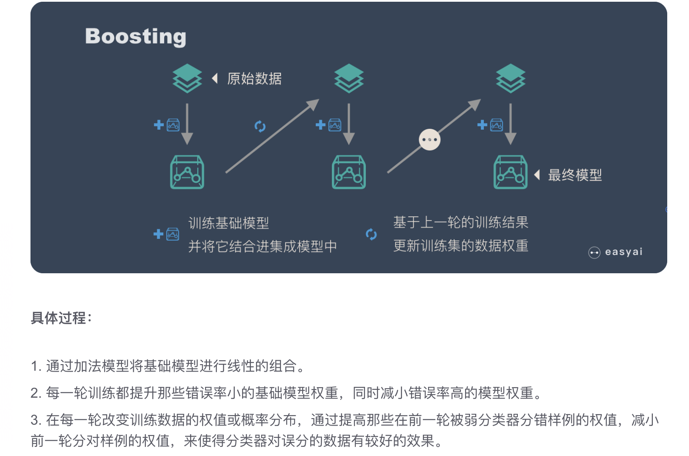
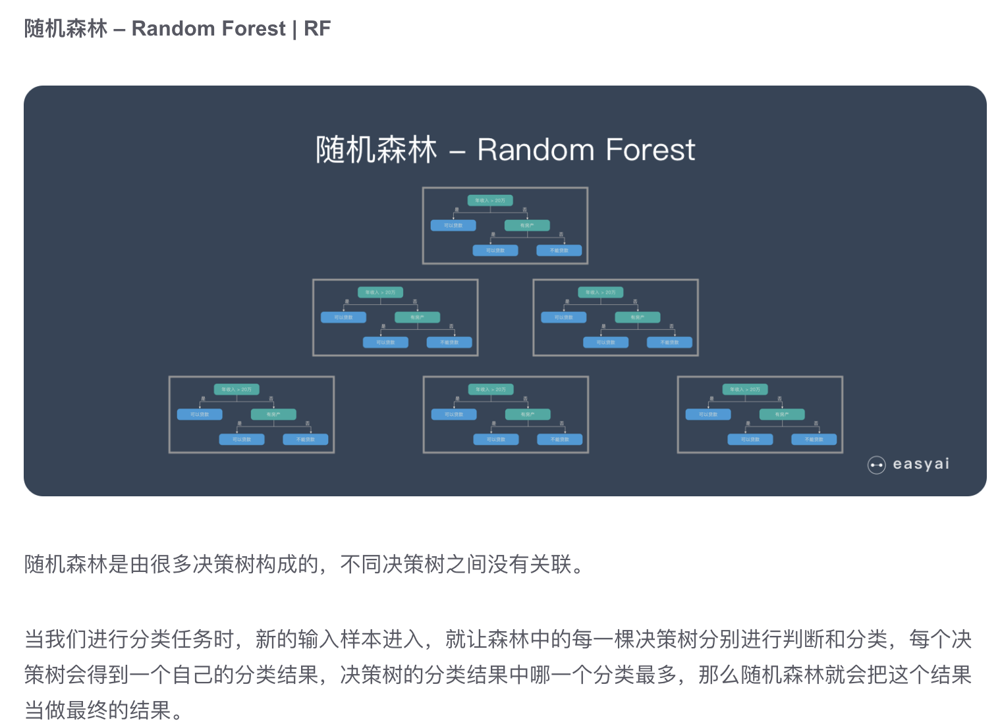
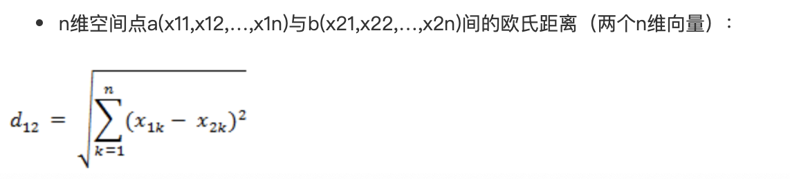
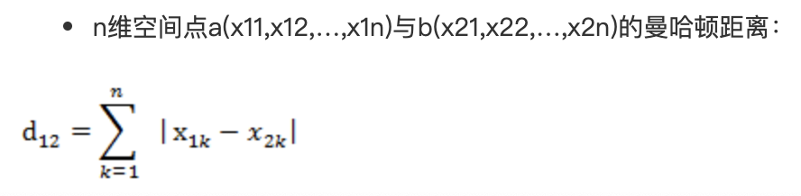
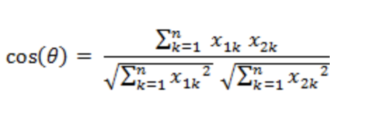
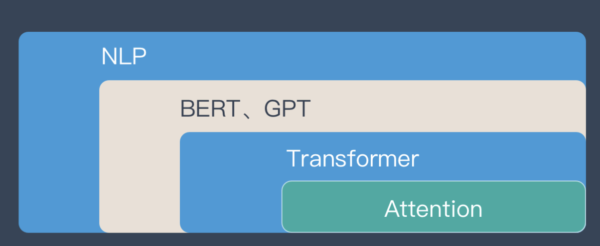
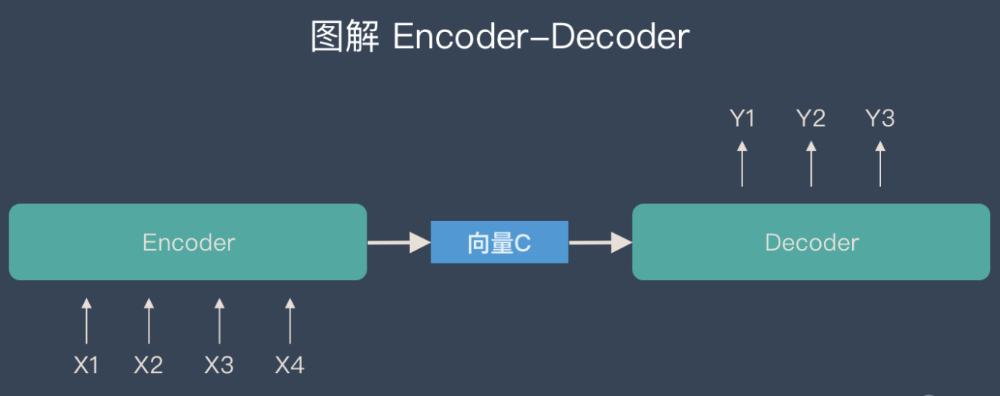
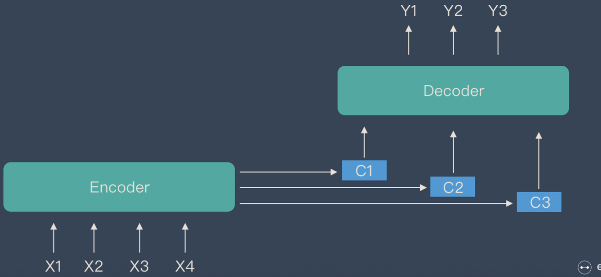
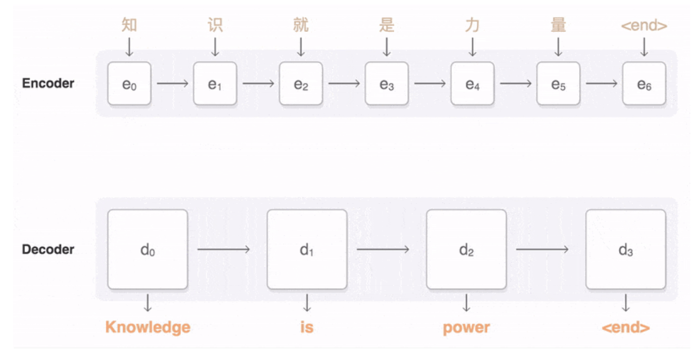
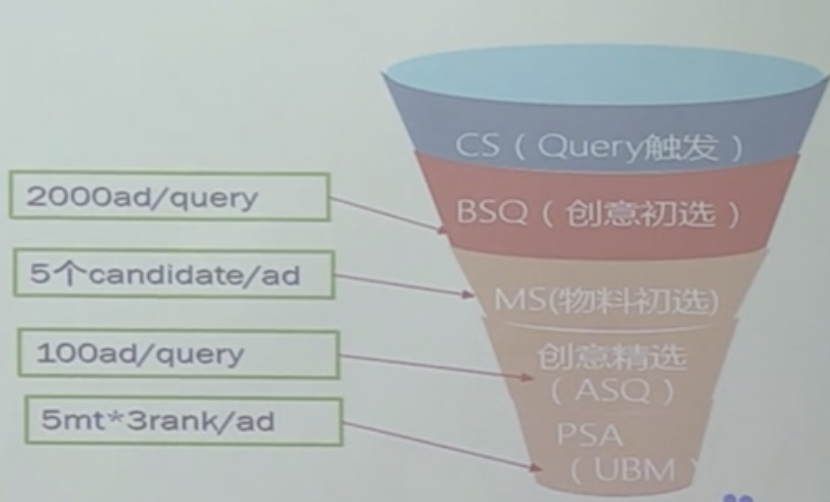

##### 监督学习的2个任务

  * 回归： 预测连续的、具体的数值，比如支付宝中的芝麻信用分数
  * 分类： 预测离散的值，比如性别，是否垃圾页面等；

##### 分类监督任务

  * 朴素贝叶斯：贝叶斯分类法是基于贝叶斯定定理的统计学分类方法。它通过预测一个给定的元组属于一个特定类的概率，来进行分类。朴素贝叶斯分类法假定一个属性值在给定类的影响独立于其他属性的–类条件独立性。
  * 决策树：决策树是一种简单但广泛使用的分类器，它通过训练数据构建决策树，对未知的数据进行分类。
  * SVM：支持向量机把分类问题转化为寻找分类平面的问题，并通过最大化分类边界点距离分类平面的距离来实现分类。
  * 逻辑回归：逻辑回归是用于处理因变量为分类变量的回归问题，常见的是二分类或二项分布问题，也可以处理多分类问题，它实际上是属于一种分类方法。

##### 回归监督任务

  * 线性回归: 线性回归是处理回归任务最常用的算法之一。该算法的形式十分简单，它期望使用一个超平面拟合数据集（只有两个变量的时候就是一条直线）。
  * 回归树: 回归树（决策树的一种）通过将数据集重复分割为不同的分支而实现分层学习，分割的标准是最大化每一次分离的信息增益。这种分支结构让回归树很自然地学习到非线性关系。
  * K邻近: 通过搜索K个最相似的实例（邻居）的整个训练集并总结那些K个实例的输出变量，对新数据点进行预测。
  * Adaboosting: Adaboost目的就是从训练数据中学习一系列的弱分类器或基本分类器，然后将这些弱分类器组合成一个强分类器。  
神经网络: 它从信息处理角度对人脑神经元网络进行抽象， 建立某种简单模型，按不同的连接方式组成不同的网络。

##### 数据集

  * 训练集：用来训练模型
  * 验证集：确保模型没有过拟合
  * 测试集：评估效果

#### 决策树

决策树算法采用树形结构，使用层层推理（if-then-else）来实现最终的分类。决策树由下面几种元素构成：

  * 根节点：包含样本的全集;
  * 内部节点：对应一个特征属性值;
  * 叶节点：代表决策的结果;  
训练的三个步骤：
  * 特征选择：筛选出和结果最相关的特征；
  * 决策树生成： 从根节点出发，每次对节点计算所有特征的信息增益，选择信息增益最大的特征作为节点特征；
  * 决策树剪枝  
典型的决策树算法：
  * ID3： 利用信息增益来选择特征
  * C4.5：引入“信息增益比”指标作为特征的选择依据
  * CART：使用了基尼系数取代了信息熵模型。

#### boosting

Boosting是一种集合技术，试图从多个弱分类器中创建出一个强分类器。它的核心思路是——挑选精英。  

#### GBDT的原理

GBDT（Gradient Boosting Decision Tree）是一种迭代的决策树算法，又叫 MART（Multiple Additive Regression Tree)，它通过构造一组弱的学习器（树），并把多颗决策树的结果累加起来作为最终的预测输出。该算法将决策树与集成思想进行了有效的结合。

#### XGBoost

和GBDT不同，xgboost给损失函数增加了正则化项（L1或L2正则化项，视学习目标不同而取不同正则化参数。）  
有些损失函数是难以计算导数的，鉴于这种情况，xgboost使用损失函数的二阶泰勒展开作为损失函数的拟合  
GBDT的节点分裂方式是遍历所有特征的所有可能划分，再选取最优者分裂。xgboost使用分位点及分位数法，近似地计算，有效降低计算量。

#### L1 & L2 正则

  * L1正则化可以产生稀疏权值矩阵，即产生一个稀疏模型，可以用于特征选择；
  * L2正则化可以防止模型过拟合（overfitting）；一定程度上，L1也可以防止过拟合；

#### 随机森林

#### bias（偏差）& variance（方差）& Error(误差)

  * Error = bias + variance
  * bias: Bias表示的就是模型预测的值和真实值之间的距离的期望。
  * variance: 模型每一次输出结果与模型输出期望之间的误差，即模型的稳定性。

#### 欧氏距离&曼哈顿距离&余弦夹角

  * 欧氏距离： 两个点在空间中的距离；  

  * 曼哈顿距离：城市街区距离  

  * 余弦距离： 两个向量之间的差异  

#### softmax函数

softmax函数把一些输入映射为0-1之间的实数，并归一化保证和为1，常用在多分类中；

#### Attention

将有限的注意力集中到重点信息上，从而节省资源，快速获取有效信息；引入的原因：
  * 参数少
  * 速度快： 可以并行计算（RNN是不可以并行计算，CNN可以并行计算）
  * 效果好：因为是挑重点，因此即使文本长，也能从中抓住重点。  

#### encoder - decoder

标准的encoder-decoder中的变量是定长的。  
  
这样的缺点是：容易丢失信息；  
加入attention机制的encoder-decoder模型，中间是一组C向量；  

#### seq2seq

Seq2Seq是属于encoder-decoder，输入一个序列，输出另一个序列。这种结构最重要的地方在于输入序列和输出序列的长度是可变的。  

#### KNN和K-means

KNN：K近邻算法，找出样本X最相近的K个样本，K个样本中大多数属于哪个类别，则X样本就属于哪个类别；  
Kmeans：无监督的聚类的方法，首先会选出K个值作为质心，然后对数据集合中的每个样本，计算与质心的距离并划分到最近的一类；

#### 点击模型 & 相关性排序

点击模型：将用户的点击数据直接反馈到搜索引擎返回结果排序的模型。是一种后验排序；  
相关性排序: 根据query和page的相关性进行排序；这是一种先验排序；

##### 朴素贝叶斯

朴素贝叶斯是假设样本中间是相互独立的。

##### ctr预估模型

ctr预估模型广泛的用于个性化推荐、检索、在线广告等，用来学习和预测用户的反馈（购买、点击、收藏等）。  
ctr预估模型通常包含多个特征，高维、稀疏以及多类别是CTR预估模型的特征数据的典型特点。  
实际场景中数据分部严重失衡，query长尾效应很严重。  
点击率模型一般为线上系统，对响应时间要求很高，一般要小于<30ms;  
  
ctr预估的一个例子：  
如果用户搜索的历史query中出现了“宝马”，则认为用户对汽车类的推荐感兴趣。一种具体的做法是将当前用户的前三个或者五个query串联再加上用户的点击序列作为输入，利用LSTM模型，进行预估。

#### 点击模型

点击模型一般可以分为：

  * 在线服务： 完成训练数据的采集和线上预估服务，采用BaiduRPC框架，配置热加载；
  * 离线计算：完成线上日志和用户日志的拼接清洗、生成训练数据、模型训练。

