#### 神经网络分类

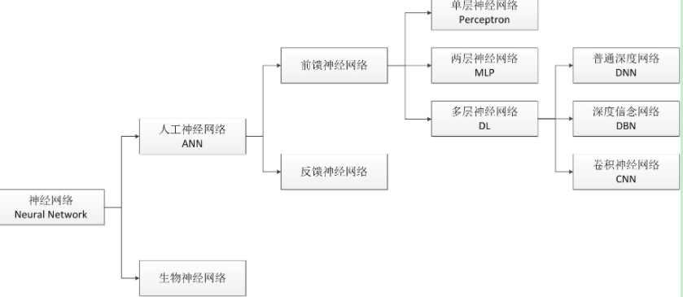

#### 神经网络的发展

  * 网络结构发展  
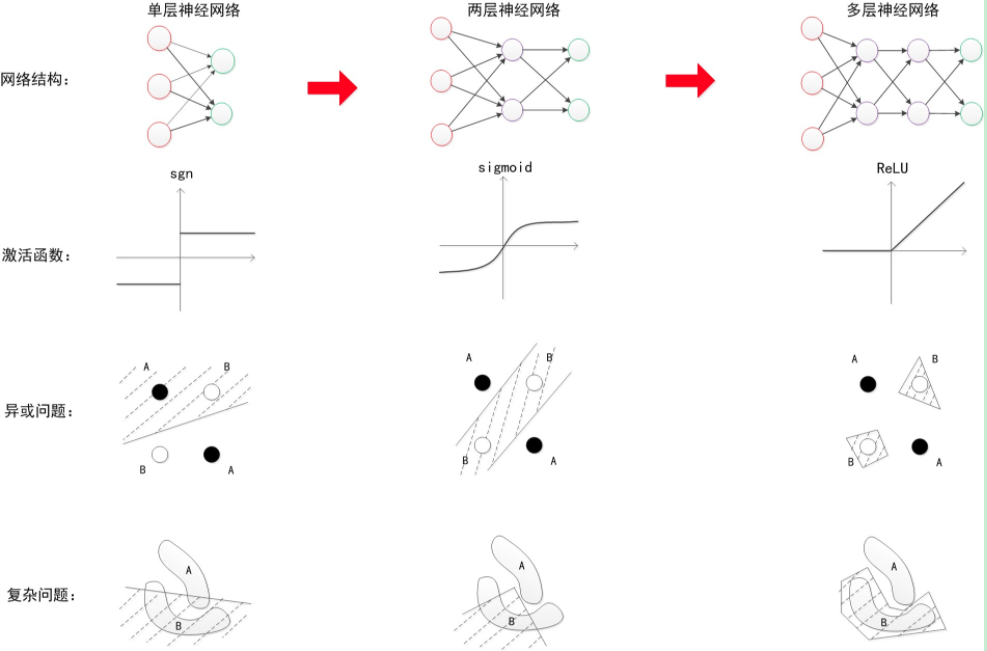
  * 算力发展  
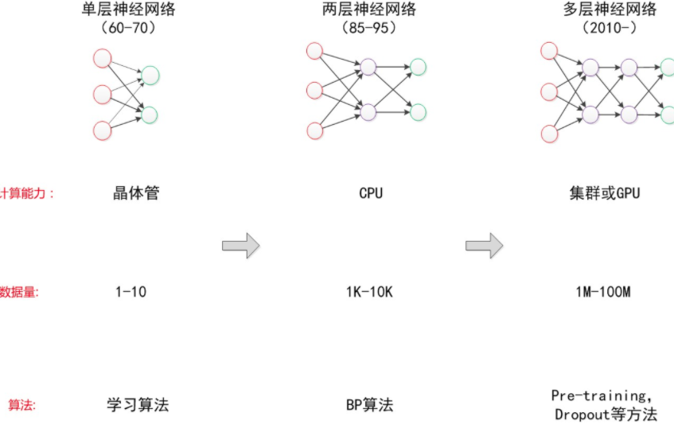  
神经网络在ACL中的占比图：  
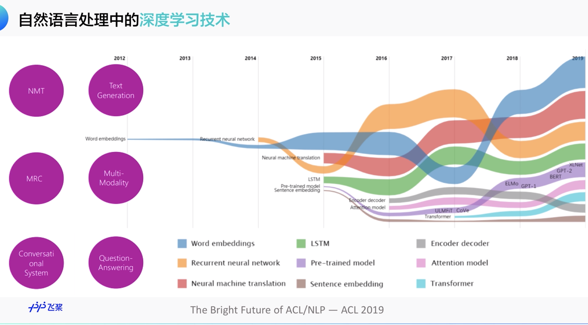

#### 神经网络&深度学习

神经网络最开始是单层神经网络，单层神经网络只能处理线性分类的问题，后来有人提出了双层神经网络，也就是单层神经网络中加了一个隐藏层，可以很好的解决非线性分类的任务。  
但双层神经网络的隐藏层从设计完全依赖于经验，节点数需要不断调参，并且优化很难，研究人员不爱用。神经网络进入冰河期。  
2006年提出了多层神经网络，和传统的神经网络训练方式不同的是，他先有一个“预训练”（pre-training）的过程，找到一个接近最优解的值，然后在通过微调（fine-tuning）技术进行优化网络。这两个技术的利用减少了训练的时间和难度，这就是深度学习。

深度学习不等于多层神经网络，深度学习是让多层神经网络可训练，可以work的一套架构和方法；  
深度学习四大要素:

  * 训练数据
  * 模型
  * 算力
  * 应用

深度学习在自然语言处理的位置：  
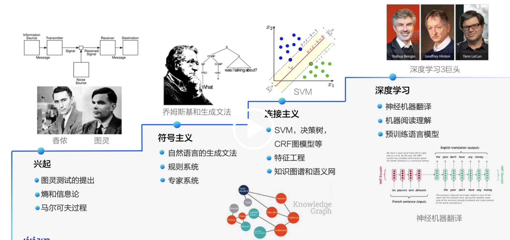

#### BP算法

BP算法：backPropagation，误差反向传播算法；  
正常情况下如果一个训练好的网络，给定输入，可以通过正向传播得到输出。但是训练网络才是最难的。训练的过程是为了减小LOSS值。  
BP算法的原理：在确认L+1层的误差向量以及权值矩阵后，就可以求出当前层的误差向量；因此如果得到最后一层的误差，就能找到所有的误差；  
训练过程为：

  * 先将训练集沿正向传播走一遍，保存下各种中间变量
  * 先计算出最后一层的误差；
  * 用误差更新最后一层的权重；
  * 计算前一层的误差；
  * 更新前一层的权重；
  * 再计算前一层的误差；
  * 更新权重，直到所有权重更新完成；

#### BPTT

训练RNN的方法用BPTT（基于时间反向传播），本质还是BP算法。  
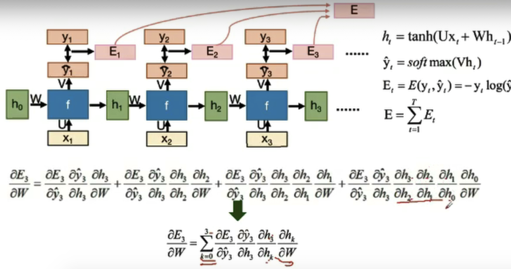

#### 梯度下降

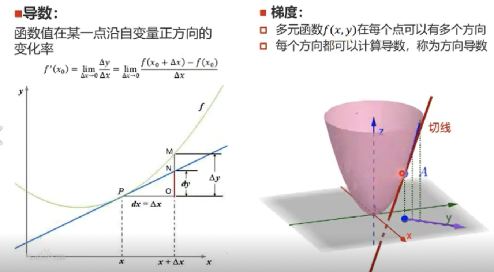  
BP算法根据损失函数计算的误差通过反向传播的方式，指导深度网络参数的更新优化。优化的目的是减少误差，即取得loss函数最小值；求解最小值的方法在数学上即使用梯度下降法；  
求解最优不是只有梯度下降法，还有拉格朗日松弛、分支定界、启发式模型等等；  
**使用梯度下降需要保证优化的函数是凸函数** 。  
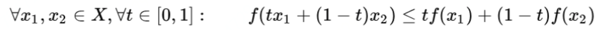

#### 训练出现loss=NAN的情况

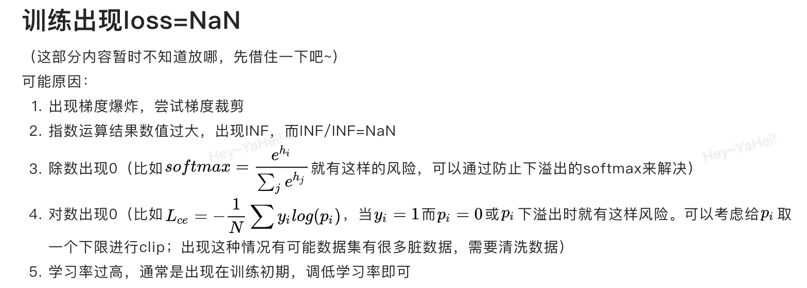

#### 模型微调

基于预训练模型去微调，比从头开始训练能节省大量的计算资源和计算时间，从而提高计算效率甚至提高准确率。  
浅层的卷积提取的是基础特征，深层的卷积层提取的是抽象的特征。预训练模型相当于已经具备了浅层的基础特征和深层的抽象特征能力。  
不同数据集下使用微调：（以下不具有指导意义，需要具体问题具体分析）

  * 训练数据少，但数据相似度极高，只需要修改最后几层或者最终的softmax层。
  * 数据量少，数据相似度低，可以冻结训练模型的前K层，重新训练剩余的n-k层。
  * 训练数据量大，相似度低，可以从头训练神经网络。
  * 数据量大，数据相似度高，使用预训练模型中的权重重新训练网络。

**网络计算量大的优化方式：**

  * FPGA硬件加速：除了用GPU之外，卷积操作也可以通过FPGA硬件加速。
  * 隐藏层共享，缓存；
  * 将多个属性拆成几个独立的部分进行训练，直接降维，最后再进行特征整合；
  * 进行模型蒸馏；

#### transfer learning和fine tune的区别：

  * fine-tuning：是一个trick，在迁移学习中有所涉及，但不仅仅出现在迁移学习中，指对参数进行微调；
  * Transfer learning： 可以看成是一套完整的体系，是一种处理流程；

#### 损失函数

损失函数是为了衡量预测值和实际值之间的距离的，损失函数越小说明预测的约准确。假设真实值为y，预测值为f(x)，样本数为m，常见的几种损失函数有：

  * 绝对值损失函数：m个样本的真实值和预测值之间距离的平均值；  
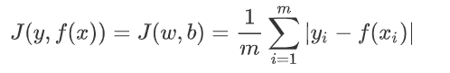
  * 均方差损失函数  
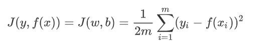
  * 交叉熵损失函数  
交叉熵损失函数常用于解决分类的问题，y的取值只有0或1。  
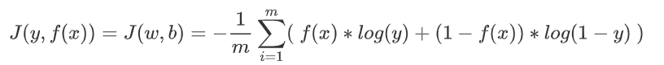

#### 激活函数

**引入激活函数的原因：** 神经网络的每一层相当于一个线性函数，多个神经网络层次相乘，最终还是一个线性函数。因此需要进行非线性映射。非线性变换相当于对空间进行变换，把原来线性不可分的问题变为线性可分的。  
**常见的激活函数**

  * sigmoid：也称之为Logistic函数，是LR模型指定的激活函数；公式和导数为：  
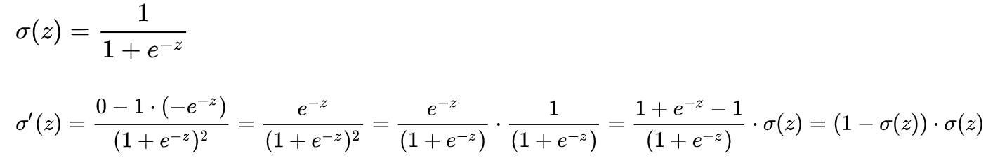

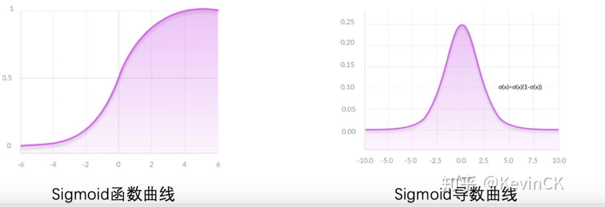  
优点：平滑，易求导  
缺点：激活函数计算量大，正向和逆向都包含幂等运算；导数在【0，0.25】之间，容易发生梯度消失；输出不是0均值；

  * tanh： 为sigmoid的平移和拉伸；解决了不是0均值的问题；但是梯度小时和幂等运算的问题依然存在；

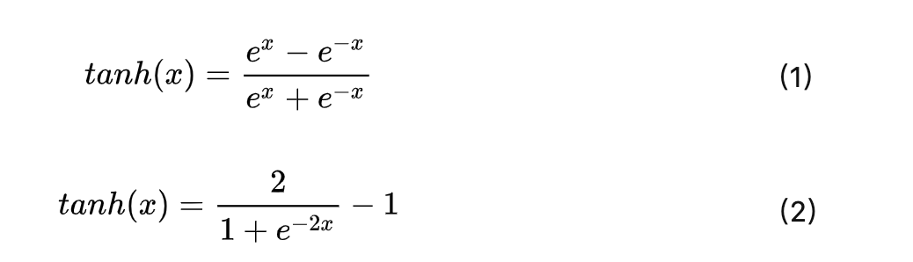

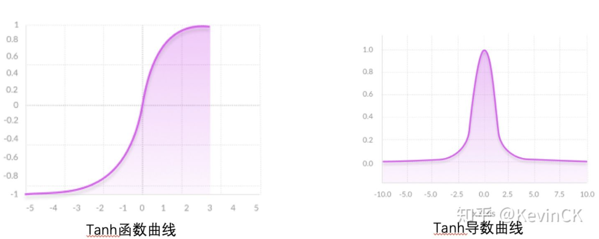

  * ReLu：修正线性单元函数；有效导数为1，解决了梯度消失和运算量的问题。导数为0，相当于一个去噪声的过程，但如果用ReLu，学习率不能设置的过大，容易导致模型学不到有效的特征；  
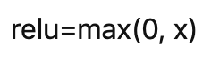  
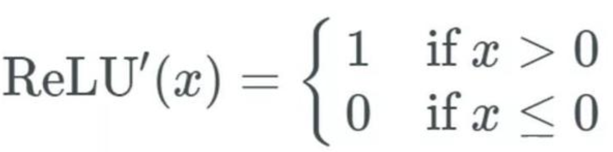  
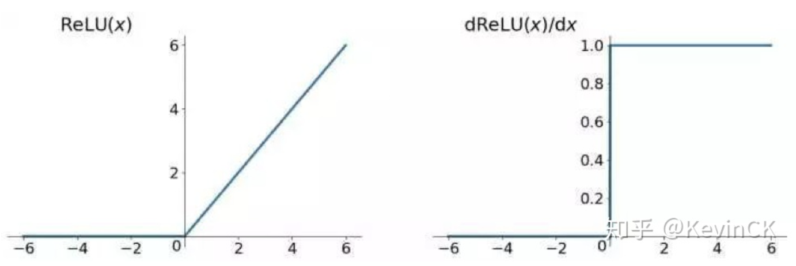

  * Leaky Relu  
为了防止模型”dead“的情况，在RELU的x<0的部分不设置为0，而是给一个很小的负数；  
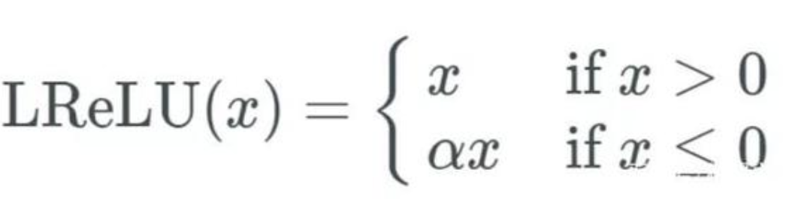  
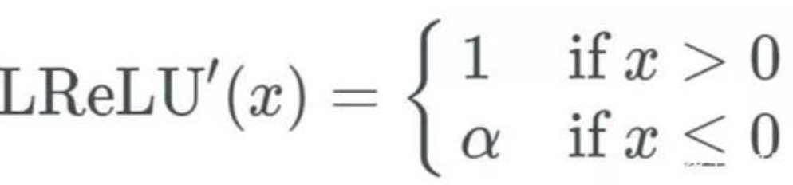

  * GELU：高斯误差线性单元激活函数。transformer使用的是gelu，似乎是当前最优秀的，能避免梯度爆炸、消失的问题。  
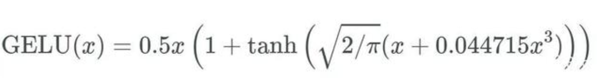  
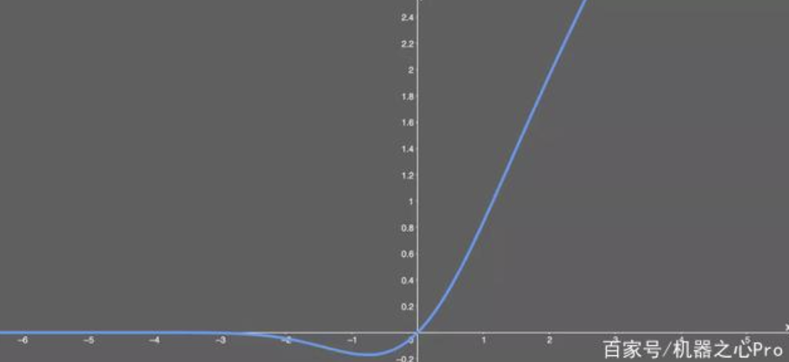

**ReLu的效果要优于tanh和sigmoid** ：  
1\. tanh和sigmoid需要求导，计算量大。ReLu计算量会节省很多。  
2\. Relu会使一部分的神经元的输出为0，会缓解过拟合的发生。  
3\. sigmoid和tanh在饱和区域的gradient非常平缓，接近于0，容易造成梯度消失的问题。而ReLu的gradient是常数。

#### 梯度爆炸和消失产生的原因

梯度下降作为一种最常见的迭代式优化策略，应用在神经网络的BP算法中，由于深度神经网络层级太深，在求导的过程中，由于链式法则，可能会出现梯度消失和梯度爆炸现象，为了搞清楚为什么会出现这些情况，以sigmoid激活函数为例子，从最简单的单层神经网络的求导过程着手，查看求导的结果。  
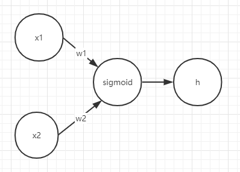  
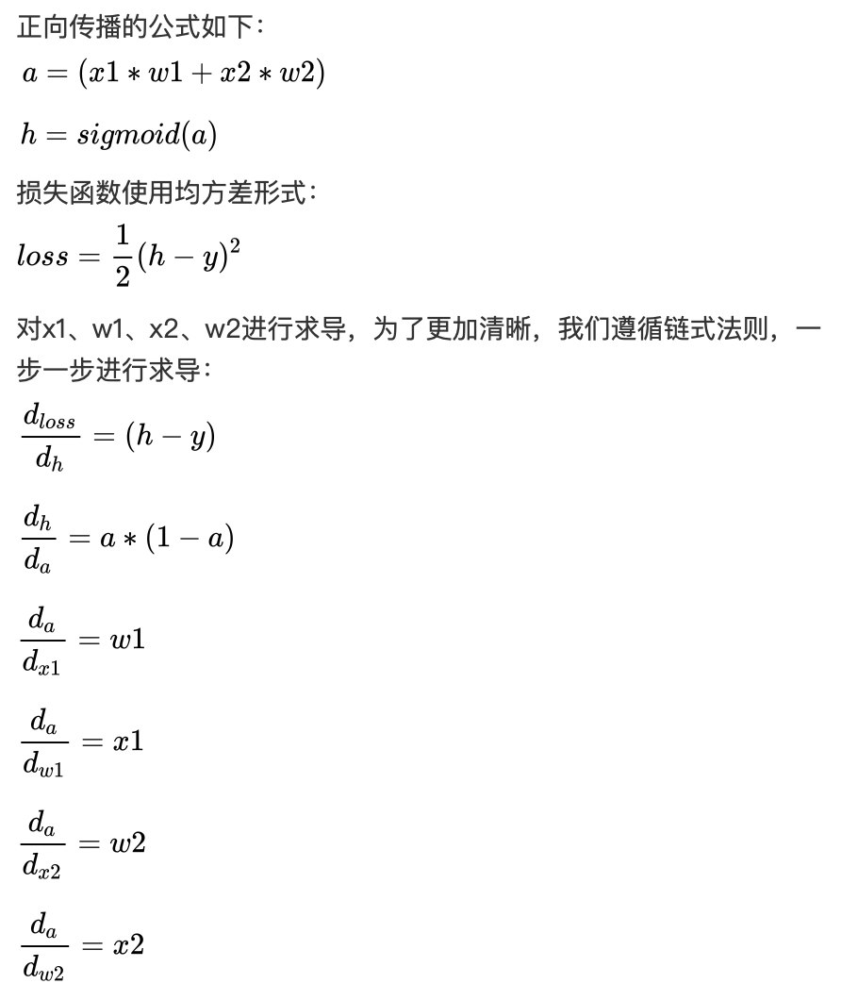  
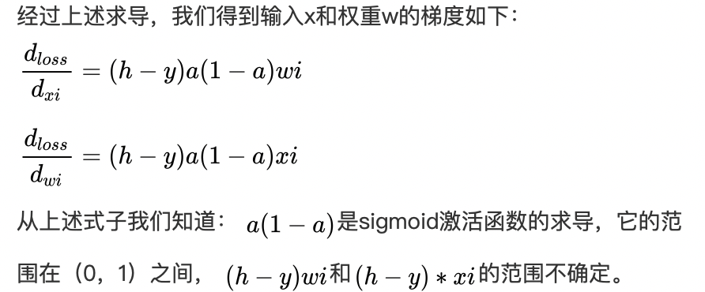  
梯度消失：如果层层之间的梯度均在（0，1）之间，层层缩小，那么就会出现梯度消失；表现是训练变慢；  
梯度爆炸：如果层层传递的梯度大于1，那么经过层层扩大，就会出现梯度爆炸，表现为：训练波动很大，不稳定；  
可见梯度的消失与爆炸与激活函数没有特别大的关系，反而和权重有较大关系，因此权重的初始化对神经网络的训练很重要。  
**总之梯度爆炸和梯度消失的产生主要是由于链式法则的求导、梯度层层缩放导致的，因为神经网络的不只有激活函数的作用，还有权重与神经元的相互作用。**

#### 解决梯度爆炸和消失的常用技术

  * 【缓解爆炸】合理的随机初始化策略：随机选取一些较小的数值，防止参数过大导致梯度爆炸；但参数过小，收敛过慢；
  * 【缓解消失】使用非饱和参数作为激活函数（如RELU）
  * 【缓解消失和爆炸】使用批归一化（Batch Normalization ）。是指在每层的激活函数之前添加一个BN操作，使得特征图数据归一化为均值为0，标准差为1的分布；  
归一化：数据预处理，将数据限定在特定范围内；  
标准化：数据预处理，使数据符合标准正态分布；  
正则化：在损失函数中添加惩罚项，增加建模的模糊性；
  * 【缓解爆炸】梯度剪裁（gradient clipping）：其思想是设置一个梯度剪切阈值，然后更新梯度的时候，如果梯度超过这个阈值，那么就将其强制限制在这个范围之内，通过这种直接的方法就可以防止梯度爆炸。
  * 【缓解消失和爆炸】复用预训练层，直接使用已经训练好的网略来训练一个新的任务；
  * 【缓解爆炸】权重正则化：比较常见的是l1正则，和l2正则，在各个深度框架中都有相应的API可以使用正则化，比如在tensorflow中，搭建网络的时候已经设置了正则化参数，则调用以下代码可以直接计算出正则损失：  
regularization_loss = tf.add_n(tf.losses.get_regularization_losses(scope=’my_resnet_50’))  
如果没有设置初始化参数，也可以使用以下代码计算l2正则损失：  
l2_loss = tf.add_n([tf.nn.l2_loss(var) for var in tf.trainable_variables() if ‘weights’ in var.name])
  * 【缓解消失】残差结构
  * 【缓解消失】LSTM：长短期记忆网络（long-short term memory networks），是不那么容易发生梯度消失的，主要原因在于LSTM内部复杂的“门”(gates)，LSTM通过它内部的“门”可以接下来更新的时候“记住”前几次训练的”残留记忆“，因此，经常用于生成文本中。

#### FC-全连接网络

每个节点都与上一层的所有节点相连。特点是参数剧多。

#### CNN-卷积神经网络

卷积神经网络的分层：

  * **输入层** ：一般做数据预处理
  * **卷积层** ：是为了提取特征，在不断的训练过程中，最终优化的就是这个特征，特征在CNN中称之为卷积核。卷积层是局部连接+参数共享，它可以看做是计算量和准确度的一种妥协；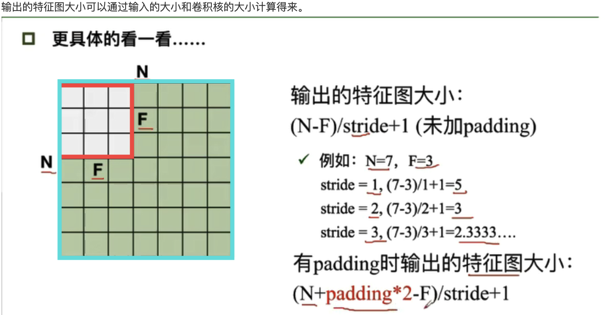
  * **激活层** ：对卷积层的结果做一次非线性映射。
  * **池化层** ：欠采样或者下采样，主要用于特征降维，压缩数据和参数的数量，减少过拟合；有max polling（最大池化）和average polling（平均池化）两种。
  * **全连接FC层** ：作用是将前面学到的特征引用到样本标记空间；参数量最大，通常在卷积神经网络的尾部。  
除了最后一层是全连接层，前面几层均为局部连接层，原因是：全连接层的参数太多，并且一个像素只和他周边的点相关，因此用局部关联可以减少参数。

其他概念  
**局部连接** ：CNN认为神经元没有必要对整个全局图像进行感知，他只和周边的元素联系较为紧密，因此只需要对其周边的神经元进行连接；

**权值共享** ：定义一小块（**卷积核** ，一般为3 * 3或者5 * 5），并已知这一块的每个像素点的权重参数，这一块的权重参数也会被其他块共享，这就是权值共享。  
局部连接和权值共享的作用是减少参数量，这两种措施组合在一起称之为**卷积** 操作。  
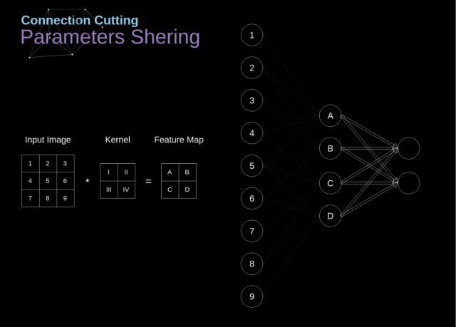  
**步长** ：卷积核每次划过窗口的大小。  
**零填充** ：为了不丢失图像边上的信息，在图像四周添加0信息；  
**深度** ：卷积核的个数；  
**内积** ：1* 1 + 0* 0 + 1* 1 + 0* 0 + 1* 1 + 0* 0 + 1* 1 + 0* 0 + 1* 1 = 5  
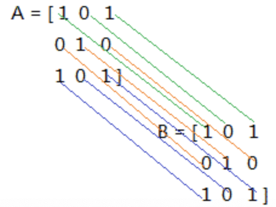

#### RNN-循环神经网络

传统神经网络输入和输出是独立的，RNN通过循环结构引入记忆的概念，输出不仅仅依赖输入，还依赖于记忆。  
RNN可以更好的处理具有时序关系的任务。  
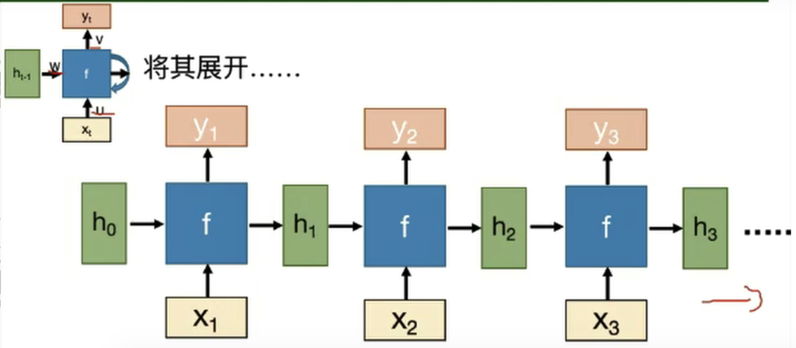  
Xt是时间t处的输入，Yt为时间t时刻的输出。U是从输入到隐藏态，W从前一隐藏态到下一个隐藏态，V是从隐藏态到输出。

#### LSTM（long short-term memory）长短期记忆模型

LSTM拥有三个门（遗忘门、输入门，输出门）来保护和控制细胞状态  
遗忘门：决定丢弃信息；  
输入门：确定需要更新信息；  
输出门：输出信息；  
RNN的”记忆“在每个时间点都会被新的输入覆盖，但LSTM中”记忆”是与新的输入相加；

#### GRU（Gate recurrent Unit）门控循环单元

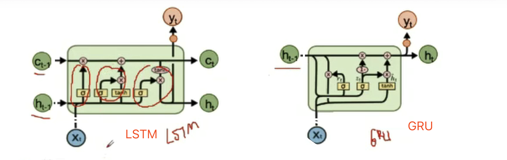  
能够较好的处理训练文本中长距离依赖的问题。  
GRU只有两个门：  
重置门：控制忽略前一时刻状态信息的程度，重置门越小表示忽视的越多；  
更新门：控制前一时刻的状态信息被带入到当前状态中的程度，更新门越大表示前一时刻的状态信息带入的越多；
